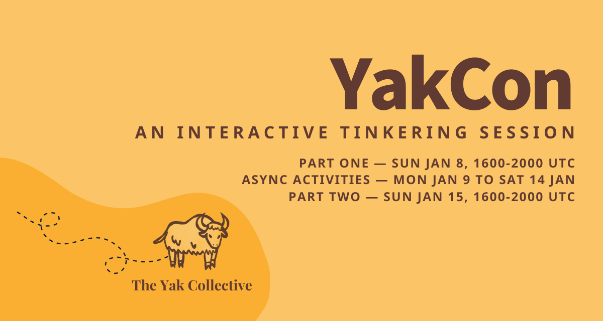

---
---
# The Yak Collective

<a href="https://lu.ma/event/evt-X4vzgzOFPUEUy7u" class="luma-checkout--button" data-luma-action="checkout" data-luma-event-id="evt-X4vzgzOFPUEUy7u" style="text-decoration: none;">Register now!</a>

The Yak Collective is an online space for collaborative tinkering. Here you can find an eclectic group of people working together on technology, research, writing, and art projects, and occasionally trying to make money together as well.

Current experiments include: **building** open-source rovers, **crafting** experimental web infrastructures, **publishing** speculative fiction, and **studying** emerging decentralization. Learn more about us on the [About page](/about.html).

Check out our [members](/members.html) and [projects](/projects.html), read some of [our latest thoughts](/writings.html), and get in touch with any of us if you’d like to learn more.

<!--

## Featured Yak


	Pull in relevant member information from page properties.









	Output featured yak info.


	

		
	

	

		<h3>{{ professional_name }}</h3>

		
			<small class="db">
{{ tagline }}
</small>
		

		
    			
    				<small class="db"><b>Currently:</b> {{ currently }}</small>
    			
    			
    				<small class="db"><b>Previously:</b> {{ previously }}</small>
    			
		

        <small class="db">
<a href="{{ member_url }}">Learn more&hellip;</a>
</small>
	

-->

## Active Study Groups




    
    


## Most Recent Project




