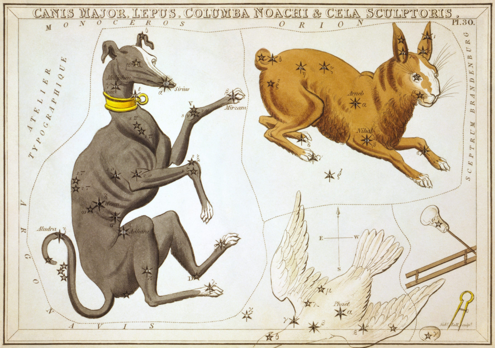

## “The Dog Daies”
It’s been a relatively quiet week at Yak as we lope into the Dog Days of Summer: Pandemic Edition.

Historically, the “dog daies”, as medieval scribes called them, begin on July 3rd, and coincide with the time of the year when the Sirius star system appears to come closest to the sun. The name Sirius comes from Homeric Greek, referring to “Orion’s dog”.

To the ancient eye, this seemed to be the reason summer was the hottest at this period: the brightest star in the night sky at it’s closest point to the sun, augmenting the power (read: *the heat*) of the sun. In fact, *Sirius* is 8.7 light years away.

For this reason, the dog days of summer have historically been regarded as an apocalyptic and unlucky time of the year.

> “Dog Days \[were\] an evil time; the Sea boiled, the Wine turned sour, Dogs grew mad, and all other creatures became languid; causing to man, among other diseases, burning fevers, hysterics, and phrensies.”
> 
> — [John Brady, 1813: Clavis calendaria](http://www.emmitsburg.net/nfs/articles/re/2012/clavis.htm); or, A compendious analysis of the calendar, illustrated with ecclesiastical, historical, and classical anecdotes.

Since forming in March of this year, the Yak Collective has been chugging along, [completing two project cycles](../projects/index.md) in a span of four months, as well as completing its first paid project for a client, involving nearly 20 Yak contributors.

As the collective matures(and as we go deeper into the hottest season of the year), we recognize the need to focus on the quality of projects over the speed at which they are completed, to ensure that all Yak projects are of a high caliber.

That said, we are on the cusp of beginning our third round of projects, and releasing a collection of essays focusing on the problems executives face in adopting innovation.

As they say, it’s a marathon, not a sprint.

## Yaks Do Innovation Consulting
Currently, [David McDougall](https://x.com/dmcdougall) and [Vaughn Tan](https://x.com/vaughn_tan) are leading a to-be-published essay collection at Yak Collective that addresses challenges regarding why corporate executives often fail to foster and implement innovation at their own companies.

The project is currently seeking contributors for the second phase of the project, which is a collection of “solution essays”, in response to the first round of “problem essays”.

The essay collection tentatively will be released in late Summer 2020.

## What We’re Reading
**[Vaughn Tan](https://uncertaintymindset.substack.com/p/35-patterning-herding-programming)** [continues his exploration of Uncertainty](https://uncertaintymindset.substack.com/p/35-patterning-herding-programming) in his newsletter *The Uncertainty Mindset*, and asks:

> *Why do we find it so difficult to recognize a situation of tremendous uncertainty even when, as now, it has come up and essentially punched us in the collective face?*

**[Anne-Laure Le Cunff](https://nesslabs.com/alyssa-x-interview)** [published an excellent piece this week](https://nesslabs.com/alyssa-x-interview) interviewing [Alyssa X](https://medium.com/@alyssax), an “incredibly talented designer, full-stack developer, and entrepreneur”, which only begins to do her output and abilities justice. She’s also 19, and won Maker magazine’s “Woman Maker of the Year” award in 2018.

**[Ben Thompson](https://stratechery.com/2020/apple-and-facebook/)** [published this excellent post](https://stratechery.com/2020/apple-and-facebook/) deconstructing dynamic and productive tensions between the Apple and Facebook ecosystems.

## Useful Links
Apply to [become a Yak here](../join.md).

Interested in hiring the Yak Collective? Send a message to <vgr@ribbonfarm.com>.

*This newsletter authored by [Alex Wagner](https://x.com/alexdw5), with feedback from [Grigori Milov](https://x.com/grigorimilov), [David McDougall](https://x.com/dmcdougall), and [Will Schutze](https://x.com/mrbonetangles).*
