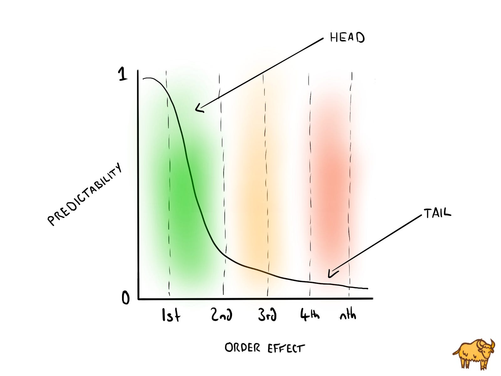

## This week at Yak Collective:
- We held regular weekly voice chats for “Online Governance Studies”, “BUILD A RIGHT BRAIN / NATURE THEATRE”, and, Jordan Peacock’s weekly reading group for Reza Negarestani’s book, “[Intelligence and Spirit](https://mitpress.mit.edu/books/intelligence-and-spirit)”.
- **[Vinay Débrou](https://marginalrevolution.com/marginalrevolution/2020/07/emergent-ventures-india-second-cohort-of-winners.html)**[received a micro-grant from Tyler Cowen’s Emergent Ventures program](https://marginalrevolution.com/marginalrevolution/2020/07/emergent-ventures-india-second-cohort-of-winners.html), for his *Yak-Network-Map* project.
- This week, **[Vaughn Tan](https://vaughntan.org)** released his book, ***The Uncertainty Mindset***, “which is about uncertainty, innovation, organizational design – and cutting-edge cuisine”.

### Yak Projects
Currently, Yaks are working on:

- ***Astonishing Stories***, a collection of speculative fiction.
- ***Innovation Consulting***, a collection of problem and response essays addressing challenges in corporate innovation.
- ***Yak-Network-Map***, which is an internal experiment that which seeks to foster positive interactions in the Yak network. From the proposal, “the core objective of this experiment is to *let a hundred interesting collisions spark among yaks*.”

If you’d like to know more about these projects, you can **[join Yak Collective here](../join.md).**

## Chasing Tails, Part One
*By [Joseph Ensminger](https://x.com/EnsmingerJoseph) and [Matthew Sweet](https://x.com/Matthew_Sweet)*

Governments and multinational corporations use thought experiments to wargame, [scenario plan](https://en.wikipedia.org/wiki/Scenario_planning), and reveal risk.

For these thought experiments to be minimally effective, the interweaving of experts from many disciplines, such as economics, psychology, epidemiology, politics and the military, is required. But even when the experts *are* present, the ROI is usually marginal and rarely meaningful.

The world is complex and always in flux, much like how our environment is perturbed due to the COVID pandemic. The many variables of our world — and their interconnectivity — make it difficult to reliably predict higher order effects. Even experts, who are great at analysing the “what,” misstep when considering unfolding events and interaction effects.

Never doubt human ingenuity, though…

### What’s In a Tail?
The tail of a distribution refers to the events or outcomes that aren’t expected to happen.

In many situations, the unlikeliness of these tail occurrences makes testing and exploring their effects implausible. But with the democratization of simulation technology, methods like [systems dynamics](https://en.wikipedia.org/wiki/System_dynamics) can be used to [edgecraft](https://seths.blog/2013/09/edgecraft-instead-of-brainstorming/) situations, generate ideas, and chase tails. Absurd questions will be asked and tentative possibilities will be born. But who is likely to chase such tails?

1. **Creatives, certainly.** A novelist whose story involves a state shutting down internet access in a population centre would no longer have to guess how many people are needed to spread a message via a mesh network. They could [toy with the network parameters](https://en.wikipedia.org/wiki/Network_simulation) and adjust the story accordingly.
2. **Amateurs and hobbyists, too.** There’s no rule that says experimentation requires a hypothesis. Once the tools are available, people will use them in unpredictable ways to do unexpected things. There will be a simulation modelling equivalent of [a toaster on the internet](https://ldapwiki.com/wiki/Internet%20Toaster).
3. **Individuals, teams and organisations** that want to go in the direction of [maximal interestingness](https://breakingsmart.com/en/season-1/rough-consensus-and-maximal-interestingness/).

The latter class of tail-chasers is who we are going to focus on over the next few weeks. We’re going to look at some example applications of simulation models in different contexts and see how they can be used to ideate and imagine alternate realities.

(P.S. We have some examples in mind but if there are any in particular you’d like to see, let one of the Yak Talk team know.)

## Yak Writings
- Ben Mosior’s piece, **[“Ten Heuristics for Bad Times”](https://hiredthought.com/2020/07/26/ten-heuristics-for-bad-times/)**. From the piece:

	> A [heuristic](https://en.wikipedia.org/wiki/Heuristic) is a cognitive shortcut for decision-making. It is not guaranteed to be rational or even correct. It serves only to help you get to “good enough” in the short term.

- **[A special episode](https://breakingsmart.substack.com/p/thinking-out-loud-year-one)** of Venkatesh Rao’s Breaking Smart Podcast, recapping the past year of the podcast.

- **Tom Critchlow** posted, **“[Updates to Quotebacks](https://tomcritchlow.com/2020/07/24/quotebacks-update/)”**.

## Join/Hire
Apply to [become a Yak here](../join.md).

Interested in hiring the Yak Collective? Send a message to <vgr@ribbonfarm.com>.

*The Yak Talk team for this weeks edition is: [Alex Wagner](https://x.com/alexdw5), [Shreeda Segan](https://shreeda.substack.com), [Praful Mathur](https://aionthebeach.com/), [Matthew Sweet](https://x.com/Matthew_Sweet), [Joseph Ensminger](https://x.com/EnsmingerJoseph), and [Grigori Milov](https://x.com/grigorimilov).*
