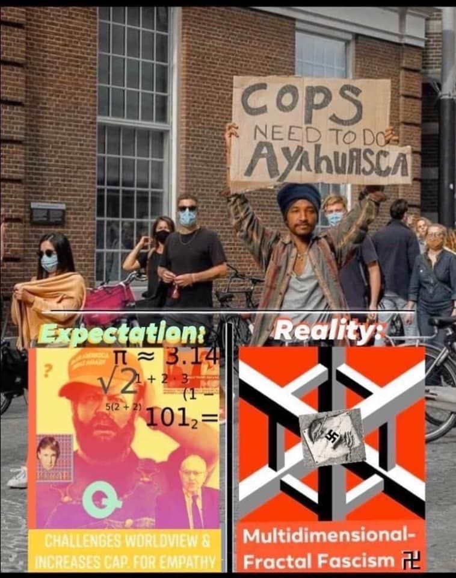

## This week at Yak Collective:
### Yak Projects
Currently, Yaks are working on:

- ***Astonishing Stories***, a collection of Yak-authored speculative fiction.
- ***Innovation Consulting***, a collection of problem and response essays addressing challenges in corporate innovation.
- ***Yak-Network-Map***, which is an internal experiment that which seeks to foster positive interactions in the Yak network. From the proposal, “the core objective of this experiment is to *let a hundred interesting collisions spark among yaks*.”

If you’d like to know more about these projects, you can **[join Yak Collective here](../join.md).**

### Yak Writings
- **Vaughn Tan** published, **“[\#40: Trials and Tribulations](https://uncertaintymindset.substack.com/p/40-trials-and-tribulations)”**, on his [Uncertainty Mindset blog](https://uncertaintymindset.substack.com).
- **Benjamin Taylor** published, **“[The Force in organisational life and becoming a Jedi — part 2: the Dark Side](https://medium.com/@antlerboy/organisational-jedi-knights-have-to-confront-themselves-with-love-4caed5c1142c)”**.
- **Tom Critchlow** published, **“[Creating an Alumni Network for Indies](http://tomcritchlow.com/2020/08/06/indie-alumni/)”**.

## \#Online-Governance: Presidential Campaign as Decentralized Organization
*By Praful Mathur, with Shreeda Segan, Alex Wagner, and Grigori Milov*

[From the beginning](../about.md), Yak Collective has operated as a decentralized organization. At Yak, there is no central authority to enforce governance of Yak processes and code of conduct. Yak projects are governed in a somewhat-federated method.

By nature, Yak projects are short-lived. These projects function as both texts and use cases to generate ongoing discussion, as well as future projects.

Every couple of months brings a new proposal cycle. Each proposal is led by one or two project leads, who head working groups which work towards the creation of a specific deliverable. For instance, [The New Old Home](../projects/new%20old%20home.md) project sought to envision “the return to the home as a site of production”, essentially asking, ‘how is the home going to change, now that COVID is forcing us to spend most of our waking hours there?’.

These spontaneously-created groups, such as the one that created the *New Old Home*, are formed to solve problems, critically imagine futures, and otherwise explore complex questions. Often, these projects focus on creating “collisions” in response to a problem or question, and these collisions typically are found at uncharted intersections of various types of domain knowledge. Once the deliverable is created, it’s then handed off to Yak Collective to share, market, and otherwise signal boost.

There are several kinds of organization that precede Yak Collective in working in a similar decentralized manner. Possibly, the largest-scale analog, in terms of impact and sheer human-power, are political campaigns within representative democracies.

Political campaigns, especially at the presidential level, are short-lived, have dramatic consequences, and require vast organization across many locations to spin-up, coordinate, and tear-down. They, like all decentralized organizations, have a core group of dedicated members, many being volunteers.

One key difference between Yak and presidential campaigns is that the volunteers and operatives of political campaigns are focused outward, towards the specific task of changing the opinions of voters. Those working within political campaigns work to leverage larger groups of volunteers that are not already affiliated within the campaign e.g. the aforementioned voters; political influencers such as former presidents, TV pundits and other politicians currently in office; as well other kinds of online influencers such as celebrities and social media personalities.

The work of political organizing centers around bringing a diverse group of people together, and getting them to believe at least some of the same things about a single candidate.

To put it in more technical terms, one could argue that the two most important aspects of any decentralized organization are “alliance networks” and “narrative alignment”.

We can examine the last two winning presidential campaigns to see both of these forces at play.

Social media may be the most obvious example of both forces working in concert, with alliance networks propagate campaign messaging effectively through a spectrum of social media interactions: tweet threads, hashtags, Facebook groups, Facebook events, Tik-Tok, Youtube ads, and videos. The success of the Obama campaign can largely be attributed to its use of what was, at the time, emerging social media technologies, by which the 2016 Trump campaign made study of, and doubled down to win the presidency.

Trump’s effective use of “dark ads” and[outspending Hillary Clinton’s campaign on Facebook ads](https://thenextweb.com/facebook/2018/04/04/facebook-confirms-trumps-ads-bested-clintons-during-presidential-bid/) — by a wide margin, almost double the budget — may ultimately have shifted the race in his favor.

Trump won the presidency because he built more motivated, and larger, alliance networks. He brought these alliance networks into fierce narrative alignment with catchphrases, normalizing numerous conspiracy theories, and coded appeals to white nationalism.

As discussed by Yak Alex Wagner’s piece, “[Are K-Pop Stans the Future of Activism?](https://yakcollective.substack.com/p/are-k-pop-stans-the-future-of-activism)”, the trend of expansive yet ephemeral alliances due to social media is rapidly evolving in the US political sphere.

While online actors have been influencing politics over the years with ever more frequency – think Anonymous, QAnon, alt-right blogs Breitbart and the Daily Caller – United States-based K-Pop Stans aligning with Black Lives Matter([and K-Pop idols too](https://www.teenvogue.com/story/k-pop-stars-speaking-up-black-lives-matter)) may be a prime symbol of new and disruptive online political movements, with Trump going as far as claiming that he will ban the app in the US, possibly out of fear that the stans will effectively cancel even more of his rallies, leading up to the election.

Online organizing has accelerated in 2020, and will continue to generate new political alliances oriented-both left and right, both in good faith and bad.

It’s worth stating that building alliances is no small feat, especially with organizations outside of one’s own. It takes charismatic, shrewd, and dedicated participants to face specific problems that are sufficiently difficult and complex, to the degree that a single org cannot solve them alone.

While Yak Collective has no stated political motive, or mission statement, Yak continues to evolve as a decentralized organization, and as an alliance of brains who gravitate towards solving complex problems.

To quote [Tom Critchlow](https://tomcritchlow.com) in a recent Yak chat in the \#new-to-consulting channel via the Yak Discord:

> One magic question. Goes like this:
> 
> Client: we want help solving problem $x$
> 
> Consultant: great, why have you been unable to solve it yourself?

## Join/Hire
Apply to **[become a Yak here](../join.md)**.

Interested in hiring the Yak Collective? Send a message to **<vgr@ribbonfarm.com>**.

*The Yak Talk team for this weeks edition is: [Alex Wagner](https://x.com/alexdw5), [Shreeda Segan](https://shreeda.substack.com), [Praful Mathur](https://aionthebeach.com/), [Matthew Sweet](https://x.com/Matthew_Sweet), [Joseph Ensminger](https://x.com/EnsmingerJoseph), and [Grigori Milov](https://x.com/grigorimilov).*
