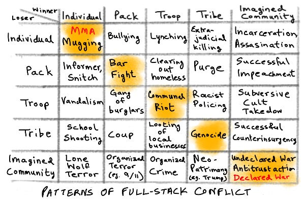
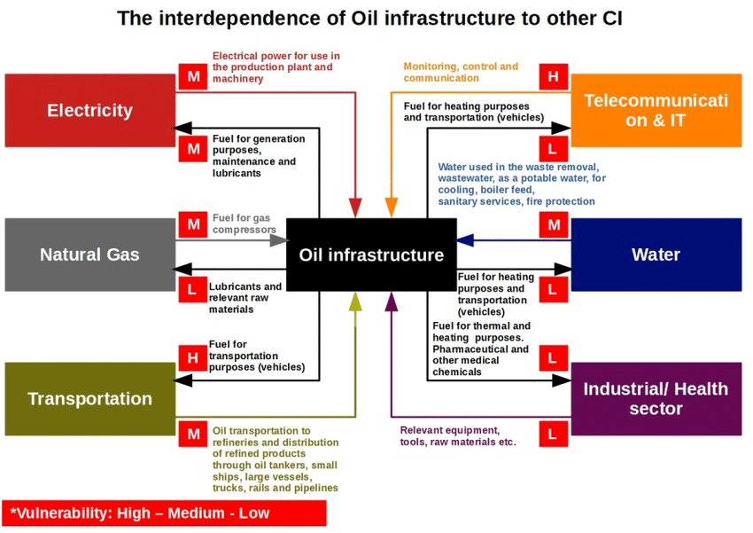
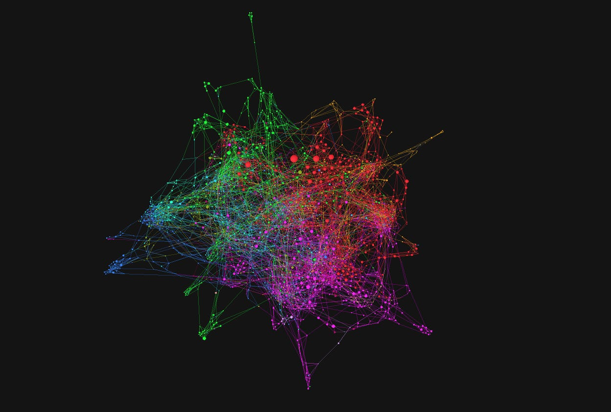

## Editor’s Note
This is the ninth issue of *Yak Talk*, Yak Collective’s weekly email newsletter.

The newsletter started mid-June, from an observation that Yak should probably have a newsletter. For the first few weeks, I did my best to simply curate applicable links w/r/t the output of Yak Collective, and the blog/email list writings of it’s members.

Around the fourth or fifth issue of *Yak Talk*, a team coalesced:

- **[Grigori Milov](https://x.com/grigorimilov)**, as our resident senior consultant, and voice of quality control for the publication.
- **[Shreeda Sagan](https://shreeda.substack.com)**, as our steadfast, no-bs copy editor.
- **[Praful Mathur](http://x.com/prafulfillment)**, our ⌗online-governance beat writer, and analytics man.
- **[Joseph Ensminger](https://x.com/EnsmingerJoseph)**, contributing writer to the ⌗complexity beat.
- **[Matthew Sweet](https://x.com/Matthew_Sweet)**, beat writer for ⌗complexity track.

I’m writing this note to our readers because we want your feedback.

Each week, we meet on Saturday at 12p EDT, and we spend about an hour talking about how to improve Yak Talk.

If you have questions, critique, pitches, or any other flavor of feedback, **[send us an email.](mailto:yaktalk6@gmail.com)**

Thanks, and Yak-Speed,

— **[Alex Wagner](https://x.com/alexdw5)**, nominal editor of *Yak Talk*

## This Week at Yak Collective:
### Yak Projects
Currently, Yaks are working on:

- ***Astonishing Stories***, a collection of Yak-authored speculative fiction.
- ***Final Frontiers:*** Yaks thinking through potential futures of space and oceanic exploration. *Status*: slide deck in progress.
- ***Innovation Consulting***, a collection of essays addressing challenges in corporate innovation.
- ***Yak-Network-Map***, which is an internal experiment that which seeks to foster positive interactions in the Yak network. From the proposal, “the core objective of this experiment is to *let a hundred interesting collisions spark among yaks*.”

If you’d like to know more about these projects, you can **[join Yak Collective here](../join.md).**

## Targeting Trust
*by [Matthew Sweet](https://x.com/Matthew_Sweet)*

As [Kranzberg’s first law of technology](https://en.wikipedia.org/wiki/Melvin_Kranzberg) states, “Technology is neither good nor bad; nor is it neutral.” Bad actors will — somewhere, somehow, somewhen — enter the fray.

*(Technology empowers full-stack conflict. [Source: Unflattening Hobbes](https://www.ribbonfarm.com/2018/10/18/unflattening-hobbes/).)*

Rogue states, cabals of elites defending the status quo, clandestine orgs determined to disrupt and destroy, angry and aggrieved packs, lone wolves — tools that trickle down to the best of us (not listed) are also liable for adoption by the worst of us. Let’s look at an example.

### Disrupting Trust
In *Brave New War*, [John Robb](https://globalguerrillas.typepad.com/) talks of “[systems disruption](https://www.google.com/search?client=safari&rls=en&q=systems+disruption&ie=UTF-8&oe=UTF-8).” Systems disruption is a methodology of attack that leverages modernity’s interconnectivity to create self-reinforcing cascades of failure ([or volatility](https://taylorpearson.me/interestingtimes/volatility-clusters/)). In other words, the interconnected nature of society means that things falling apart in one area will “domino effect” into others.

 *(An easily-discoverable overview of infrastructure interdependence. [Source](https://www.google.com/url?q=https://www.researchgate.net/publication/337549204/figure/fig3/AS:829703267024898@1574828082946/The-interdependence-of-the-oil-infrastructure-Source-adapted-from-65.ppm&sa=D&ust=1597325361321000&usg=AFQjCNFvc1DXaxhSPsXOrR5XzK*J*k9J-Q).)*

A key principle of systems disruption is a complex system’s vulnerability to simple, primitive attacks. Robb gives an example:

> “In February 2006, Nigerian guerillas of the amorphous Movement for the Emancipation of the Niger Delta attacked the loading dock on Shell Oil’s Forcados export platform. The attackers escaped without being captured or suffering casualties. The estimated cost of the attack was ＄2,000 (twenty men at a generous ＄100 each for the day). The cost to Shell was ＄400,000 in lost oil exports for an estimated two weeks and the indefinite shutdown of an adjacent oil field. The estimated lost revenue to Shell was over ＄50 million. The rate of return: 25,000 times the cost of the attack.”

Such primitive assaults on oil pipelines and platforms are now mitigated by the ever-presence of heavily armed, aggresively proactive, well-trained (usually ex-special forces) security. However, attackers remain innovative (and audacious) in the face of defensive evolution.

The pattern repeats in other domains. In physical and digital security, for example, there is no such thing as an infallible defense. But what happens if we mix the concept of systems disruption with the already weakened state of trust in government and legacy media? The answer is *trouble*.

### Bitcoin and Blue Ticks
A couple of weeks ago, many [prominent Twitter accounts were hacked](https://x.com/Support/status/1283518038445223936). The [perpetrators](https://en.wikipedia.org/wiki/2020_Twitter_bitcoin_scam#Perpetrators) turned out to be two Florida-based teens and a Bognor Regis-based teen. They [socially engineered](https://en.wikipedia.org/wiki/Social_engineering_(security)) access to high profile accounts and posted appeals for Bitcoins. The [“2020 Twitter Bitcoin scam”](https://en.wikipedia.org/wiki/2020_Twitter_bitcoin_scam):

> “The scam tweets asked individuals to send bitcoin currency to a specific cryptocurrency wallet, with the promise of the Twitter user that money sent would be doubled and returned as a charitable gesture. Within minutes from the initial tweets, more than 320 transactions had already taken place on one of the wallet addresses, and bitcoin to a value of more than US＄110,000 had been deposited in one account before the scam messages were removed by Twitter. In addition, full message history data from eight non-verified accounts was also acquired.”

Relatively speaking, this was a rather mundane caper that ultimately failed. But let’s imagine it was something far more ambitious.

### Bricking an Election in Four Steps
In our counterfactual, near-future world, our teenage trouble makers are a part of a larger group determined to run interference in a key election. They have a four-step plan.

#### Step One: Access
The first step is the hardest and the prerequisite for the others. In our real-world scenario, the teens managed to socially-engineer access to an [“agent tool”](https://en.wikipedia.org/wiki/2020_Twitter_bitcoin_scam#Method_of_attack) (one of Twitter’s internal administrative functions). This allowed them to access and post as different accounts. Something similar would have to happen, and it would most likely occur via a human pathway rather than a technological one.

#### Step Two: Who?
The next question is, “Which accounts?” [@MenanderSoter](https://x.com/MenanderSoter) used network graphing techniques to visualise different “communities” active in the Twitterverse ([details here](https://twitterverse.net/faq)). A full list of created graphs is [here](https://twitterverse.net/graph) but this is what the [“supergraph”](https://twitterverse.net/graph/supergraph) looks like:

The largest nodes are the accounts with the most “influence”. Our election disruptors would use similar methods to chart the political Twitterverse and classify nodes as either:

- Experts (highly influential, highly *trusted* political accounts)
- Provocateurs (highly influential, highly *inflammatory* political accounts).

The most trusted and the most inflammatory accounts would then form something of a hitlist. These would be the accounts utilised.

#### Step Three: When and Where?
An interference operation isn’t about using insight to persuade. It’s about maximising confusion and amplifying disorder. The best time to do this is when time is running out or is already up.

Access to the Expert and Provocateur accounts would be best leveraged moments before an election, during it and seconds after it is concluded. Additionally, it would cover not just the one-to-many format of a typical tweet but also the public one-to-one @s and private direct messages, too.

#### Step Four: What?
A compromised account, if used to actively post and message, wouldn’t stay compromised for long. Our hackers would need to coordinate a barrage of simultaneous activity within a small time frame. This doesn’t mean that the content has to be monotonous, obviously inauthentic or even consistent.

In the case of the Expert accounts, GPT-3 could be trained on relevant datasets and used to create a plausible, persuasive retraction of a long-held political position or ideology. In the case of Provocateur accounts, the existence of an incendiary cover-up could be claimed, further details could be promised, and imminent censorship could be warned against.

The options here are quite endless.

### Targeting Trust
The moment arrives; our hackers act and the world responds.

In the actual hack we witnessed, Twitter swiftly suspended many Blue Tick’s ability to post. But it was also fairly obvious that the tweets sent out were illegitimate.

What if the tweets were, despite being unusual or representing a shift of position, passably authentic? Would Twitter suspend them so rapidly if the account’s audiences (and even their owners) had no immediate reason to suspect a hijack?

> Once we became aware of the incident, we immediately locked down the affected accounts and removed Tweets posted by the attackers.
> 
> — [Twitter Support • @TwitterSupport • 2:38 AM • Jul 16, 2020](https://x.com/Support/status/1283591849681342469)

And even if Twitter did respond rapidly, wouldn’t the damage be done? How would limiting the functionality of a key social media platform affect an election? Exactly how would the nominees themselves — and the armies waging political war on their behalf — respond?

### Small Chance, Medium Downside, Large Impact
The cost and risk in such an operation is small relative to the possible ROI. The team wouldn’t be trying to dupe a million people. They’d be trying to corrode trust and good faith past a critical level at a critical juncture and cause a lockdown of some essential informational infrastructure.

The salience of social media in information spread, a decayed trust in traditional institutions and a growing desire of frustrated populaces to exert agency in *some* manner would do the rest of the work.

Such a critical security failure coinciding with an election is admittedly unlikely. But it *could* still happen, and this fact raises questions about the outsized impact a simple stack of contemporary technologies can have.

*Matthew Sweet is a regular contributing writer for Yak Talk, covering the ⌗complexity-studies beat. [Check out his newsletter here.](https://swellandcut.com/mag7/)*

## Join/Hire
Apply to **[become a Yak here](../join.md)**.

Interested in hiring the Yak Collective? Send a message to **<vgr@ribbonfarm.com>**.

*The Yak Talk team for this weeks edition is: [Alex Wagner](https://x.com/alexdw5), [Shreeda Segan](https://shreeda.substack.com), [Praful Mathur](http://x.com/prafulfillment), [Matthew Sweet](https://x.com/Matthew_Sweet), [Joseph Ensminger](https://x.com/EnsmingerJoseph), and [Grigori Milov](https://x.com/grigorimilov).*
