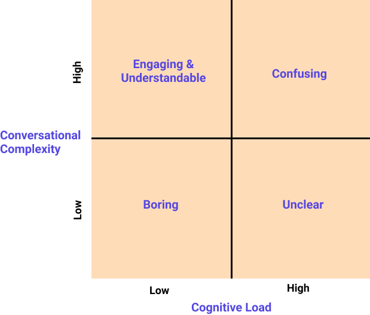
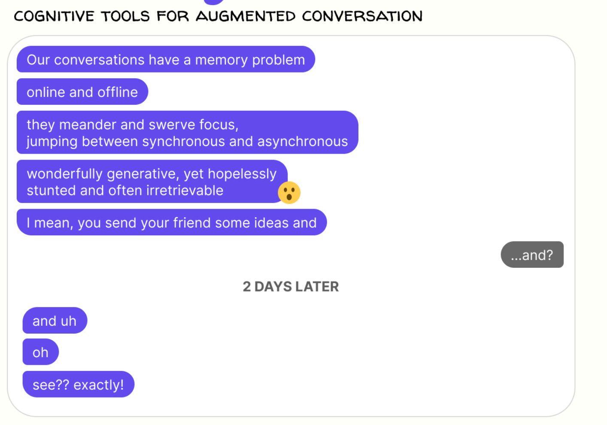
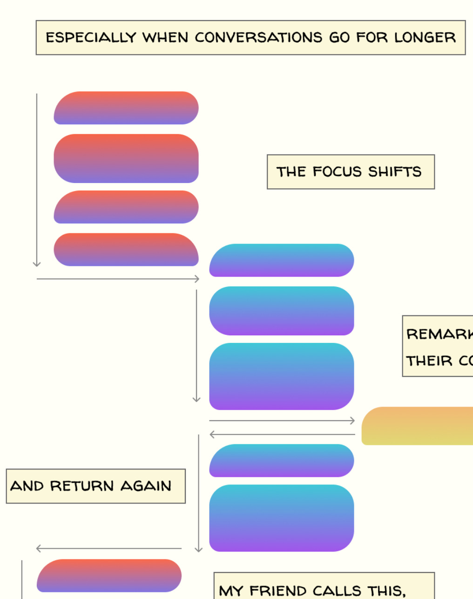
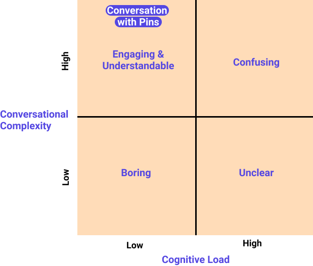
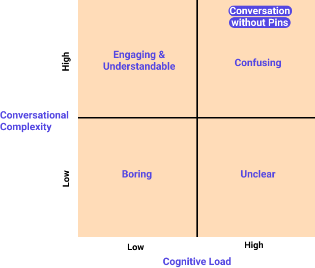
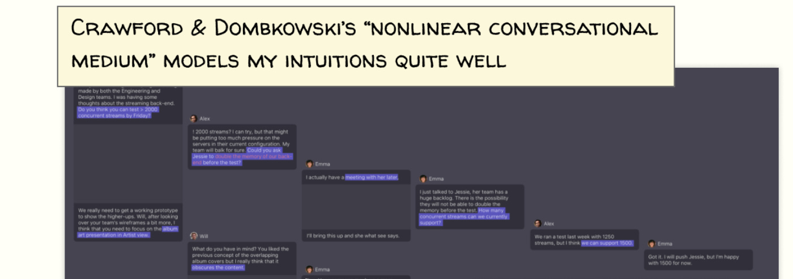

## In This Week’s Yak Talk:
- *Podcasting Needs Cognitive Hooks*
- *How to Become a Tech Contractor*
- *Emergent Infrastructure*

## Podcasting Needs Cognitive Hooks
*by [Joseph Ensminger](https://x.com/EnsmingerJoseph)*

**Podcasts could be much more interesting to the audience and the speakers if they had a visual aid that mapped the conversation flow and dubbed points the speakers would like to return to.**

When I tune into podcasts, the most engaging ones are structured differently:

- They’re barely post-produced.
- They’re long-form, usually at least an hour or two.
- They’re a conversation, not an interview.
- They’re a debate, not a fight.

The following podcasts are structured this way:

- [Making Sense](https://www.youtube.com/c/samharrisorg/videos) by Sam Harris.
- [The Drive](https://www.youtube.com/channel/UC8kGsMa0LygSX9nkBcBH1Sg/videos) by Peter Attia MD.
- [Artificial Intelligence](https://www.youtube.com/c/lexfridman/videos) by Lex Fridman.
- [Dark Horse](https://www.youtube.com/c/BretWeinsteinDarkHorse/videos) by Bret Weinstein.
- [The Portal](https://www.youtube.com/c/EricWeinsteinPhD/videos) by Eric Weinstein.

These podcasters engage in some form of [Socratic dialogue](https://en.wikipedia.org/wiki/Socratic_dialogue). This makes it easier to learn and stay engaged. However, it’s also easy to get lost in the conversation; the format is very fluid.

It’s not just me. Both the interviewer and interviewee find themselves lost periodically. You’ll hear phrases like, “Let’s put a pin in it for now,” “Let’s revisit this” and “I’ll get to this point soon, so let’s hold off for now.”

This is the result of many simultaneous ideas (and their relationships) causing us to hit a cognitive ceiling. It’s difficult to hold it all in your head.

Stephen C. Levinson articulates this well in the abstract of [Turn-taking in Human Communication — Origins and Implications for Language Processing. Trends in Cognitive Sciences, 2015](https://dyslectern.info/2016/01/01/complexity-of-conversation/)

> “Most language usage is interactive, involving rapid turn-taking. The turn-taking system has a number of striking properties: turns are short and responses are remarkably rapid, but turns are of varying length and often of very complex construction such that the underlying cognitive processing is highly compressed.
> 
> The bulk of language usage is conversational, involving rapid exchange of turns. New information about the turn-taking system shows that this transition between speakers is generally more than threefold faster than language encoding.
> 
> To maintain this pace of switching, participants must predict the content and timing of the incoming turn and begin language encoding as soon as possible, even while still processing the incoming turn.
> 
> This intensive cognitive processing has been largely ignored by the language sciences because psycholinguistics has studied language production and comprehension separately from dialog.”

We need a solution that reduces the cognitive load of all the parties involved without eliminating the *richness* that is created by the complexity of ideas. And I think we can draw inspiration from messaging interfaces to form a framework for what a solution could look like.

### Introducing Pins
*The podcast’s flow of conversation mustn’t be interrupted.* Interruptions void trains of thought that otherwise would have been fleshed out. The solution needs to be mostly automated to retain text and context, therefore preserving as much *“meaning”* as possible. I’m imagining a messaging interface where the words are transcribed live on screen and who said what is visually denoted.

For example, think about a traditional messaging format.

A live transcription software that *only* maps words to the speaker who said them isn’t of much help to the podcasters. *They just said the words.* It’s mostly for the benefit of the audience; often, they want to go back to some spot in the conversation. It’s common for speakers to want to do this, too.

Remember our phrases, like “Let’s put a pin in that”? We need a functionality that allows participants to denote a single thought or collection of thoughts. Something like, “I have something to say on that last statement, but I think we should come back to it later.”

The pin should be short; only 3 – 4 words, not unlike a sticky note you would write for yourself. The pin is a reminder to return to the conversation and context that led up to that point. *It indicates an open loop*. The pin should also provide enough context to re-prompt the speaker to expand on it later in the conversation. We want to retain both the “meaning” of the thought in that particular moment *and* have an external memory that reduces cognitive load.

As a conversation progresses, focus shifts and “pins” are created. The speakers will have increasing difficulty holding the whole conversation in their head. They’ll forget important points they meant to revisit. This creates loops that are never closed. At some point, it’ll make sense for a speaker to revisit a particular “pin”.

This happens in a couple of situations: when the conversation is ending and you want to close all the “open loops” that the “pins” represent in the mind of a speaker or when a seemingly unrelated piece of the conversation triggers a speaker to connect the current thoughts back to a “pin”.

**Thus, the “pin” acts as a reminder but also a cognitive hook to hang pieces of the conversation on.** This leads to a lower cognitive load and retains the full complexity and “meaning” of the conversation.

Think of it as a visual-spatial aid. Unlike note-taking, it won’t interrupt the natural flow. It acts like a mediator connecting the conversational dots. UX designers would say a feature like this reduces [cognitive friction](https://www.sachinrekhi.com/the-hierarchy-of-user-friction). If implemented right, it’ll allow the conversation to be richer, more valuable, and enjoyable for everyone.

This idea is closely related to Crawford & Dombkowski’s “Nonlinear conversation medium”, but instead of augmenting written dialogue like a text message conversation, it augments auditory conversation.

Traditional messaging systems have a complete memory of the conversation. But most are written conversation, which is procedurally represented one thought after the other. The ideal system would provide a visual aid that takes us from procedural to nonlinear, like a natural verbal conversation.

Procedural conversational design is linear, top to bottom, like our messaging systems. A juxtaposition to the left or right of that conversation, using a different spatial dimension, left and right of the main flow, using “pins” could be the new form.

The juxtaposition allows you to see the flowing conversation, while also seeing “all” the pins created, allowing the speakers to retain object permanence resulting in reduced cognitive load.

When a pin is revisited, it will be emphasized or visually emboldened to communicate to the speaker and audience that we are currently revisiting that pin. This allows us to figure out where “we” are in the conversation.

> [!note]
> While this idea is loosely developed, I think it has legs. I pulled inspiration from many places but heavily from [here](https://a9.io/glue-comic/).

> [!note]
> Conversational Complexity is basically the number of different threads of conversation × the depth of those threads. At a certain complexity, the listeners and speakers hit a cognitive ceiling where they need aids to help manage and keep track of the conversation.

## How To Become A Tech Contractor
[Jessica Burton](http://www.x.com/@ssica3003) recently published an irreverent guide for anyone umm-ing and ahh-ing about moving into contract work.

> …I have heard every excuse under the sun for not yet being a freelancer: lack of experience, mortgage, kids, sick mother, everything. And I have also met successful freelancers with every single one of these burdens that other people use as an excuse. This tendency to make excuses is often a sign that being a freelancer is actually an escape fantasy.

Read the [full article](https://ssica3003.wordpress.com/2020/08/18/how-to-become-a-tech-contractor/).

## Emergent Infrastructure
*by [Matthew Sweet](http://x.com/@Matthew_Sweet)*

The Yak Collective’s Discord server features channels related to active projects, themed discussion channels (like ⌗complexity and ⌗gigster-logistics) and channels centered on “bureaucracy” (aka the development and maintenance of YC itself).

Within the “Bureaucracy” set, the ⌗infrastructure channel has seen a flurry of activity over the past week. A collection of Yaks (Maier, Darren Kong, Nathan Acks and Jenna Dixon) have been wrangling with further developments to the YC’s IT infrastructure.

YC’s website is built on [Jekyll](https://jekyllrb.com); Discord is fundamental to operations; [Roam Research](https://roamresearch.com) is used as both a data tracking tool and a collaborative sense-making tool. Automatic backups of existing Roam databases have just been introduced. Now, the above Yaks are plotting the latest of many rapid iterations that have occurred in the last few months.

Roam and Discord will remain integral; [Gatsby](https://www.gatsbyjs.com) is being considered, down the line, as a replacement for Jekyll; [Knack](https://www.knack.com) has been proposed as an accessible and flexible centralized database; additional integrations with services like GitHub and tools like [Carl.gg](https://carl.gg) are on the table.

The aim of these efforts (and other efforts to more effectively map YC’s people and processes) is:

- to make the Yak Collective more comprehensible to new and existing members.
- to make the Yak Collective more resilient to inevitable disruption and disorder.
- to ensure the Yak Collective’s strengths translate to all its domains of activity.

I’m inclined to believe at least one of these aims will be realised.

## Join / Hire
Apply to **[become a Yak here](../join.md)**.

Interested in hiring the Yak Collective? Send a message to **<vgr@ribbonfarm.com>**.

*The Yak Talk team for this week’s edition is: [Alex Wagner](https://x.com/alexdw5), [Shreeda Segan](https://shreeda.substack.com/), [Praful Mathur](http://x.com/prafulfillment), [Matthew Sweet](https://x.com/Matthew_Sweet), [Joseph Ensminger](https://x.com/EnsmingerJoseph), and [Grigori Milov](https://x.com/grigorimilov).*
