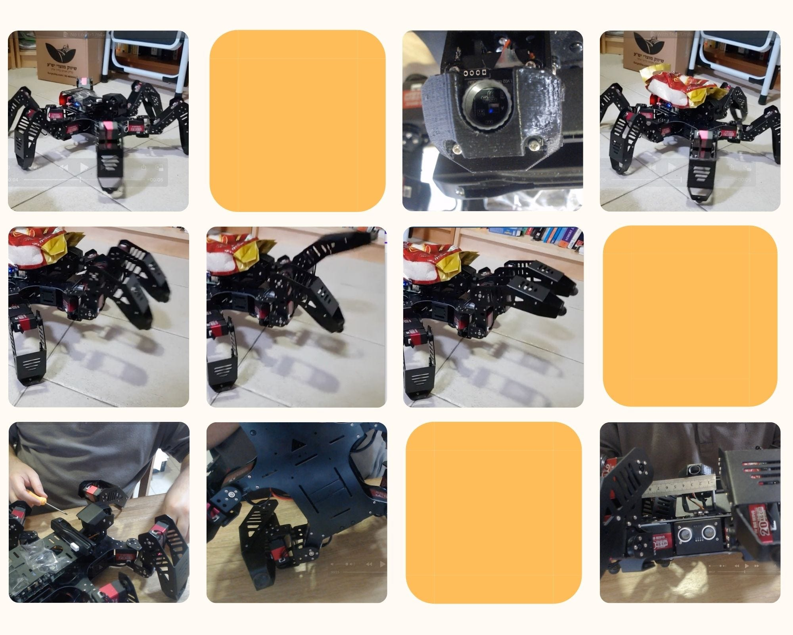
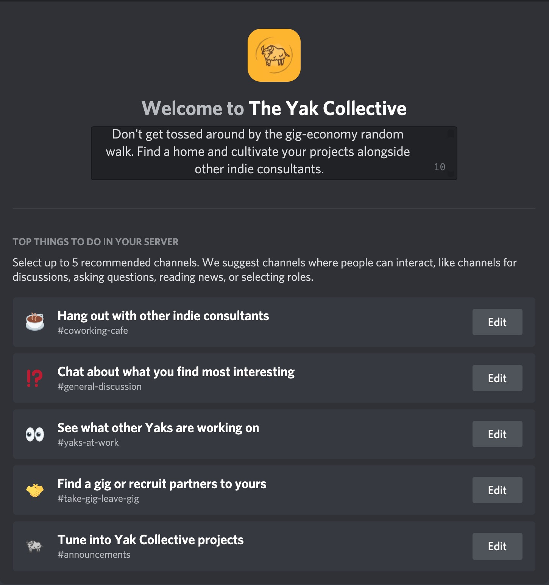
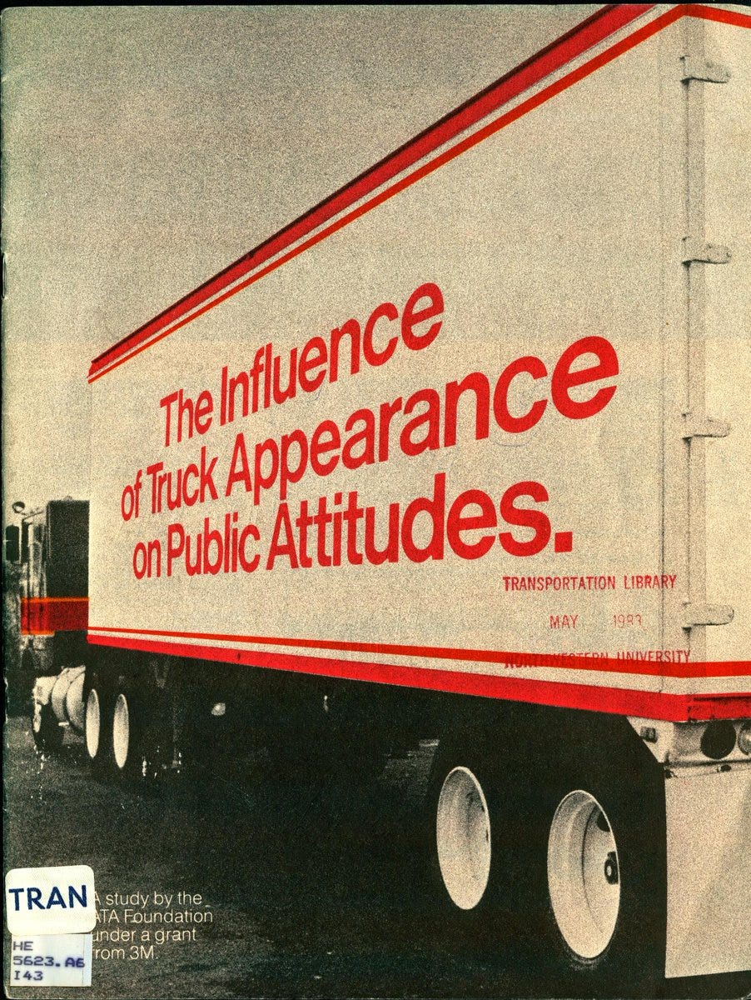

Hello and welcome to Yak Trails, a new occasional roundup of what hundreds of Yak Collective independent consultants have been up to recently in projects and on the Discord server.

Yaks can jump on the server to see details. If you’re any flavor of indie consultant and not yet a Yak Collective member, [check us out](../index.md) and consider [joining us here](../join.md).

#### \#yak rover project updates
The Yak Rover project is an effort by Yak Collective to create an open-source rover design capable of being deployed on Mars by 2031. We are betting that radically declining launch costs and increasingly capable infrastructure on Mars and the Moon (such as shared communications relay or charging facilities) could open up the possibility of an open-source space program based on low-cost rovers. Weekly standing calls on Mondays include quick status updates on: last week  **lw**, next week  **nw**, blockers  **bl**, and one interesting thing  **oit**.

The Yak Rover project includes five independent rover builds.

**fmi:** [Yak Rover Project](../study%20groups/yak%20robotics%20garage.md)

- **Infinity and Beyond**. *Based on the ESA model rover*
	- **lw** — Flew beyond outside just before Ingenuity’s flight (yay). Printed the bogie bearings.
	- **nw** — Play with RISC-V board
	- **oit** — Need to add new camera with pan-tilt to drone to see what is below the drone, since the drone-camera is fixed to the body and looking forward
- **Go and See**. *A pair of simple PiCars*
	- **lw** — Tried to get the new ultrasonic sensor working on the first PiCar and failed. Tried to connect a different camera to the first PiCar and realized I'll need to create a mount for it in order for that to work well enough. Continued assembly of the second PiCar.
	- **nw** — Finish assembly of the second PiCar and get all of the sensors and other features working.
- **Nature is Murder**. *A from-scratch rocker-bogie design*
	- **lw** — Learned basic motor control circuits
	- **nw** — Design a simplified chassis just for motor testing
	- **oit** — Components not sitting properly on breadboards is like the most likely error always
- **Abio Flex Wanderer**. *A spider-bot*
	- **lw** — Play with sensor candidates to mount, including a thermal camera, an optical range finder, a laser range finder, a new camera, and seeing though ABS and acrylic
	- **nw** — Start implementing a software watchdog
	- **bl** — Work for food stealing work for good
	- **oit** — Pondering a simple question: What does it mean to go forward? The problem is to find an abstract and meaningful API to command a rover to go forward (same question then for any action). The question seems trivial until considering different rovers. Wheels, legs, spheres, etc. Aside different servo commands, it is unclear to me what other data this API needs, what options, and what feedback it should provide. Example of distance forward as a feedback is hairy: Absolute distance is inaccurate, legged rovers usually have gait that makes vague actual distance. Anyway, this is the kind of polish I am trying to apply with the BOS API for rover commands.
- **Wonderful Wandering Growth**. *A spider-bot*
	- **lw** — tried to figure out the outdoors image quality problem
	- **nw** — see if i can use some type of AGC or maybe glasses to reduce light levels and maybe help with the blooming problem. if time permits, start on some type of image processing and maybe look up a suitable SLAM
	- **bl** — only %life

#### [\#gig list](https://discord.com/channels/692111190851059762/692816049678057544/845740816269574176)
The \#take-gig-leave-gig channel on the server is where yaks share openings.

- Was asked to spread word about this position at xxx. It’s a remote job, but you’ll need to based in the UK. If interested, please reach out to xxx
- I am looking for a product engineer to work on a new headphone project I am looking to get off the ground.
- looking for a graphic designer who can take technical process and architecture diagrams and make them look attractive.
- Client is looking for a react-native front-end dev for a 2 week UI sprint towards launch. Being able to start immediately is a plus.
- Looking for wearable UX developer. Target platform is probably Wear OS, but this is currently more of a prototyping/exploratory engagement so this is negotiable since the hardware isn't locked yet.
- cool job alert: xxx is hiring a Head of Creators and a friend is leading the recruiting for the role. who's the right person for the job?
- came across this 6-week research project for a food business thought someone here might be interested.
- Looking for a lead UI/UX/Product designer and biz/legal ops intern/associate for my new startup.
- Urban tech startup xxx is looking for a contract mobile developer, for a small project, to get an app on the app stores (it’s a single-task app for sensor installers, with no commercial activity on the app).
- Justice tech startup xxx is hiring a Product Designer!
- A friend of mine is looking for a web designer to help launch a web page for a start-up he's working with. Scope of work is to help determine overall design style, illustrations, and UI/UX assets; bonus if it can be done in webflow, or even better — implemented end-to-end.
- Working as a contractor through xxx, a fellow consultancy is looking for someone with Drupal 8 to 9 upgrade experience — doesn't have to be UK based or have government clearance, for once.

#### \#soapbox
The #soapbox channel on the server is for yaks to give a little speech on what’s on their mind re: internal affairs at Yak Collective. A sort of ongoing townhall to ensure that things on people’s minds get articulated and aired. Extracts from recent posts include:

> … “architecture of gathering” … an airports vs communities metaphor for how/why people gather … recommend airports as both normative and descriptive models / [\#](https://discord.com/channels/692111190851059762/829810073194201128/844981896684765254)

> It seems like what’s beginning to happen here is that the current core members … are starting to align on what it is that we're doing here … a place for indie knowledge workers with a bias for action to come hang out and have interesting interactions that lead to interesting projects that can mutualistically signal status to the outside world the virtue of both participating indies and the YC… / [\#](https://discord.com/channels/692111190851059762/829810073194201128/831937097408839690)

> … we have had two types of projects — ones that require people to repackage their existing ideas and frameworks (NOH, Reboot) and ones that are more open ended exploration usually (Astonishing, Yak Rover)… / [\#](https://discord.com/channels/692111190851059762/829810073194201128/837720259792076870)

> I’m going to shamelessly steal and riff on an idea that Kim Stanley Robinson spoke about in a small talk I participated in on from his book _Ministry for the Future._ That book, for those that haven’t read it, is a sorta pragmatically optimistic take on how the next several decades might unfold in a scenario where we kinda sorta muddle our way through the climate crisis… / [\#](https://discord.com/channels/692111190851059762/829810073194201128/834273098948935731)

> … an understanding of engagement that’s based on time-patterns of activity. There is continuous active presence, continuous partial presence, occasional surge drop-in participation, spikey drive-by participation in things like yakathon, pass-through contribution to projects without further contribution to YC as the sponsoring org, etc. We should encourage and enable all these. / [\#](https://discord.com/channels/692111190851059762/829810073194201128/837779009646755858)

#### \#working agendas by channel
Many channels on the server maintain a shared working agenda. The channel name below is linked to a post of the current working agenda on the server.

- [\#coffee-with-a-yak](https://discord.com/channels/692111190851059762/819285222394036284/845738749475160115)
	- YakC to drive team formation and team gigs, herds, imagined as opt-in to a small team that wanted to offer similar services together. might be multiple herds on overlapping topics.
- [\#infrastructure](https://discord.com/channels/692111190851059762/704369362315772044/844576401625579590)
	- discussion of consistent open-source licensing policy for yc content (member contributed and 3rd party used)
	- financial governance/spending process
	- softlaunch member profile portal » review round » launch
	- discuss ui for projects bot a bit more
	- should we use a calendar bot like apollo or sesh
	- Revisit third-party analytics/tracking decisions
	- journey (ux) diagram
	- UX for convening an event (same topic/time for live call)
- [\#internal-learnings](https://discord.com/channels/692111190851059762/706605168854171709/845745273661292554)
	- create decisions log
	- agree on channel lifecycles. start. pause. archive
- [\#non-fungible token](https://discord.com/channels/692111190851059762/813292262837977128/845669247354142730)
	- two of us have been playing around with the concept of an NFT platform for authors — something that allows authors to mint NFTs of the worlds they create. Is there anyone interested in contributing/making this a project? We’d also be learning how to do this ourselves
- [\#online governance studies](https://discord.com/channels/692111190851059762/709454740614021121/845739326218305536)
	- establish content licensing model for website content
	- establish financial governance model
	- review status of meta-project list
	- discuss cost and benefits of use of email for coordinating YC and whether it is possible to do without email given our constraints, with some suitable reading.
	- discuss a mechanism for publicizing things that require no new infrastructure or project-like work, but just a clear statement of recommended behavior on a key point. Like a “best practice note” or “supreme court opinion.”
	- ip policy for hackathon output
	- policy for website member profiles for hackathon participants yay/nay
- [\#philosophy](https://discord.com/channels/692111190851059762/702921068834324710/845670426285441038)
	- have read: Nietzsche's Daybreak and Slavoj Zizek’s First as Tragedy, then as Farce
	- this week we’re reading Rene Girard’s The Scapegoat (currently chapters 9-11)
- [\#yak-marketing](https://discord.com/channels/692111190851059762/756113566452678707/845739630355546152)
	- review past discussions for action items
	- discuss how to launch, in view of latest results of launch
	- where is the GDPR issue to be discussed?
	- rethink yakc-marketing goals in view of input from annual meeting
	- how to coordinate the various players involved in launch, especially continuous launch
	- how to build a calendar of expected marketing events, like launches
	- discuss potentially presenting our capabilities by vertical sector for better marketing (healthcare, robotics) instead of/in addition to offering type (futures, analysis, trends…) or format (pop-up think tank, whitepaper…)
	- interactive serendipity engine for yakc
	- discuss whether to have yaks offer packetized work services a la fiverr, operating yak as a platform. So combining vertical, type, and format as a crisply defined, fixed-price, fixed-schedule, specific inputs-outputs product. $95 for a 20 minute coffee zoom to talk over a tactical execution problem in your healthcare technology digital transformation project.
	- review xxx’s proposal for coffee with yak and decide how many yaks
- [\#yak-rover](https://discord.com/channels/692111190851059762/779070653122084864/845740316984213504)
	- discuss ground rules for using tweeting mechanism from discord to market this project
	- discuss how to publish this project on the [yakcollective.org](../index.md) website (perhaps a photostream? notebook?)
	- discuss how to use separate twitter account for rovers to auto-tweet and whether to have one per rover or one for all rovers
	- discuss project management tooling choices and polyglot vs monolithic approach
	- marketing exhaust
	- limited scope participation
	- legal and IP for rover assets/code
- [\#welcome-squad](https://discord.com/channels/692111190851059762/809070388621082635/845786350291779604)
	- fire up Discord Community Server setting
	- fire up new community server Welcome Screen
	- fire up new community server #get-started-here channel

#### \#links shared
Yaks have a pretty wide range of interests and lots of links get shared on the server. Here’s a recent sampler. Jump on the server to join the conversations.

- The Theology of Monsters: Part 1, Omens & Warnings / [\#](http://experimentaltheology.blogspot.com/2009/02/theology-of-monsters-part-1-omens.html)
- How cells can find their way through the human body / [\#](https://phys.org/news/2020-08-cells-human-body.html)
- Understanding Urbit / [\#](https://urbit.org/understanding-urbit/)
- Amazon CEO Jeff Bezos Believes This Is the Best Way to Run Meetings / [\#](https://observer.com/2019/06/amazon-ceo-jeff-bezos-meetings-success-strategy/)
- Meet Nezha, a $99 64-Bit Linux SBC for IoT / [\#](https://www.hackster.io/news/meet-nezha-a-99-64-bit-linux-sbc-for-iot-0ee55f3fc2b1)
- Sphero takes early learners for driving lessons with indi robot car / [\#](https://newatlas.com/robotics/sphero-indi-robot-car-early-learners/)
- NASA Awards $500K in First Phase of $5M Watts on the Moon Challenge / [\#](https://www.nasa.gov/directorates/spacetech/centennial_challenges/500k-awarded-in-first-phase-of-5m-watts-on-the-moon-challenge.html)
- InfiniLED Illuninates for Years / [\#](https://www.hackster.io/news/infiniled-illuninates-for-years-c8305d80a7a3)
- Bioregionalism—Living with a Sense of Place at the Appropriate Scale for Self-reliance / [\#](https://medium.com/age-of-awareness/bioregionalism-living-with-a-sense-of-place-at-the-appropriate-scale-for-self-reliance-a8c9027ab85d)
- The New Old Home / [#](../projects/New%20Old%20Home.md)
- Casey Neistat's Wildly Functional Studio / [\#](https://www.youtube.com/watch?v=vb60rrtTddQ)
- Enten—Smart Headphones to Measure Focus & Work / [\#](https://www.indiegogo.com/projects/enten-smart-headphones-to-measure-focus-work?fbclid=PAAabihaOLTaFWs3ACiw3-ft-6fIOUBcZQjRjtRtumZ4BZQaNeQUJtH2RFbPI)
- China launches core module of new space station to orbit / [\#](https://www.space.com/china-launches-core-module-tianhe-space-station)
- Locus Online—The Magazine of the Science Fiction and Fantasy Field / [\#](https://locusmag.com/)
- Network Realism: William Gibson and new forms of Fiction / [\#](https://booktwo.org/notebook/network-realism/)
- Can speculative fiction teach us anything in a world this crazy? / [\#](https://techcrunch.com/2021/05/01/can-speculative-fiction-teach-us-anything-in-a-world-this-crazy/)
- Practical Screenwriting—practical screenwriting advice from an outsider working in an insider industry / [\#](https://practical.substack.com/)
- Community leaders deserve better: An open letter about community software / [\#](https://li.substack.com/p/community-leaders-deserve-better)
- Selling Tiny Internet Projects For Fun and Profit | Tiny Projects / [\#](https://tinyprojects.dev/posts/selling_tiny_internet_projects_for_fun_and_profit)
- Geneva | A home for groups of all shapes and sizes / [\#](https://geneva.com/)
- Stoop — A newsletter app / [\#](https://stoopinbox.com/)
- The Anatomy of an Amazon 6-pager / [\#](https://writingcooperative.com/the-anatomy-of-an-amazon-6-pager-fc79f31a41c9)
- Psionica / Dual — An open source local-first virtual assistant for knowledge work / [\#](https://github.com/Psionica/Dual)
- Paper Engineering course with Kelli Anderson / [\#](http://coopertype.org/event/paper_engineering#instructor)
- Gratitude for Invisible Systems / [\#](https://www.theatlantic.com/technology/archive/2017/05/gratitude-for-invisible-systems/526344/)
- Survey: Knack Chrome Extension for the new Knack Builder / [\#](https://support.knack.com/hc/en-us/community/posts/360077658351-Survey-Knack-Chrome-Extension-for-the-new-Knack-Builder)
- Discord Slash Commands FAQ / [\#](https://support.discord.com/hc/en-us/articles/1500000368501-Slash-Commands-FAQ)
- Federal Reserve Chair Jerome H. Powell outlines the Federal Reserve's response to technological advances driving rapid change in the global payments landscape / [\#](https://www.federalreserve.gov/newsevents/pressreleases/other20210520b.htm)
- Rekt—Value DeFi—REKT 2 / [\#](https://www.rekt.news/value-rekt2/)
- SEC.gov | Werewolves of Change: Remarks before the ISDA Derivatives Trading Forum Regulatory Change / [\#](https://www.sec.gov/news/speech/werewolves-of-change)
- Two Elements of Pair Programming Skill / [\#](https://arxiv.org/pdf/2102.06460.pdf)

> 
> 
> — [Rachel Cole ∙ @rmartincole ∙ 2:03 PM ∙ Sep 23, 2019](https://x.com/rmartincole/status/1176135108996280320)
