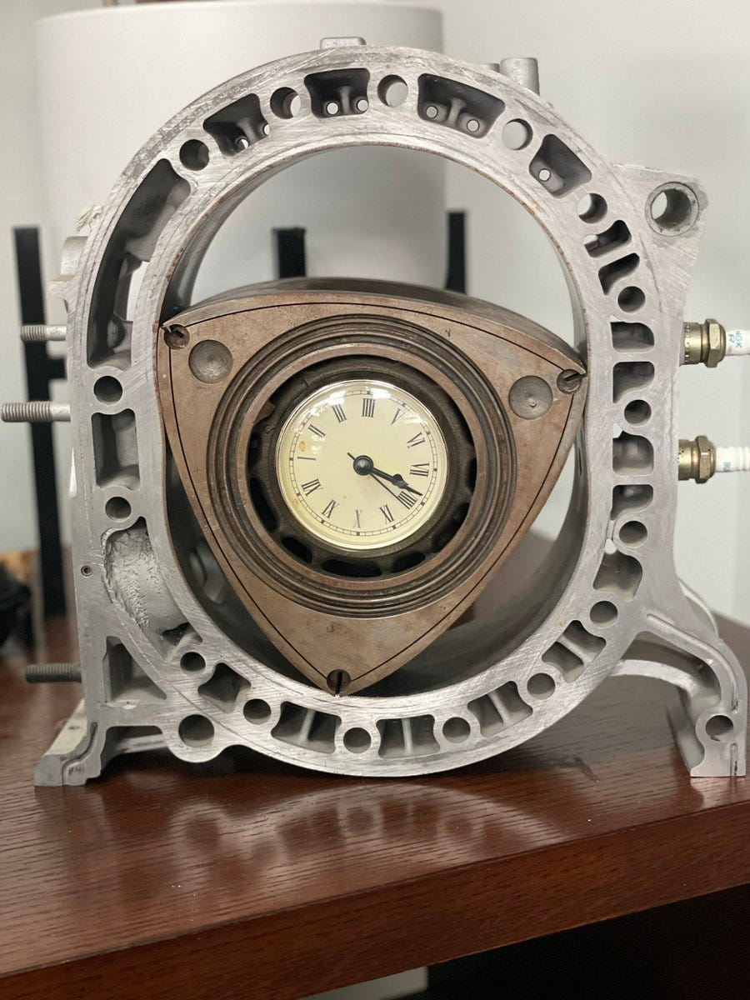
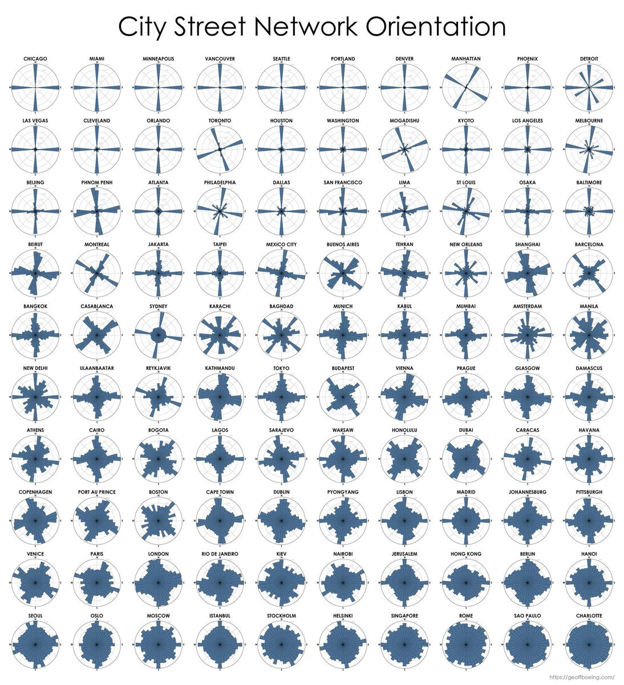

Herewith a roundup of what Yak Collective indies have been up to this past week. Yaks can jump on the server to join in. If you’re not yet a Yak Collective member, [check us out](../index.md) and consider [joining here](../join.md).

## \#yak rover project updates
**Stubborn.** Completed next iteration of command language. Much more usable. Operability tests performed by a 6-year old to great success. Will plan to focus more on drivability. FFWD command, for example, kicks so hard it registers as an impact. Need to develop some sort Attack and Decay concept. Each time the rover would break due to either my software or a loose wire, the 6-year old assume it was her fault. Being more accepting of faults seems like a critical engineering lesson to teach.

**Wonderful Wandering Growth.** collected images to use for trying out various stereo/sfm/flow algorithms, and ideas and papers thereon. sunglasses using polarized strips, maybe from an LCD display, more work on vision and/or on closed loop. stereo is still hard. insight: reality has a surprising amount of detail. instead of trying to regularize it, maybe rover can glorify in it and use it. added some twitter functionality. consider twitter polls

> Last night @vgr was explaining Reubleaux triangles and I almost fell out of my chair trying to show off my sweet clock.
> 
> 
> 
> — [Rhett Garber ∙ @rhettford ∙ 3:57 PM ∙ Jun 1, 2021](https://x.com/rhettford/status/1399756932370485251)

## \#infrastructure project updates
- we started on the idea of a YakCollective legal layer (licensing, IP protection, confidentiality, YakC incorporation). an intention of **\#coffee-with-a-yak** was to facilitate casual, pre-formal conversations with potential team-mates and potential clients
- discussed ui for projects. raising visibility of new and ongoing projects. consider moving project ui to knack
- discussed ui for server bots

## \#recent working agenda adds by channel
Yak projects are coordinated in server channels. Yaks can use `$agendalist` to view channel agendas and `$agendaadd` to add to the channel agenda.

- **\#coffee-with-a-yak**
	- what’s our stack for the Yak Cafe service? profiles for yaks, for team conversations, for scheduling, for calls, for coordination messaging?
	- what are ToS for Yak Cafe for the yaks and for guests?
- **\#infrastructure**
	- UX for convening an event (same topic/time for live call)
	- Roam API? repo last updated 4 months ago
	- update or archive \#subscribe-projects
- **\#internal-learnings**
	- agree on channel lifecycles. start. pause. archive
- **\#future-of-governance**
	- establish content licensing model for website content
	- establish financial governance model
- **\#philosophy**
	- on Sunday morning 8am CST we are continuing to read Rene Girard’s *The Scapegoat*
- **\#yak-marketing**
	- how to build a calendar of expected marketing events
	- interactive serendipity engine for yakc
- **\#yak-rover**
	- discuss how to publish project on [yakcollective.org](../index.md)
	- limited scope participation
	- legal and IP for rover assets/code

## \#yakstack
Two channels on the server focus on what folks use to get stuff done as an indie consultant: \#tool-time and \#production. This week we highlight what tools is Nitzan Hermon using:

- Emails — [mailchimp.com](https://mailchimp.com/) > [buttondown.email](https://buttondown.email/) > [Ghost](https://ghost.org/)
- Sites — [Jekyll](https://jekyllrb.com/) > [Ghost](https://ghost.org/). [Cargo](https://cargo.site/). [Persona](https://persona.co/)
- URL — bundled — CBS + Coaching + Thirdness + The Third Space (soon) + blog + (paid) email > [www.in-process.net](https://www.in-process.net/) on [Ghost](https://ghost.org/)
- URLs — unbundled — homepage [byed.it](http://byed.it/) on [Jekyll](https://jekyllrb.com/); research: [everything-will-happen.com](http://everything-will-happen.com/), [meta-medium.com](http://meta-medium.com/) and [complexity-design.com](http://complexity-design.com/) on [Jekyll](https://jekyllrb.com/); studio: [www.future-of.agency](https://www.future-of.agency/) on [Cargo](https://cargo.site/) (I am likely to change this); misc: [artsandscience.co](https://artsandscience.co/) on [Persona](https://persona.co/); [design.byed.it](http://design.byed.it/) on [Cargo](https://cargo.site/) (archive)

## \#links shared
- [Jodorowsky’s Dune — Wikipedia](https://en.wikipedia.org/wiki/Jodorowsky%27s_Dune). *[\#yaks-at-work](https://discord.com/channels/692111190851059762/723191355991654422/850432912640704583) 2021-06-04*
- [Can the Subaltern Speak? | Gayatri Chakravorty Spivak](http://abahlali.org/files/Can_the_subaltern_speak.pdf). *[\#voice-meta](https://discord.com/channels/692111190851059762/698566364595486720/850411894192078878) 2021-06-04*
- [Hoe Cultures: A Type of Non-Patriarchal Society](https://srconstantin.wordpress.com/2017/09/13/hoe-cultures-a-type-of-non-patriarchal-society/). *[\#voice-meta](https://discord.com/channels/692111190851059762/698566364595486720/850397358176600186) 2021-06-04*
- [Stack Overflow Sold to Tech Giant Prosus for $1.8 Billion](https://www.wsj.com/articles/software-developer-community-stack-overflow-sold-to-tech-giant-prosus-for-1-8-billion-11622648400). *[\#weak-signals](https://discord.com/channels/692111190851059762/706606552819433482/850359434072424521) 2021-06-04*
- [Poe’s Best-Selling Book During His Lifetime Was a Guide to Seashells — Atlas Obscura](https://www.atlasobscura.com/articles/edgar-allan-poe-seashell-book). *[\#coworking-cafe](https://discord.com/channels/692111190851059762/772547365662883870/850353760386809876) 2021-06-04*
- [Poe’s Best-Selling Book During His Lifetime Was a Guide to Seashells — Atlas Obscura](https://www.atlasobscura.com/articles/edgar-allan-poe-seashell-book). *[\#coworking-cafe](https://discord.com/channels/692111190851059762/772547365662883870/850353760386809876) 2021-06-04*
- [The SEO MBA](https://seomba.substack.com/). *[\#general-discussion](https://discord.com/channels/692111190851059762/725542427229945877/850349749747318784) 2021-06-04*
- [MECANT on kävelevä kone](https://areena.yle.fi/1-50176396). *[\#yak-rover](https://discord.com/channels/692111190851059762/779070653122084864/850234463283839007) 2021-06-04*
- [Passport – Stratechery by Ben Thompson](https://stratechery.com/2021/passport/). *[\#online-governance-studies](https://discord.com/channels/692111190851059762/709454740614021121/850106543617605713) 2021-06-03*
- [Start.coop: Empowering Entrepreneurs to Build Cooperatively-Owned Businesses](https://start.coop/). *[\#online-governance-studies](https://discord.com/channels/692111190851059762/709454740614021121/849742226967363615) 2021-06-02*
- [‘Cruella’ is aggressively mediocre, but Emma Stone still shines](https://www.mic.com/p/cruella-is-aggressively-mediocre-but-emma-stone-still-shines-81052846). *[\#yak-poop](https://discord.com/channels/692111190851059762/712112363566006322/849686386470813726) 2021-06-02*
- [Online database and workflow templates: Project Management](https://www.knack.com/templates/project-management). *[\#infrastructure](https://discord.com/channels/692111190851059762/704369362315772044/849663083613782036) 2021-06-02*
- [Real Flight Personal Drone Flying — YouTube](https://youtu.be/Pv5JQnmD1Yk). *[\#yak-rover](https://discord.com/channels/692111190851059762/779070653122084864/849587738474053633) 2021-06-02*
- [Spaghetti Style Twitter](https://docs.google.com/presentation/d/1fWH1GzZLDc02EFN_U-BAVmxjU4gBCiZj4FxswOtOgag/edit). *[\#yak-rover](https://discord.com/channels/692111190851059762/779070653122084864/849434159763423273) 2021-06-01*
- [Hashtags felt dated and cringeworthy. So why are influencers still using them?](https://www.latimes.com/business/technology/story/2021-06-01/hashtags-influencers-use-them) *[\#general-discussion](https://discord.com/channels/692111190851059762/725542427229945877/849324630158475274) 2021-06-01*
- [The Meat Question](https://mitpress.mit.edu/books/meat-question). *[\#why-do-whoop](https://discord.com/channels/692111190851059762/809318532990500865/849274604827443260) 2021-06-01*
- [How to Choose the Right Dose of Exercise for Your Brain | Outside Online](https://www.outsideonline.com/2424158/exercise-cognitive-function-research). *[\#why-do-whoop](https://discord.com/channels/692111190851059762/809318532990500865/849020081665343490) 2021-05-31*
- [Onshape | Product Development Platform](https://www.onshape.com/en/). *[\#yak-rover](https://discord.com/channels/692111190851059762/779070653122084864/849019169827061811) 2021-05-31*
- [JAXA to send tiny transforming robot to the lunar surface](https://newatlas.com/space/jaxa-transforming-robot-lunar-surface/). *[\#yak-rover](https://discord.com/channels/692111190851059762/779070653122084864/849008270055964712) 2021-05-31*
- [GitHub OCTO | Flat Data](https://octo.github.com/projects/flat-data). *[\#tool-time](https://discord.com/channels/692111190851059762/692448025372655656/848924029520052266) 2021-05-31*
- [All is Orwell by Gerald Frost](https://newcriterion.com/issues/2021/6/all-is-orwell). *[\#online-governance-studies](https://discord.com/channels/692111190851059762/709454740614021121/848302700847300658) 2021-05-29*
- [Plague and renaissance](https://the.ink/p/after-the-plague?token=eyJ1c2VyX2lkIjo4OTg1LCJwb3N0X2lkIjozNjk3MTM4OSwiXyI6IlEzbndiIiwiaWF0IjoxNjIyMzAxMjA1LCJleHAiOjE2MjIzMDQ4MDUsImlzcyI6InB1Yi03MDM3NCIsInN1YiI6InBvc3QtcmVhY3Rpb24ifQ.uBhfjSTVc2DKHYCPeLcTjB5UjdMHqMUFcOAgx8P-z1g). *[\#online-governance-studies](https://discord.com/channels/692111190851059762/709454740614021121/848265443508486194) 2021-05-29*
- [The Great Affordability Crisis Breaking America — The Atlantic](https://www.theatlantic.com/ideas/archive/2020/02/great-affordability-crisis-breaking-america/606046/). *[\#new-old-home-and-country](https://discord.com/channels/692111190851059762/709753766076874774/848234738397216779) 2021-05-29*
- [Why You Should Wait Out the Wild Housing Market — The Atlantic](https://www.theatlantic.com/ideas/archive/2021/05/us-housing-market-records/619029/). *[\#new-old-home-and-country](https://discord.com/channels/692111190851059762/709753766076874774/848234327606296617) 2021-05-29*
- [Plague and renaissance](https://the.ink/p/after-the-plague). *[\#online-governance-studies](https://discord.com/channels/692111190851059762/709454740614021121/848218370036858900) 2021-05-29*
- [NocoDB | Turns your SQL database into a Nocode platform. Free & Open Source.](https://www.nocodb.com/) *[\#tool-time](https://discord.com/channels/692111190851059762/692448025372655656/848214636171493415) 2021-05-29*
- [Geneva | A home for groups of all shapes and sizes](https://geneva.com/). *[\#tool-time](https://discord.com/channels/692111190851059762/692448025372655656/848190004383580170) 2021-05-29*
- [The truth is out there — Today, Explained — Overcast](https://overcast.fm/+WEGlZuftc). *[\#astonishing-stories](https://discord.com/channels/692111190851059762/709768319108120636/848044937689563186) 2021-05-29*
- [How Kudumbashree Changed 5 Million Lives in Kerala](https://www.thebetterindia.com/119677/kudumbashree-poverty-gender-5-million-kerala/). *[\#online-governance-studies](https://discord.com/channels/692111190851059762/709454740614021121/847881507364536390) 2021-05-28*

> One of my favorite scientific figures is this one of the entropy levels of 100 world cities by the orientation of streets. The cities with most ordered streets: Chicago, Miami, & Minneapolis. Most disordered: Charlotte, Sao Paulo, Rome & Singapore. Paper: <https://appliednetsci.springeropen.com/articles/10.1007/s41109-019-0189-1>
> 
> 
> 
> — [Ethan Mollick ∙ @emollick ∙ 6:41 PM ∙ Jun 4, 2021](https://x.com/emollick/status/1400885452261974020)

> When you generate images with VQGAN + CLIP, the image quality dramatically improves if you add “unreal engine” to your prompt. People are now calling this “unreal engine trick” lol e.g. “the angel of air. unreal engine”
> 
> 
> 
> — [Aran Komatsuzaki ∙ @arankomatsuzaki ∙ 9:02 PM ∙ May 31, 2021](https://x.com/arankomatsuzaki/status/1399471244760649729)
