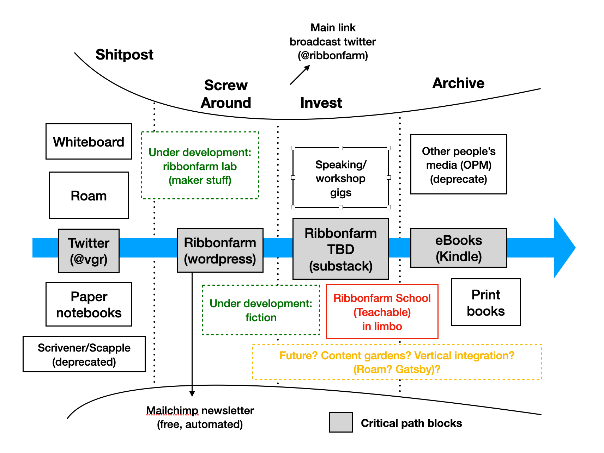
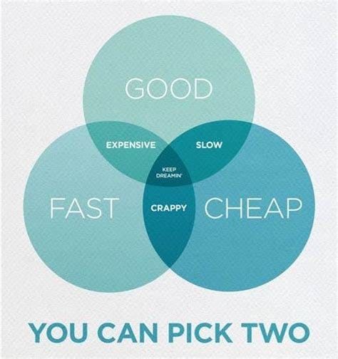

Herewith a roundup of what the Yak Collective is up to this week.

- Yaks — [jump on the server](https://discord.com/channels/692111190851059762/725542427229945877) to join in.
- If you’re not yet a member, consider joining [here](../join.md).

## @now
[\#Internal Learnings](https://discord.com/channels/692111190851059762/706605168854171709/850421783998758935). “\[…\] bot-based automation is one of the abundance variables we have that I think we should use to cover for the scarcities, in this case of coordination labor. To handle differences over bot UX, perhaps it is worth defining a new ‘yak style bot automation’ project to think them through and arrive at a ‘rough consensus and running code’ shared design philosophy.” Discussion on weekly [\#Infrastructure](https://discord.com/channels/692111190851059762/704369362315772044) call Wednesdays 10am ET.

[\#New Old Home and Country](https://discord.com/channels/692111190851059762/709753766076874774) “is making a call for interesting case studies in the emergent roles & projects spun up or faltered during the course of the pandemic. This would begin as a slide presentation just like last year’s [The New Old Home](../projects/New%20Old%20Home.md) and could go for there to multimedia formats. DM Scott Garlinger or email him at <scottgarlinger@gmail.com> for info for next steps.”

[\#Online Governance Studies](https://discord.com/channels/692111190851059762/709454740614021121). A weekly call for discussing ideas about governance of online communities, collectives, networks, etc. We take a somewhat scholarly approach to discussions. Fridays 9am PT.

[\#Philosophy](https://discord.com/channels/692111190851059762/702921068834324710). “We finished a book last week and took this week off and the next. Our next book will be George Eliot’s translation of Spinoza’s *Ethics*. Currently reevaluating times.”

[\#Weak Signals](https://discord.com/channels/692111190851059762/706606552819433482). A sounding board for things that feel significant but you can’t articulate why. Then finding a consensus on what to measure and how to measure it. *async*

[\#General Discussion](https://discord.com/channels/692111190851059762/725542427229945877/850428862101979156). “I’d like to throw up a discussion prompt… I don’t think we are nailing the ‘doing consulting’ part.… the question is, do we broaden the scope (while remaining action-biased)? … I’d like us to figure out what that emergent evolutionary path is, and either own it, or if it needs a course correction, attempt to make it.”

## [#yak rover updates](../study%20groups/yak%20robotics%20garage.md)
**Nature is Murder.** Printed chassis for a test rig for the board/motors, a lot of shopping. Reprint the chassis to hold the battery I got, which doesn’t fit in the space I though it would. To decouple a system into subsystems with a stub, the complexity of the stub (like my test rig chassis) is a function of the complexity of the systems being decoupled. In this case, the test rig has to hold 8 motors and the board and batteries and have 4 drive wheels just like the actual robot design, otherwise it won’t do much by way of useful decoupling.

**Stubborn.** Open Sourced stubborn project. Started working on a component for managing configuration vars in non-volatile memory. This should be really helpful for fine-tuning. Got a RaspberryPi booted up just to see how it felt. Finish up configuration system and focus on some movement tuning. Writing to EEPROM immediately crashed my rover. Got garbage on the serial and an immediate reboot. I was really stumped and thought I was really screwed because it’s not like I have a debugger or a core. After sleeping on it I realized I just messed up my pointer arithmetic and was probably overwriting my stack pointer. C is hard.

**Wonderful Wandering Growth.** investigated Twitter control and tried to recycle LCD display into sunglasses. try to solve the physical and smoothness problems of the sunglasses, build Twitter control. figuring out how to cut optically usable small pieces of plastic backed glass. drone obstacle detection algorithm may be able to provide data for automatic characterization of surroundings.

**Infinity and Beyond.** Print the solar panels for rover. Setup PlatformIO for RISC-V. Setup the YouTube channel. Go through one tutorial of OnShape and Descript for video editing.

**Go and See.** Reviewed where the Go and See build is at… I am switching gears to designing the custom build I thought I would start in October, now. I"m not able explore many of the features and concepts that I hope to be part of my longer term design using a cheap kit robot, and want to start working on a robot that can be used outdoors in a more complex environment. Prepare to present on the custom design — motivation, strategy, specific use cases, design considerations, and technologies. Then, do so! As often occurs, being intrigued by some aspects of the conversation in the Yak Rover meeting — this time the discussion of the natural locations of computer vision processing and component redundancy in the context of safety critical applications (cars) vs. less human centric uses (Mars rovers) was particularly interesting.

## \#yakstack
This week’s highlight — from [Upcoming Changes: The newsletter is metamorphosing, reorienting, pivoting](https://breakingsmart.substack.com/p/upcoming-changes), the tools [Venkatesh Rao](https://breakingsmart.substack.com/p/upcoming-changes) using in writing and publishing work.

*“Here is a diagram of what unfortunately has the ominously managerial look of a pipeline diagram. The grey boxes are my critical path.”*

## [\#yaks-at-work](https://discord.com/channels/692111190851059762/723191355991654422)
- [Non-Contact — Ribbonfarm](https://www.ribbonfarm.com/2021/06/04/non-contact/). *2021-06-04 [\#](https://discord.com/channels/692111190851059762/723191355991654422/850433670422724628)*
- [\#4 Pirate Jenny and the Black Freighter — Sachin — Moebius](https://moebius.substack.com/p/4-pirate-jenny-and-the-black-freighter). *2021-06-06 [\#](https://discord.com/channels/692111190851059762/723191355991654422/851228109688012850)*
- [What’s your mission? How are you bringing it into the world? | by Benjamin P. Taylor](https://antlerboy.medium.com/whats-your-mission-how-are-you-bringing-it-into-the-world-bc07c6833bda). *2021-06-09 [\#](https://discord.com/channels/692111190851059762/723191355991654422/852082521264750592)*
- [Upcoming Changes — Breaking Smart](https://breakingsmart.substack.com/p/upcoming-changes). *2021-06-10 [\#](https://discord.com/channels/692111190851059762/723191355991654422/852342444660883516)*
- [The Praise Paradox: when well-intended words backfire — Ness Labs](https://nesslabs.com/praise-paradox). *2021-06-10 [\#](https://discord.com/channels/692111190851059762/723191355991654422/852547654859620383)*
- [Procrastination triggers: eight reasons why you procrastinate — Ness Labs](https://nesslabs.com/procrastination-triggers). *2021-06-10 [\#](https://discord.com/channels/692111190851059762/723191355991654422/852570141279125534)*

## \#links shared
- [Yak Collective — Calendar — Upcoming Events](https://calendar.google.com/calendar/u/0/embed?src=o995m43173bpslmhh49nmrp5i4@group.calendar.google.com). *2021-06-09 \#upcoming-events*
- [Online-Offsite Reboot Scope – Expansive, Unedited, Kitchen-Sink v0.1](https://docs.google.com/document/d/1HBu4rFymxvki0HaVPbAh5_yg69ZWsbpvZFJKn_RO6nQ/edit). *2021-06-05 \#general-discussion*
- [Torpedo Factory Art Center](https://torpedofactory.org/). *2021-06-06 \#general-discussion*
- [Magawa the hero rat retires from job detecting landmines — BBC News](https://www.bbc.com/news/world-asia-57345703). *2021-06-05 \#yak-poop*
- [Assume Positive Intent: With Postlight’s Michael Shane](https://postlight.com/podcast/assume-positive-intent-with-postlights-michael-shane). *2021-06-10 \#yak-poop*
- [Hoe Cultures: A Type of Non-Patriarchal Society](https://srconstantin.wordpress.com/2017/09/13/hoe-cultures-a-type-of-non-patriarchal-society/). *2021-06-04 \#voice-meta*
- [Jodorowsky’s Dune — Wikipedia](https://en.wikipedia.org/wiki/Jodorowsky%27s_Dune). *2021-06-04 \#yaks-at-work*
- [Simple and fair pricing — Fathom Analytics](https://usefathom.com/pricing). *2021-06-09 \#voice-meta*
- [The Fun Scale | Jesse Evers](https://jesseevers.com/fun/). *2021-06-07 \#why-do-whoop*
- [Astonishing Stories Project Page](https://roamresearch.com/#/app/ArtOfGig/page/i-N8F7618). *2021-06-09 \#experimental-project-ui*
- [The New Old Country — Roam](https://roamresearch.com/#/app/ArtOfGig/page/5IGUtpDLa). *2021-06-09 \#experimental-project-ui*
- [Hack US Gig Worker Healthcare](https://roamresearch.com/#/app/ArtOfGig/page/5oz2LDnNd). *2021-06-09 \#experimental-project-ui*
- [Yak Rover — Roam](https://roamresearch.com/#/app/ArtOfGig/page/QmE-vAzPn). *2021-06-09 \#experimental-project-ui*
- [The Shape of a Story – Popula](https://popula.com/2020/11/17/the-shape-of-a-story/). *2021-06-07 \#astonishing-stories*
- [Sudowrite](https://www.sudowrite.com/). *2021-06-08 [astonishing-stories](https://discord.com/channels/692111190851059762/709768319108120636/851919862343139348)*
- [In search of the new](https://society.robinsloan.com/archive/in-search-of-the-new/). *2021-06-11 \#astonishing-stories*
- [Realising the Potential of Learning Health Systems — The Learning Healthcare Project](https://learninghealthcareproject.org/realising-the-potential-of-learning-health-systems/). *2021-06-06 \#reimagine-healthcare*
- [BPS.space — Channel Trailer — 2019 — YouTube](https://youtu.be/OE0_-g7YV1M). _2021-06-05 \#yak-rover_
- [HASH — Complex Systems Simulation](https://hash.ai/). *2021-06-05 \#yak-rover*
- [Kinda a big announcement – Joel on Software](https://www.joelonsoftware.com/2021/06/02/kinda-a-big-announcement/). *2021-06-05 \#yak-rover*
- [USB Rechargeable Lithium Smart Batteries](https://paleblueearth.com/). *2021-06-07 \#yak-rover*
- [Artem vs. Predator](https://www.ribbonfarm.com/2016/05/12/artem-vs-predator/). *2021-06-08 \#yak-rover*
- [OpenSLAM.org](https://openslam-org.github.io/). *2021-06-08 \#yak-rover*
- [Mobileye REM™ — Road Experience Management](https://www.mobileye.com/our-technology/rem/). *2021-06-08 \#yak-rover*
- [Intel® Movidius™ Vision Processing Units (VPUs)](https://www.intel.com/content/www/us/en/products/details/processors/movidius-vpu.html). *2021-06-08 \#yak-rover*
- [The SLAM hardware conundrum](https://blog.slamcore.com/the-slam-hardware-conundrum). *2021-06-08 \#yak-rover*
- [Towards Virtual Reality Infinite Walking: Dynamic Saccadic Redirection | Research](https://research.nvidia.com/publication/2018-08_Towards-Virtual-Reality). *2021-06-08 \#yak-rover*
- [Wild Wild West (8/10) Movie CLIP — 80 Foot Tarantula (1999) — YouTube](https://www.youtube.com/watch?v=NHRtlXDOqOU). *2021-06-08 \#yak-rover*
- [Attention Is All You Need](https://arxiv.org/abs/1706.03762). *2021-06-08 \#yak-rover*
- [Contact the OpenCV AI Kit team on BackerKit](https://opencv-ai-kit.backerkit.com/faq). *2021-06-08 \#yak-rover*
- [MyHDL](http://www.myhdl.org/). *2021-06-09 \#yak-rover*
- [FPGA and FPGA Dev Boards — What is it and What are they used for? — Latest open tech from seeed studio](https://www.seeedstudio.com/blog/2019/10/29/fpga-what-is-it-and-what-are-they-used-for/). *2021-06-09 \#yak-rover*
- [Relativity Space’s reusable Terran R rocket can be 3D-printed in 60 days](https://newatlas.com/space/relativity-spaces-terran-r-rocket-3d-printed/) *2021-06-09 \#yak-rover*
- [Real Time Edge Detection in FPGA using Python — YouTube](https://www.youtube.com/watch?v=WtzEbtrQivc). *2021-06-09 \#yak-rover*
- [PYNQ — Python productivity for Zynq — Home](http://www.pynq.io/). *2021-06-09 \#yak-rover*
- [Python Hardware Processor | a Hardware Processer written in Myhdl which executes very simple python code](https://pycpu.wordpress.com/). *2021-06-09 \#yak-rover*
- [Spartan Edge Accelerator Board | Arduino FPGA Shield with ESP32 — YouTube](https://www.youtube.com/watch?v=Cs3Gz91Xw5c). *2021-06-09 \#yak-rover*
- [Fomu | Crowd Supply](https://www.crowdsupply.com/sutajio-kosagi/fomu). *2021-06-09 \#yak-rover*
- [The Fomu family. | I’m Tomu — A tiny ARM microprocessor which fits in your USB port](https://tomu.im/). *2021-06-09 \#yak-rover*
- [Location Map for Perseverance Rover — NASA Mars](https://mars.nasa.gov/mars2020/mission/where-is-the-rover/). *2021-06-10 \#yak-rover*
- [DIY Gimbal | Arduino and MPU6050 Tutorial — YouTube](https://www.youtube.com/watch?v=UxABxSADZ6U). *2021-06-10 \#yak-rover*
- [NASA Ingenuity Helicopter — Build Your Own Flying Mars Model Helicopter — YouTube](https://www.youtube.com/watch?v=UoTwTEP0r7M). *2021-06-10 \#yak-rover*
- [ULX3S | Crowd Supply](https://www.crowdsupply.com/radiona/ulx3s). *2021-06-10 \#yak-rover*
- [Onion Tau LiDAR Camera | Crowd Supply](https://www.crowdsupply.com/onion/tau-lidar-camera). *2021-06-10 \#yak-rover*
- [WomBot robot used to explore and analyze wombat burrows](https://newatlas.com/robotics/wombot-robot-wombat-burrows). *2021-06-11 \#yak-rover*
- [PYNQ — Python productivity for Zynq](http://www.pynq.io/). *2021-06-11 \#yak-rover*
- [Sociocracy — basic concepts and principles | Sociocracy For All](https://www.sociocracyforall.org/sociocracy/). *2021-06-05 \#online-governance-studies*
- [Our distributed company is a garden — computers suck](https://sanctucompu.substack.com/p/distributed). *2021-06-05 \#online-governance-studies*
- [The Cooperation Economy 🤝 — Not Boring by Packy McCormick](https://www.notboring.co/p/the-cooperation-economy-?). *2021-06-07 \#online-governance-studies*
- [Birchpunk — Russia Tomorrow News — YouTube](https://youtu.be/4gyKDCOwdC0). *2021-06-07 \#online-governance-studies*
- [How To Be An Educated Layman | Sarah Constantin](https://srconstantin.github.io/2021/06/09/Educated-Layman.html). *2021-06-09 \#online-governance-studies*
- [Cassandra’s Legacy: The March of the Holobionts: Why Gaia is one of us](https://cassandralegacy.blogspot.com/2020/03/the-march-of-holobionts-why-gaia-is-one.html). *2021-06-05 \#weak-signals*
- [Programming note](https://www.robinsloan.com/notes/society-advisory/). *2021-06-09 \#infrastructure*
- [Markdeep](https://casual-effects.com/markdeep/). *2021-06-09 \#infrastructure*
- [Colophon of the Society of the Double Dagger](https://society.robinsloan.com/archive/colophon/). *2021-06-09 \#infrastructure*
- [Dreams of discord](https://society.robinsloan.com/archive/dreams-of-discord/). *2021-06-09 \#internal-learnings*
- [On Horizons](../projects/future%20frontiers.md) *2021-06-09 \#production*
- [Logseq: A privacy-first, open-source knowledge base](https://logseq.com/). *2021-06-06 \#tool-time*
- [Why Prefetch Is Broken](https://www.jefftk.com/p/why-prefetch-is-broken). *2021-06-06 \#tool-time*
- [Tools for Thought](https://www.forthought.tools/). *2021-06-08 \#tool-time*
- [Create 2021-06-05 links.md by evanwolf · Pull Request #97 · The-Yak-Collective/yakcollective · GitHub](https://github.com/The-Yak-Collective/yakcollective/pull/97). *2021-06-04 \#yak-marketing*

*The Iron Triangle via Bruce Sterling*
