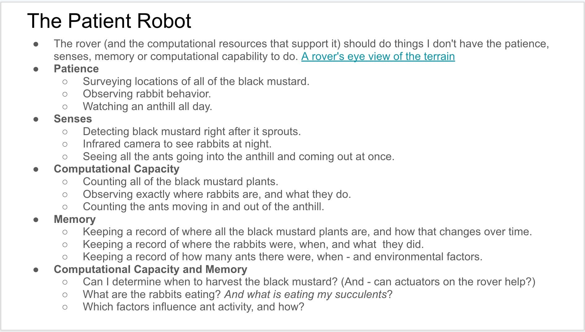
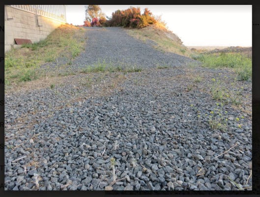
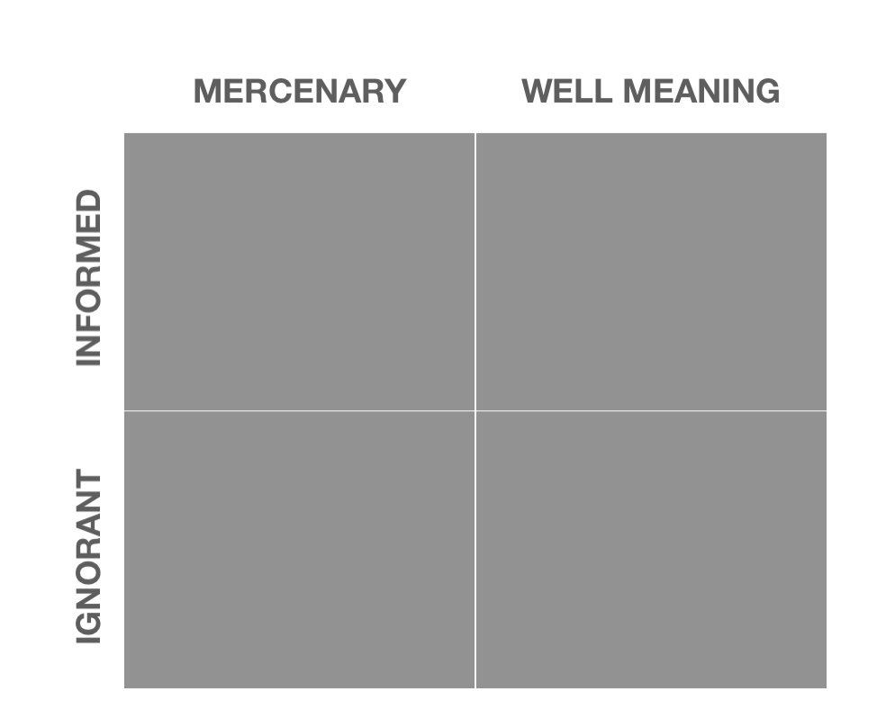
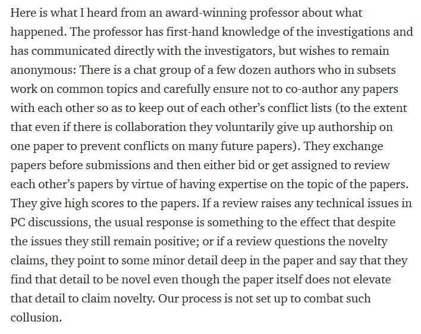

A to-be-automated roundup of what the Yak Collective was up to this week. Yaks — [jump on the server](https://discord.com/channels/692111190851059762/725542427229945877) to join in. If you’re not yet a member, consider joining [here](../join.md).

## @now
[\#Soapbox](https://discord.com/channels/692111190851059762/829810073194201128/855150520355389450). “It is now obvious that the concept of ‘project exhaust’ is central to everything we do here. It is not just fuel for marketing/PR on the website, newsletter, etc, but it is also the input for automation processes. Everybody here is here not only because we all kinda hate being managed, but because we *hate managing* as well. I barely have patience for project managing my solo activities, let alone other people in teams. \[…\] What are the principles of generating ‘smart exhaust’? A simple example is — every conference tool (Google Meet, Zoom) has its native chat stream, but if we adopt the convention of never using those and *only* using Discord as the sidechannel, it’s a little bit of a burden, but a lot easier on the management. We need to generalize this into a set of ‘smart exhaust design principles’ across everything we do. Create data to kill the need for human management.”

[\#Quantum Computing](https://discord.com/channels/692111190851059762/855077891347054652/855078058617077780). “Would anyone be interested in a project or study group on quantum computing? I don’t have a specific direction in mind, but with tools like [Qiskit](https://qiskit.org/) it looks not so hard to play around and do something interesting.”

[\#New Old Home and Country](https://discord.com/channels/692111190851059762/709753766076874774) “Making a call for interesting case studies in the emergent roles & projects spun up or faltered during the course of the pandemic. This would begin as a slide presentation just like last year’s [The New Old Home](../projects/New%20Old%20Home.md) and could go for there to multimedia formats. DM Scott Garlinger or email him at <scottgarlinger@gmail.com> for info for next steps.”

[\#General Discussion](https://discord.com/channels/692111190851059762/725542427229945877/855871466184638495) “Anyone interested in a decentralized finance study group? thinking about starting one up” / “Also, anyone interested in regular weekly coworking sessions?”

[\#Online Governance Studies](https://discord.com/channels/692111190851059762/709454740614021121). “Are y’all familiar with this? Transduction, different sensemaking worlds, and deathmarch projects… [The Wetware Crisis: the Thermocline of Truth: Bruce F. Webster](https://brucefwebster.com/2008/04/15/the-wetware-crisis-the-themocline-of-truth/). I associate it with (1) transduction in systems/cybernetics (2) my concept of [‘worlds’ of sensemaking](https://www.linkedin.com/posts/antlerboy_complexity-society-weltanschauung-activity-6734737917031399424-7glc) (3) my [‘doomed to succeed’ death march projects](https://www.linkedin.com/feed/update/urn:li:activity:6770242474721075201/). Y’all will have different associations, and/but this seem worthy of a place in the reference library”

> My patience for project management level of procedural meta thinking is at a lifetime low… just wanna fingerspiutzengefuhl my way through shit in a well-appointed environment that magically translates vague intentions into quality output with nothing in between
> 
> — [Venkatesh Rao • @vgr • 6:08 PM • Jun 17, 2021](https://x.com/vgr/status/1405588247556739076)

## [\#yak rover updates](../study%20groups/yak%20robotics%20garage.md)
[Weekly work call notes](https://roamresearch.com/#/app/ArtOfGig/page/dEHRA-jcd) | [Go and See Build Snapshot 2021-06-13](https://docs.google.com/presentation/d/1ug3vkDoDGSGTB2PZ0etH7OPhEZ1wZaRuayvIovF6iW4/edit#slide=id.gdfc7ca8d1e_2_11)

**Go and See.** For this third rover iteration, researched use cases for an earth-based rover that are accessible to me without a lot of added overhead. Settled on the perspective of the rover being a field research unit that does things that I am curious about but don’t have the patience, senses, computational capacity, or memory to do; and prepared to discuss this and associated mission and technology related topics in the Yak Rover Meeting. Determine the fundamental operations that this rover iteration needs to be able to do, distill those down into capabilities that the technologies involved need to provide, and then begin research into what will provide them, with intent to be able to eventually generate a BOM and then proceed from there. This rover will will be performing much more complex operations in a much less constrained environment than my previous indoors kit robots, so I don’t expect this to be a fast process. Realizing that there are many potential uses for rovers in field research here on Earth beyond what I’ve seen in the existing literature. I definitely want to explore this further!

*Gravel is standardized size numbers.*

**Wonderful Wandering Growth.** build sunglasses. try to update sunglasses with IR blocker. need to obtain damaged surveillance camera. even if the camera does not expose an exposure-control tool, it seems to have some sort of auto-exposure mechanism built in.

**Stubborn.** Built a persistent configuration component for flight system. Wired it up so I can disable the impact sensor on-demand. Starting dreaming about some non-software improvements. Add a few more configuration options to fine tune movement. Maybe I’ll decide to rewire the rover. I created a PR (on GitHub) for my work on adding persistent configuration to Stubborn. Even though I’m working alone on this code I found it very satisfying to package up and explain a change even if I’m the only one to see it.

**Abio Flex Wanderer.** (1) Upgrade software tooling for the recently mounted OAK-1 camera. (2) Sketch out how to approach bidirectional communication OAK-1 / RPi, so alerts can be pushed. (3) Just keeping considering flexible skills modelling with Maier (this starts converging into tasks), as part of BOS. (1) OAK-1 upgrade requires long compilation times on RPi. First is to finish this! So Maier’s remote control can work with OAK. (2) code more on BOS. (3) hopefully find a way to easily experiment with OAK-1 to RPi message pushing. Not really a blocker, but I am trying to focus on code with Rust and Python. The OAK-1 to RPi seems it is going to need C++. Working around that may just burn time. Very glad with the feedback from this week talk on multi-compute builds. Challenging and maybe not always the right choice, but engaging intersection between multi-agent systems and real-time systems…

**Nature is Murder**. Modify the design of Accessory Before the Fact… battery turned out to be too big to fit the space I planned. Which in turn means my longest 20mm M3 bolt is too short 🤬. I think I need a proper full week-or-two long block of time to do nothing but rover. This piecemeal shit isn’t enough. The first 50% of the parts buying takes 90% of the time. The second 50% takes the other 90% of the time. It’s amazing how I always seem to have just a few more components to buy.

> We make progress, designing the real rover… this is like 6 hours of CAD work :D
> 
> — [Venkatesh Rao • @vgr • 5:40 AM • Jun 20, 2021](https://x.com/vgr/status/1406487021380521987)

## [\#take-gig-leave-gig](https://discord.com/channels/692111190851059762/692816049678057544/856164967811514399)
@gigayak list of outstanding gigs. details on the server

- Was asked to spread word about this position at the Exeter Ed Incubator — part of the prestigious University of Exeter. It’s a remote job, but you’ll need to based in the UK.
- I am looking for a product engineer to work on a new headphone project I am looking to get off the ground. essentially the idea is modular over ear headphones where if anyone any one part breaks then as part of a subscription you can get a replacement part without having to replace the whole thing.
- looking for a graphic designer who can take technical process and architecture diagrams and make them look attractive.
- Client is looking for a react-native front-end dev for a 2 week UI sprint towards launch.
- cool job alert: Linktree is hiring a Head of Creators and a friend is leading the recruiting for the role. who’s the right person for the job?
- came across this 6 week research project for a food business thought someone here might be interested.
- Urban tech startup is looking for a contract mobile developer, for a small project, to get an app on the app stores (it’s a single-task app for sensor installers, with no commercial activity on the app)
- Justice tech startup is hiring a Product Designer!
- A friend of mine is looking for a web designer to help launch a web page for a start-up he’s working with.
- Looking for a tech lead/collaborator my new startup! *(I’ve coded a good chunk in MERN + GraphQL, but everything is flexible / fine to throw away / plan to transition to Postgres.)* DM for details

## [\#yaks-at-work](https://discord.com/channels/692111190851059762/723191355991654422)
- [A grid for better customer / citizen led transformation](https://antlerboy.medium.com/a-grid-for-better-customer-citizen-led-transformation-fe3fad5f9c21)
- [Negative capability: how to embrace intellectual uncertainty](https://nesslabs.com/negative-capability)
- [Should we really focus on one thing at a time?](https://nesslabs.com/should-we-really-focus-on-one-thing-at-a-time)
- [The Clockless Clock](https://ribbonfarmstudio.substack.com/p/the-clockless-clock)
- [After Westphalia](https://ribbonfarmstudio.substack.com/p/after-westphalia)
- [Welcome to Ribbonfarm Studio](https://studio.ribbonfarm.com/p/welcome-to-ribbonfarm-studio)
- [Perpetuated Beta](https://studio.ribbonfarm.com/p/perpetuated-beta)
- [The Ultimate Guide & Reasons To Take A Sabbatical](https://think-boundless.com/sabbaticals/)
- [Communal computing, part 1](https://chrizbot.medium.com/communal-computing-part-1-f871c6bc5257?source=rss-ba6349c9c628------2)
- [Transduction — leading transformation — Issue \#2](https://antlerboy.medium.com/transduction-leading-transformation-issue-2-92882b9327dd?source=rss-97852f5a56ae------2)
- [Links for June, 2021](https://bens.substack.com/p/links-for-june-2021)

## \#links shared
- [Open-Source Quantum Development](https://qiskit.org/)
- [Make a personal changelog](https://brianlovin.com/writing/make-a-personal-changelog)
- [Telomeres and aging — PubMed](https://pubmed.ncbi.nlm.nih.gov/18391173/)
- [Things To Try Before Quitting Your Job — Interintellect](https://interintellect.com/salon/things-to-try-before-quitting-your-job/)
- [“Great resignation” wave coming for companies](https://www.axios.com/resignations-companies-e279fcfc-c8e7-4955-8a9b-47562490ee55.html)
- [Descript community server](https://discord.gg/zxBqeVH4ae)
- [The History of Clarus the Dogcow – 512 Pixels](https://512pixels.net/dogcow/)
- [Yak Collective Governance](https://roamresearch.com/#/app/ArtOfGig/page/7dsDXf3u0)
- [How to use Python to execute a cURL command?](https://stackoverflow.com/questions/25491090/how-to-use-python-to-execute-a-curl-command)
- [Make a Widget to Display “Future Frontiers” Style Slideshow](https://github.com/The-Yak-Collective/yakcollective/issues/98)
- [Quantum computing for the determined](https://michaelnielsen.org/blog/quantum-computing-for-the-determined/)
- [Quantum Country](https://quantum.country/)
- [Shtetl-Optimized — Archive for the ‘Quantum’ Category](https://www.scottaaronson.com/blog/?cat=4)
- [Learn quantum computing: a field guide — IBM Quantum](https://quantum-computing.ibm.com/composer/docs/iqx/guide/)
- [Composer — IBM Quantum](https://quantum-computing.ibm.com/composer/files/new)
- [Can a $110 Million Helmet Unlock the Secrets of the Mind?](https://www.bloomberg.com/news/features/2021-06-16/braintree-founder-s-helmet-size-hospital-aims-to-mine-mind-data)
- [Animation Obsessive](https://animationobsessive.substack.com/)
- [A Swim in a Pond in the Rain: In Which Four Russians Give a Master Class on Writing, Reading, and Life](https://www.amazon.com/dp/1984856022)
- [Publications accepting submissions — Roam](https://roamresearch.com/#/app/ArtOfGig/page/Rgg1_RNPX)
- [Short Stories — With Special Guest Instructor Mary Robinette Kowal — Youtube](https://www.youtube.com/watch?v=blehVIDyuXk)
- [Company Starts Shipping Its $50,000 Mind-Reading Helmet — Futurism](https://futurism.com/neoscope/company-shipping-mind-reading-helmet)
- [inspectAR PCB Tools](https://apps.apple.com/fi/app/inspectar-pcb-tools/id1478936899)
- [GitHub Codespaces: Your instant dev environment](https://github.com/features/codespaces)
- [Gitpod — Always Ready-to-Code — Youtube](https://www.youtube.com/watch?v=bFZMKpDV3GQ)
- [Intel made $2bn+ takeover offer for RISC-V chip darling SiFive](https://www.theregister.com/2021/06/10/intel_sifive_takeover_offer/)
- [Boston Dynamics — Concepts — Spot API](https://dev.bostondynamics.com/docs/concepts/readme)
- [NASA’s Dragonfly Mission to Titan Will Look for Origins, Signs of Life](https://www.nasa.gov/press-release/nasas-dragonfly-will-fly-around-titan-looking-for-origins-signs-of-life)
- [Prototype Snowcat with Injection Molded Tracks! — Youtube](https://www.youtube.com/watch?v=xE1j1BXLct4)
- [Build your own integrated sensor platform with our devices.](https://www.sofarocean.com/products/devices)
- [Tiger: Spy in the Jungle (TV Mini Series 2008– ) — IMDb](https://www.imdb.com/title/tt1220619/)
- [Thousands of eggs abandoned after a drone scares off nesting birds](https://www.washingtonpost.com/science/2021/06/07/drone-crash-abandoned-eggs/)
- [RadicalxChange — Partial Common Ownership](https://www.radicalxchange.org/concepts/partial-common-ownership/)
- [The Alignment System — True Neutral](http://www.easydamus.com/trueneutral.html)
- [Reterritorialization — Part 2 — The Individual](https://medium.com/bleeding-into-reality/reterritorialization-part-2-the-individual-98174f08eac)
- [Mark Fisher — Capitalist Realism: Is there no alternative?](https://www.amazon.com/gp/product/B008H3WB36)
- [HewlettPackard/swarm-learning](https://github.com/HewlettPackard/swarm-learning)
- [Leverage (American TV series)](https://en.wikipedia.org/wiki/Leverage_(American_TV_series))
- [How I Became the Honest Broker](https://tedgioia.substack.com/p/how-i-became-the-honest-broker)
- [Nakatomi Space — Bldgblog](https://www.bldgblog.com/2010/01/nakatomi-space/)
- [2x2 maker](https://apps.apple.com/fr/app/2x2-maker/id1572189449?l=en)
- [Flowing Markdown reference links](https://leancrew.com/all-this/2021/05/flowing-markdown-reference-links/)

> Basically, every platform says they want to make coding “simple”. But actually getting things to *be* simple is about making tricky choices & navigating difficult trade-offs. Here’s how we made @glitch massively easier for every user in our community.
> 
> <https://blog.glitch.com/post/what-kind-of-simple>
> 
> — [Anil Dash 💉💉 • @anildash • 8:47 PM • Jun 15, 2021](https://x.com/anildash/status/1404903318787403779)

> I’ve gone down a rabbit hole of reading about the life of Yellowstone wolf 21, who seems to have been the wolf equivalent of the Buddha crossed with Batman. In his entire life he never lost a fight & never killed a defeated enemy. What a legend.
> 
> 
> 
> — [Zack Stentz • @MuseZack • 4:24 AM • Jun 14, 2021](https://x.com/MuseZack/status/1404293557087707137)

> Dan Harmon on writer’s block
> 
> 
> 
> <https://news.ycombinator.com/item?id=23092657>
> 
> — [Rob Henderson • @robkhenderson • 10:21 PM • Jun 17, 2021](https://x.com/robkhenderson/status/1405651723222388739)

> Really happy to launch my first podcast series, “Overmorrow’s Library”! Each episode in the library for “the day after tomorrow” presents a book that engages with the challenge of world-making, with the end-time of a world, or with the eternal unworldly.
> 
> <https://e-flux.com/announcements/306323/overmorrow-s-library/>
> 
> — [Federico Campagna • @FedCampagna • 3:53 PM • Nov 19, 2020](https://x.com/fedcampagna/status/1329452782638796802)

> Idle moments while elevating infected foot and using icepack; playing with a matrix to position various consultants, exorcists and shallow thinkers
> 
> 
> 
> — [ᗪᗩᐯᕮ SᑎOᗯᗪᕮᑎ 🏴󠁧󠁢󠁷󠁬󠁳󠁿 🇪🇺 • @snowded • 4:08 PM • Jun 19, 2021](https://x.com/snowded/status/1406282726945263622)

> An ancient giant ‘rhino’ was truly giant. “The 26-foot-long (8 meters) beast had a shoulder height of 16.4 feet (5 m), and it weighed as much as 24 tons (21.7 metric tons).” via @LiveScience
> 
> 
> 
> <https://www.realclearscience.com/articles/2021/06/18/ancient_giant_rhino_was_one_of_the_largest_mammals_to_walk_the_earth_781988.html>
> 
> — [RealClearScience • @RCScience • 1:30 PM • Jun 18, 2021](https://x.com/RCScience/status/1405880479673323520)

> “Those lucky enough to have become full professors — supposedly the light at the end of the tunnel for struggling junior scholars — spend just 17 per cent of their time on their own research.”
> 
> — [Paul Graham • @paulg • 5:03 PM • Jun 13, 2021](https://x.com/paulg/status/1404122183799029761)

> Reports of Organized Fraud in ACM/IEEE Conferences.
> 
> 
> 
> <https://medium.com/@tnvijayk/potential-organized-fraud-in-acm-ieee-computer-architecture-conferences-ccd61169370d>
> 
> — [Chase Saunders • @MaineFrameworks • 2:02 PM • Jun 9, 2020](https://x.com/maineframeworks/status/1270355624317063171)

> A bucranium coin minted in Lamponeia, Troad (Troas) in 6th century BC…
> 
> 
> 
> <https://en.wikipedia.org/wiki/Lamponeia>  
> <https://en.wikipedia.org/wiki/Troad>  
> <https://en.wikipedia.org/wiki/Bucranium>
> 
> — [oldeuropeanculture • @serbiaireland • 9:16 AM • Jun 20, 2021](https://x.com/serbiaireland/status/1406541346689761281)
