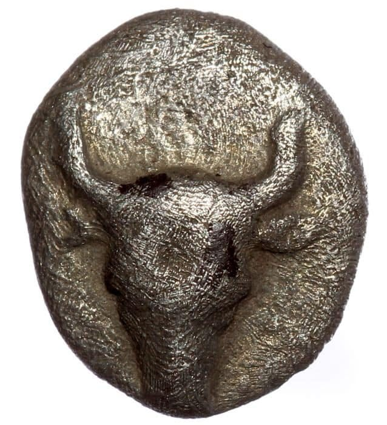
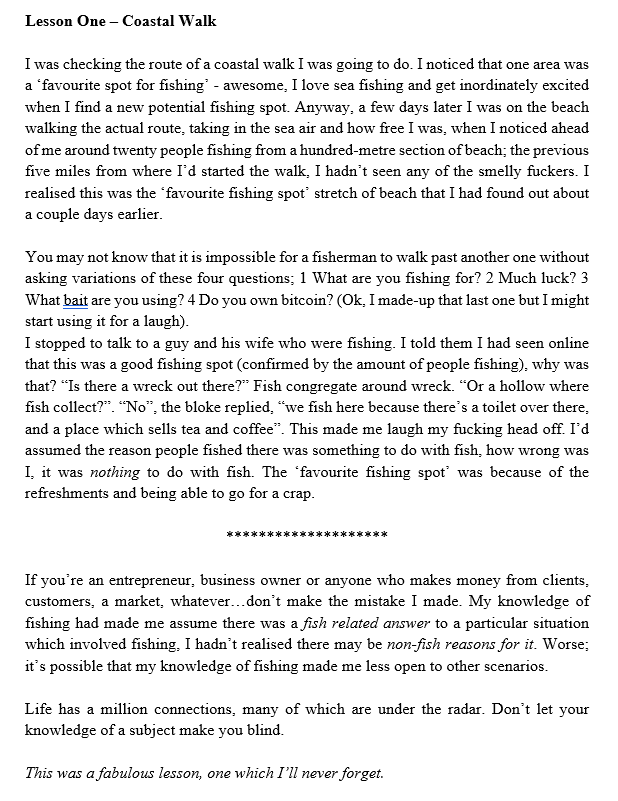
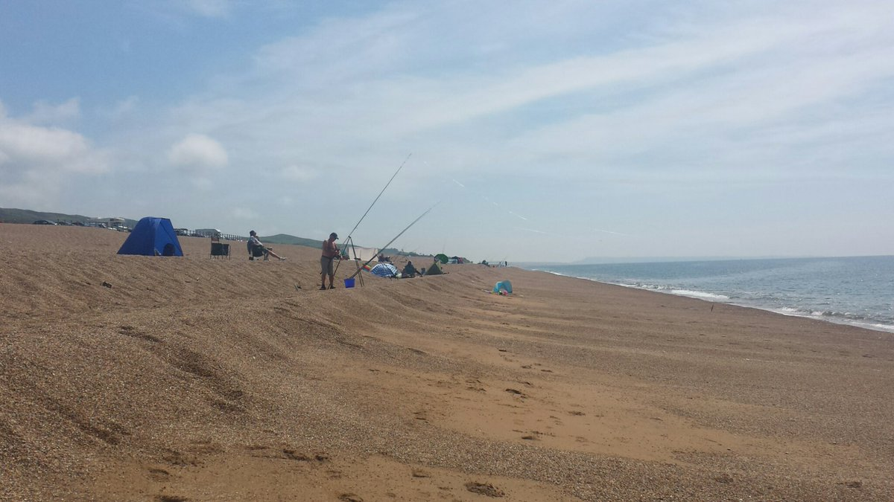
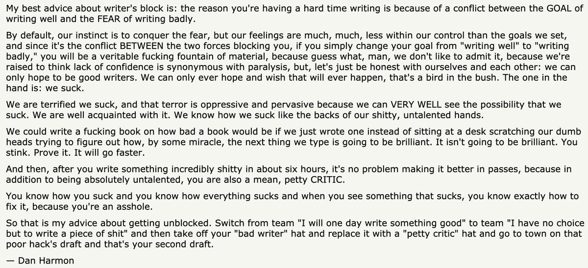

A mostly automated roundup of what the Yak Collective was up to this week. Yaks can [jump on the server](https://discord.com/channels/692111190851059762/725542427229945877) to join in. If you’re not yet a member, [consider joining](../join.md).

## channel activity
[Astonishing Stories.](https://discord.com/channels/692111190851059762/709768319108120636/857270681091702804) Fiction study group that occasionally publishes speculative fiction

[General Discussion.](https://discord.com/channels/692111190851059762/725542427229945877/858006265582190622) I’m looking to assemble a computing reading starter pack that contains, at most, 10 books. Assume, say, an undergrad level of familiarity with computer science and programming. What ten texts are up for inclusion? / Anyone interested in a decentralized finance study group? thinking about starting one up / Anyone interested in regular weekly coworking sessions?

[Infrastructure.](https://discord.com/channels/692111190851059762/704369362315772044/858029500901097533) how hard would it be to write the readingadd url list to a spreadsheet? reflecting on the governance chat exercise we just did, starting to summarize/tag a year’s worth of readings to make a summary whitepaper, it strikes me that piping link shares into a spreadsheet creates a very useful starting point in general, for many accumulating value conversations

[New Old Home and Country.](https://discord.com/channels/692111190851059762/709753766076874774) Making a call for interesting case studies in the emergent roles & projects spun up or faltered during the course of the pandemic. This would begin as a slide presentation just like last year’s [The New Old Home](../projects/New%20Old%20Home.md) and could go for there to multimedia formats.

[Online Governance Studies.](https://discord.com/channels/692111190851059762/709454740614021121) Today‘s coworking session on the 6-pager. Agenda: 10 minutes reading, 10 minutes comments, 40 minutes working on the spreadsheet together (should be obvious what we‘re trying to do from the spreadsheet, but I‘ll provide some direction). But just for fun, we’ll also do a very quick reading/discussion too of a very relevant article, as we attempt to do this… [Metacrap: Putting the torch to seven straw-men of the meta-utopia — Cory Doctorow](https://people.well.com/user/doctorow/metacrap.htm)

[Philosophy.](https://discord.com/channels/692111190851059762/702921068834324710/857969644948946955) we are currently on hiatus; I’ll have a time confirmed this week for the beginning of the next which will be early July

[Quantum Computing](https://discord.com/channels/692111190851059762/855077891347054652/855078058617077780). Would anyone be interested in a project or study group on quantum computing? I don’t have a specific direction in mind, but with tools like Qiskit [https://qiskit.org/](https://qiskit.org/) it looks not so hard to play around and do something interesting.

[Yakfit.](https://discord.com/channels/692111190851059762/809318532990500865/857271503175548970) Exploring wearables and fitness goals for yaks.

### yak rover updates
[This week‘s meeting notes.](https://roamresearch.com/#/app/ArtOfGig/page/gh_Aa0Thx)

**Nature is Murder.** Got started on CAD model of the actual final design, ordered a bunch more goodies. Boot up the BBBlue and get to led blink on it. CAD is an REPL even though it doesn’t look like it

**Wonderful Wandering Growth.** debugged video source duplication (for streaming, dual access to images) and googledrive and twitter integrations. wrote some underlying code for twitter usability. finish tweepy based twitter integration. using tools/libraries with version 0.X is “fun”

**Abio Flex Wanderer.** Tentative coding on BOS to cover goal modeling and planning in the bot. The context is for the bot to “discover” what to do when it cannot progress (e.g. never walked up stairs, how to). Continue on BOS tentatives, and complete what I could not this week on the OAK-1 camera. Remote access to the bot is down, and I lost my opportunities this week to deal with the OAK-1 configuration. A discussion with Maier on my work compared my approach to SLAM (the now famous problem definition). In fact this work could be seen as some form of SLAM for concepts/knowledge. Tentatively calling it CLAM.

> Hehe triple-hybrid test assembly: CAD printout, pen lines on paper, some actual components. This could be an art form.
> 
> — [Venkatesh Rao ∙ @vgr ∙ 8:50 PM ∙ Jun 20, 2021](https://x.com/vgr/status/1406716207156252672)

### take-gig-leave-gig
Current gigs. [Details on the server.](https://discord.com/channels/692111190851059762/692816049678057544/856164967811514399)

> Was asked to spread word about this position at the Exeter Ed Incubator — part of the prestigious University of Exeter. It’s a remote job, but you’ll need to based in the UK.

> I am looking for a product engineer to work on a new headphone project I am looking to get off the ground. essentially the idea is modular over ear headphones where if anyone any one part breaks then as part of a subscription you can get a replacement part without having to replace the whole thing.

> looking for a graphic designer who can take technical process and architecture diagrams and make them look attractive.

> Client is looking for a react-native front-end dev for a 2 week UI sprint towards launch.

> cool job alert: Linktree is hiring a Head of Creators and a friend is leading the recruiting for the role. who’s the right person for the job?

> came across this 6 week research project for a food business thought someone here might be interested.

> Urban tech startup is looking for a contract mobile developer, for a small project, to get an app on the app stores (it’s a single-task app for sensor installers, with no commercial activity on the app)

> Justice tech startup is hiring a Product Designer!

### yaks at work
- [The Ultimate Guide & Reasons To Take A Sabbatical](https://think-boundless.com/sabbaticals/)
- [Communal computing, part 1. How do we build devices that are shared… | by Chris Butler | Medium](https://chrizbot.medium.com/communal-computing-part-1-f871c6bc5257)
- [Transduction — leading transformation — Issue \#2 | by Benjamin P. Taylor | Medium](https://antlerboy.medium.com/transduction-leading-transformation-issue-2-92882b9327dd)
- [Links for June, 2021 — What I’m Reading](https://bens.substack.com/p/links-for-june-2021)
- [Making sense of systems change and systems leadership | by Benjamin P. Taylor | Medium](https://antlerboy.medium.com/making-sense-of-systems-change-and-systems-leadership-d7637cdec91f)
- [Building a healthier internet with Jeremy Hurst, co-founder of Idenati — Ness Labs](https://nesslabs.com/idenati-featured-tool)
- [spring-summer-2020](http://subpixel.space/entries/ss20/)
- [What I learned from 100 intentional LinkedIn posts | by Benjamin P. Taylor | | Medium](https://antlerboy.medium.com/what-i-learned-from-100-intentional-linkedin-posts-fc77b5671dc1)
- [In world of infinite overlapping possibility and multiple, irreconcilable differences, what does \#education mean? | by Benjamin P. Taylor | Medium](https://antlerboy.medium.com/in-world-of-infinite-overlapping-possibility-and-multiple-irreconcilable-differences-what-does-d06de954822d)
- [An ode to slowness: the benefits of slowing down — Ness Labs](https://nesslabs.com/the-benefits-of-slowing-down)
- [Accidental Designs – 1 — Ribbonfarm Studio](https://studio.ribbonfarm.com/p/accidental-designs-1)

### links shared
- [Astonishing Stories: Weird is part of the job](../projects/astonishing%20stories/index.md)
- [Roam Research – A note taking tool for networked thought.](https://roamresearch.com/)
- [Yak Collective Calendar](https://calendar.google.com/calendar/u/0/embed?src=o995m43173bpslmhh49nmrp5i4@group.calendar.google.com)
- [Critical Business School](https://www.in-process.net/cbs/)
- [Playing with RISC-V \#shorts — YouTube](https://www.youtube.com/watch?v=-ktyWCC_kNI)
- [Qiskit Learn](https://qiskit.org/learn)
- [76: Comparative Analysis of Organizations – Charles Perrow – (1967) Talking About Organizations Podcast | Systems Community of Inquiry](https://stream.syscoi.com/2021/06/20/76-comparative-analysis-of-organizations-charles-perrow-1967-talking-about-organizations-podcast/)
- [Refactoring](https://martinfowler.com/books/refactoring.html)
- [Ideas That Created the Future | The MIT Press](https://mitpress.mit.edu/books/ideas-created-future)
- [Concepts of Programming Languages — Amazon.co.uk](https://www.amazon.co.uk/Concepts-Programming-Languages-Robert-Sebesta/dp/013394302X)
- [fast.ai · Making neural nets uncool again](https://www.fast.ai/)
- [The History of Clarus the Dogcow – 512 Pixels](https://512pixels.net/dogcow/)
- [The Fart Limit \#shorts — YouTube](https://youtu.be/suwg7-y70FQ)
- [Facebook](https://www.facebook.com/photo?fbid=10159477677730477&set=pcb.10159477682155477)
- [Archaeologists recreated three common kinds of Paleolithic cave lighting | Ars Technica](https://arstechnica.com/science/2021/06/archaeologists-recreated-three-common-kinds-of-paleolithic-cave-lighting/)
- [Twitter Rallies Behind HBO Max Intern Blamed for Test Email Accidentally Sent to Subscribers](https://gizmodo.com/twitter-rallies-behind-hbo-max-intern-blamed-for-test-e-1847133274)
- [Apply for the CabinDAO Creator Residency Program — Mirror](https://creators.mirror.xyz/L7hCFAnV9-knieb8AM6z5J7ITgVv0ZUCAXPOB0Y5iWs)
- [Who wants to run a B2B SaaS startup?](https://www.jefftk.com/p/who-wants-to-run-a-b2b-saas-startup)
- [Diagram Transformation — The Sub Bench](https://www.thesubbench.com/portfolio/diagram-transformation)
- [Kurt Daradics ⚡ on LinkedIn: Head of Creators — Linktree](https://www.linkedin.com/posts/activity-6785602564038680576-U-gD)
- [Numina | Know Your Streets — Multimodal data for urban planners & facilities managers](https://numina.co/)
- [Paladin](https://www.joinpaladin.com/)
- [Product Designer. Remote | by Felicity Conrad | Paladin | Medium](https://medium.com/join-paladin/product-designer-38ef3f693a96)
- [The Norwich Conference Network » WARRIOR, WALDGAENGER, ANARCH](https://web.archive.org/web/20170318071339/http://www.norwichconference.com/?p=386)
- [Eumeswil — Wikipedia](https://en.wikipedia.org/wiki/Eumeswil)
- [RUF — Chrome](https://chrome.google.com/webstore/detail/ruf/ahjankgnkfhcpemcahifhalkfapojekc)
- [Governance Chat 6-pager — Google](https://docs.google.com/spreadsheets/d/1pfP_39fHiIiv7pSKgYhsJwERyiIYx467_OhoqTd54O4/edit)
- [Qiskit](https://qiskit.org/)
- [Quantum computing for the determined | Michael Nielsen](https://michaelnielsen.org/blog/quantum-computing-for-the-determined/)
- [Quantum Country](https://quantum.country/)
- [Shtetl-Optimized » Quantum](https://www.scottaaronson.com/blog/?cat=4)
- [Learn quantum computing: a field guide — IBM Quantum](https://quantum-computing.ibm.com/composer/docs/iqx/guide/)
- [Composer — IBM Quantum](https://quantum-computing.ibm.com/composer/files/new)
- [Animation Obsessive](https://animationobsessive.substack.com/)
- [Travis McGee — Wikipedia](https://en.wikipedia.org/wiki/Travis_McGee)
- [Astonishing Stories](../projects/astonishing%20stories/index.md)
- [Adactio: Journal — Notified](https://adactio.com/journal/18235)
- [Company Starts Shipping Its $50,000 Mind-Reading Helmet](https://futurism.com/neoscope/company-shipping-mind-reading-helmet)
- [michael jantzen unveils five experimental greenhouses from 1972 to 1980](https://www.designboom.com/architecture/michael-jantzen-series-experimental-greenhouses-1972-1980-06-19-2021/)
- [Weekend Linkages: Regime of Signs | Root Simple](https://www.rootsimple.com/2021/06/weekend-linkages-regime-of-signs/)
- [inspectAR PCB Tools on the App Store](https://apps.apple.com/fi/app/inspectar-pcb-tools/id1478936899)
- [Slab — Knowledge Base & Wiki That Democratizes Knowledge](https://slab.com/)
- [Slab — Your Team’s Long Term Memory](https://yakrover.slab.com/register/ft154a1i/Os-Jv1BdDb_dn0nQqkaqTb0k)
- [Alison Gopnik on the different (and similar) ways robots and children learn — The Robot Brains Podcast | Podcast on Spotify](https://open.spotify.com/episode/5uwjlHk89wVcz861PS5cj6?si=rJQoEDvrQNufQf1IKwe5Lw&dl_branch=1)
- [Desoldering Header Pins — Collin’s Lab Notes \#adafruit \#collinslabnotes — YouTube](https://youtu.be/LTQsP5CPmRM)
- [Small 6V 1W Solar Panel — Silver : ID 3809 : $19.95 : Adafruit Industries, Unique & fun DIY electronics and kits](https://www.adafruit.com/product/3809)
- [Extending the RISC-V architecture with domain specific accelerators — Embedded.com](https://www.embedded.com/extending-the-risc-v-architecture-with-domain-specific-accelerators/)
- [Acoustic simultaneous localization and mapping (A-SLAM) of a moving microphone array and its surrounding speakers | IEEE Conference Publication | IEEE Xplore](https://ieeexplore.ieee.org/document/7471626)
- [To build in public or not… that’s the question, eh? | by Kanika Tibrewala | Jun, 2021 | UX Collective](https://uxdesign.cc/to-build-in-public-or-not-thats-the-question-eh-6f15e4b205d4)
- [Alison Gopnik The Gardener and the Carpenter](http://alisongopnik.com/TheGardenerAndTheCarpenter.htm)
- [Buttondown’s API schema](https://api.buttondown.email/v1/schema)
- [Buttondown Integrations | Connect Your Apps with Zapier](https://zapier.com/apps/buttondown/integrations)
- [On Rover Languages · Discussion \#3 · rhettg/stubborn · GitHub](https://github.com/rhettg/stubborn/discussions/3)
- [Embedded EcoSystem for Rovers — Beyond Arduinos — to edit — العروض التقديمية من Google](https://docs.google.com/presentation/d/16Q_pMCctczQjv9ESqzCQ7boQaOvyXbMJ7vnTFD5EBOQ/edit)
- [Yak Rover Weekly Standup](https://docs.google.com/forms/d/e/1FAIpQLSfl01O61dgzQ6qG0VXbvC9daLhFNnNLaTwezRRUTm-mxh_yLw/viewform)
- [Record a video meeting — Google Meet Help](https://support.google.com/meet/answer/9308681?p=record_meeting&hl=en&visit_id=637599370714277609-1330697880&rd=1)
- [Fomu | Crowd Supply](https://www.crowdsupply.com/sutajio-kosagi/fomu)
- [Amazon SageMaker Neo](https://aws.amazon.com/sagemaker/neo/)
- [Apache TVM](https://tvm.apache.org/)
- [GitHub — abcminiuser/avr-tutorials: LaTeX typeset versions of my popular AVR Tutorials.](https://github.com/abcminiuser/avr-tutorials)
- [Motionographer Hold me, I’m scared: Your guide to navigating the hold system](https://motionographer.com/2019/03/11/hold-me-im-scared-your-guide-to-navigating-the-hold-system/)
- [FreeRTOS — Real-time operating system for microcontrollers — AWS](https://aws.amazon.com/freertos/)
- [The µLab Kiwi Aims to Simplify FPGA Programming, Offers a Quick-Start Smart Project Generator — Hackster.io](https://www.hackster.io/news/the-lab-kiwi-aims-to-simplify-fpga-programming-offers-a-quick-start-smart-project-generator-37e0732a252c)
- [OrangeCrab: A Formidable Feature-Packed FPGA Feather — Hackster.io](https://www.hackster.io/news/orangecrab-a-formidable-feature-packed-fpga-feather-04fd6c99eb0f)
- [Starlink review: dreams, not reality — The Verge](https://www.theverge.com/22435030/starlink-satellite-internet-spacex-review)
- [Revealed: why animals’ pupils come in different shapes and sizes](https://theconversation.com/amp/revealed-why-animals-pupils-come-in-different-shapes-and-sizes-45796)
- [Revealed: why animals’ pupils come in different shapes and sizes](https://t.co/EySLzmWvqp)
- [Analog electronic design without the trial and horror – Bits&Chips](https://bits-chips.nl/artikel/analog-electronic-design-without-the-trial-and-horror/)
- [Search for Life: NASA JPL Explores Martian-Like Caves — YouTube](https://youtu.be/qTW-dbZr4U8)
- [What is the difference between a fast computing system and a real-time computing system? — Quora](https://www.quora.com/What-is-the-difference-between-a-fast-computing-system-and-a-real-time-computing-system)
- [Hyundai x Boston Dynamics | As mobility evolves so does humanity — YouTube](https://youtu.be/O2_NEy0iDck)
- [Modern Microprocessors — A 90-Minute Guide!](http://www.lighterra.com/papers/modernmicroprocessors/)
- [Unitree — Go1](https://www.unitree.com/products/go1/)
- [This $2,700 robot dog will carry a single bottle of water for you — The Verge](https://www.theverge.com/2021/6/10/22527413/tiny-robot-dog-unitree-robotics-go1)
- [Unitree A1 Quadruped Robot](https://www.trossenrobotics.com/a1-quadruped)
- [Thermocline — Wikipedia](https://en.wikipedia.org/wiki/Thermocline)
- [Reterritorialization — Part 2 — The Individual | by Accelerating Meltdown | Bleeding Into Reality | Medium](https://medium.com/bleeding-into-reality/reterritorialization-part-2-the-individual-98174f08eac)
- [The Alignment System — True Neutral](http://www.easydamus.com/trueneutral.html)
- [Partial Common Ownership — RadicalxChange](https://www.radicalxchange.org/concepts/partial-common-ownership/)
- [Stewardship of global collective behavior | PNAS](https://www.pnas.org/content/118/27/e2025764118)
- [11 strategies for keeping your coliving community clean — Supernuclear](https://supernuclear.substack.com/p/11-strategies-for-keeping-your-coliving)
- [The 9 types of people you find in coliving — Supernuclear](https://supernuclear.substack.com/p/the-9-types-of-people-you-find-in)
- [Group decision-making in coliving — Supernuclear](https://supernuclear.substack.com/p/group-decision-making-in-coliving)
- [The Time Machine — Wikipedia](https://en.wikipedia.org/wiki/The_Time_Machine)
- [GitHub — HewlettPackard/swarm-learning](https://github.com/HewlettPackard/swarm-learning)
- [Build and Fund the Open Web Together | Gitcoin](https://gitcoin.co/)
- [III. CBDCs: an opportunity for the monetary system](https://www.bis.org/publ/arpdf/ar2021e3.htm)
- [How Haier Works — Video Animation — YouTube](https://www.youtube.com/watch?v=AhdjLXdxnFc)
- [‘At first I thought, this is crazy’: the real-life plan to use novels to predict the next war | Life and style | The Guardian](https://www.theguardian.com/lifeandstyle/2021/jun/26/project-cassandra-plan-to-use-novels-to-predict-next-war)
- [Zira](https://zira.gg/)
- [/r/Productivity](https://discord.gg/productivity)
- [Yak Bot Project · GitHub](https://github.com/The-Yak-Collective/yakcollective/projects/1)
- [Blog – Wider.Team](https://wider.team/blog/feed/)
- [Phil Wolff – Wider.Team](https://wider.team/author/dijest/feed/)
- [Scripting News: Wednesday, June 23, 2021](http://scripting.com/2021/06/23.html)
- [Nakatomi Space – BLDGBLOG](https://www.bldgblog.com/2010/01/nakatomi-space/)
- [Yak trails 2021-06-20 | Project exhausts and Discord convos](https://buttondown.email/yakcollective/archive/yak-trails-2021-06-20-project-exhausts-and/)
- [Color Combinations — mymind](https://access.mymind.com/colors)
- [BSAG » Exporting references from Zotero to Tiddlywiki](https://www.rousette.org.uk/archives/exporting-references-from-zotero-to-tiddlywiki/)
- [Orger: plaintext reflection of your digital self | beepb00p](https://beepb00p.xyz/orger.html)
- [Notes to Self — Phil — This wiki now lives at https://youneedastereo.com/](https://youneedastereo.com/)
- [Using DevTools to Tweak Designs in the Browser | CSS-Tricks](https://css-tricks.com/using-devtools-tweak-designs-browser/)
- [Yak trails 2021-06-20 — Yak Talk](https://yakcollective.substack.com/p/yak-trails-2021-06-20)

> A bucranium coin minted in Lamponeia, Troad (Troas) in 6th century BC…
> 
> 
> 
> <https://en.wikipedia.org/wiki/Lamponeia>  
> <https://en.wikipedia.org/wiki/Troad>  
> <https://en.wikipedia.org/wiki/Bucranium>
> 
> — [oldeuropeanculture ∙ @serbiaireland ∙ 9:16 AM ∙ Jun 20, 2021](https://x.com/serbiaireland/status/1406541346689761281)

> My patience for project management level of procedural meta thinking is at a lifetime low… just wanna fingerspiutzengefuhl my way through shit in a well-appointed environment that magically translates vague intentions into quality output with nothing in between
> 
> — [Venkatesh Rao ∙ @vgr ∙ 6:08 PM ∙ Jun 17, 2021](https://x.com/vgr/status/1405588247556739076)

> Reports of Organized Fraud in ACM/IEEE Conferences.
> 
> 
> 
> <https://medium.com/@tnvijayk/potential-organized-fraud-in-acm-ieee-computer-architecture-conferences-ccd61169370d>
> 
> — [Chase Saunders ∙ @MaineFrameworks ∙ 2:02 PM ∙ Jun 9, 2020](https://x.com/maineframeworks/status/1270355624317063171)

> “Those lucky enough to have become full professors — supposedly the light at the end of the tunnel for struggling junior scholars — spend just 17 per cent of their time on their own research.”
> 
> <https://www.timeshighereducation.com/blog/if-you-love-research-academia-may-not-be-you>
> 
> — [Paul Graham ∙ @paulg ∙ 5:03 PM ∙ Jun 13, 2021](https://x.com/paulg/status/1404122183799029761)

> @paulg Academia is a “good spot for research” (as per the parable below)
> 
> > A popular fishing spot, but not because of the fish.
> > 
> > 
> > 
> > 
> > — [GuruAnaerobic ∙ @GuruAnaerobic ∙ 3:56 PM ∙ Jun 17, 2021](https://x.com/GuruAnaerobic/status/1405645522493480967)
> 
> — [Luca Dellanna ∙ @DellAnnaLuca ∙ 8:19 AM ∙ Jun 18, 2021](https://x.com/DellAnnaLuca/status/1405802323411181568)

> An ancient giant ‘rhino’ was truly giant. “The 26-foot-long (8 meters) beast had a shoulder height of 16.4 feet (5 m), and it weighed as much as 24 tons (21.7 metric tons).” via @LiveScience
> 
> 
> 
> <https://www.realclearscience.com/articles/2021/06/18/ancient_giant_rhino_was_one_of_the_largest_mammals_to_walk_the_earth_781988.html>
> 
> — [RealClearScience ∙ @RCScience ∙ 1:30 PM ∙ Jun 18, 2021](https://x.com/RCScience/status/1405880479673323520)

> 🧵: One like = one piece of advice from Wine Mom Sarah to the youths (Specific questions also welcome)
> 
> — [Sarah Constantin ∙ @s\_r\_constantin ∙ 9:20 PM ∙ Jun 16, 2021](https://x.com/s_r_constantin/status/1405274155218464769)

> Idle moments while elevating infected foot and using icepack; playing with a matrix to position various consultants, exorcists and shallow thinkers
> 
> 
> 
> — [ᗪᗩᐯᕮ SᑎOᗯᗪᕮᑎ 🏴󠁧󠁢󠁷󠁬󠁳󠁿 🇪🇺 ∙ @snowded ∙ 4:08 PM ∙ Jun 19, 2021](https://x.com/snowded/status/1406282726945263622)

> Pls share: *Calling Researchers!* We’re looking for a \#researcher to design the \#evaluation approach, data collection & analysis plan for our \#foodventure. 6 week project starting immediately. For more info & how to respond take a look over here 👇
> 
> <https://shiftdesign.org/careers/>
> 
> — [Shift ∙ @shift\_org ∙ 4:46 PM ∙ Apr 14, 2021](https://x.com/shift_org/status/1382374723447705600)

> We were blown away by the creativity and enthusiasms of \#IBMQuantumChallenge participants! Who knows what might happen if we devised a challenge to tackle an unsolved problem in the research field?
> 
> <https://research.ibm.com/blog/quantum-challenge-2021-results>
> 
> — [Junye Huang ∙ @HuangJunye ∙ 4:28 PM ∙ Jun 18, 2021](https://x.com/HuangJunye/status/1405925304074338304)

> Dan Harmon on writer’s block
> 
> 
> 
> <https://news.ycombinator.com/item?id=23092657>
> 
> — [Rob Henderson ∙ @robkhenderson ∙ 10:21 PM ∙ Jun 17, 2021](https://x.com/robkhenderson/status/1405651723222388739)

> Really happy to launch my first podcast series, “Overmorrow’s Library”! Each episode in the library for “the day after tomorrow” presents a book that engages with the challenge of world-making, with the end-time of a world, or with the eternal unworldly.
> 
> <https://e-flux.com/announcements/306323/overmorrow-s-library/>
> 
> — [Federico Campagna ∙ @FedCampagna ∙ 3:53 PM ∙ Nov 19, 2020](https://x.com/fedcampagna/status/1329452782638796802)

> wonder if there are no new genres of fiction because there is no longer a need for sublimation of beliefs through fiction. Whatever crazy/taboo thing you believe you would have better luck finding other people by starting a subreddit or a conspiracy theory
> 
> — [Sachin ∙ @SachinB91 ∙ 7:11 PM ∙ Jun 24, 2021](https://x.com/SachinB91/status/1408140834659352577)

> 1/ Just for fun, here’s a thread comparing retrofuturist art from the mid 20th century with the reality today!
> 
> 
> 
> <https://gizmodo.com/42-visions-for-tomorrow-from-the-golden-age-of-futurism-1683553063>  
> <https://www.pinterest.com/pin/475270566909183551/>
> 
> — [Noah Smith 🐇 ∙ @Noahpinion ∙ 4:12 PM ∙ Jun 20, 2021](https://x.com/Noahpinion/status/1406646116024602627)

> @meekaale @visakanv @michaelcurzi Alexander has a number of pieces in APL which allude to intergenerationality like Teenager’s Cottage. There is an emergent typology of dualfrontdoor homes serving the grannyflat + boomerangkids + airbnbsublet. I’d like to see this APL’d.
> 
> — [Phil Pawlett Jackson ∙ @ppawlettjackson ∙ 11:17 AM ∙ Jun 25, 2021](https://x.com/ppawlettjackson/status/1408383958983794694)

> Little thread on what’s one of the harder hands-on engineering things I’ve done in my life. A real test of dexterity and eyesight: crimping a wire to put in a connector. A JST PH connector to be precise. What’s crimping? Here is an expert tutorial
> 
> <https://iotexpert.com/jst-connector-crimping-insanity/>
> 
> — [Venkatesh Rao ∙ @vgr ∙ 11:56 PM ∙ Jun 18, 2021](https://x.com/vgr/status/1406038197008703491)

> Tencent officially launched the first complete self-developed multi-modal quadruped robot \#deeplearning \#machinelearning \#datascience \#artificialintelligence \#100DaysOfCode \#BlackTechTwitter \#Microsoft \#30Daysofcode \#Unity初心者 \#arkit \#unity3d \#innovation \#robot \#robotics \#ux
> 
> — [i\_king\_of\_ml ∙ @ikingofml1 ∙ 2:59 AM ∙ Mar 15, 2021](https://x.com/ikingofml1/status/1371295003448778755)

> When did cheap C-flavored microcontroller boards first appear? Was Arduino the first one? How much did an Arduino equivalent boards cost in the 90s and aughts? I remember an Atmel board that was around $300 in 2006.
> 
> — [Venkatesh Rao ∙ @vgr ∙ 1:55 AM ∙ Jun 10, 2021](https://x.com/vgr/status/1402806640768806912)

> Intel to Create RISC-V Development Platform with SiFive P550 Cores on 7nm in 2022
> 
> <https://www.anandtech.com/show/16780/intel-to-create-riscv-development-platform-with-sifive-p550-cores-on-7nm-in-2022>
> 
> — [AnandTech ∙ @anandtech ∙ 1:20 PM ∙ Jun 22, 2021](https://x.com/anandtech/status/1407327598452133888)

> The Modular Robotic Vehicle developed by NASA is well-suited for busy urban environments. The driver relies on control inputs being converted to electrical signals and transmitted by wire to the motors within the vehicle
> 
> <https://technology.nasa.gov/patent/MSC-TOPS-74>
> 
> video: <https://www.youtube.com/watch?v=eE0KwnDYYh8>
> 
> — [Massimo ∙ @Rainmaker1973 ∙ 6:00 AM ∙ Jun 25, 2021](https://x.com/rainmaker1973/status/1408303945089495042)

> @vgr @inaturalist Long story! Short story is knockoffs flooded the market:
> 
> <https://amazon.com/s?k=underwater+drones>
> 
> They got better very fast, and much cheaper. But underwater drones are now more accessible than ever, which was the goal!
> 
> — [David Lang ∙ @davidtlang ∙ 4:18 AM ∙ Jun 26, 2021](https://amazon.com/s?k=underwater+drones)

> \#roamans, what’s the currently preferred way of reading .epub ebooks, making notes and getting things into Roam on iOS (yes, very specific question 😁)? I’ve been using Marvin but the last update was three years ago and I’m looking for something better.
> 
> 
> 
> <https://apps.apple.com/us/app/marvin-3/id1086482858>
> 
> — [C𐃏rtex Futura 🚢 9/30 Atomic Essays ∙ @cortexfutura ∙ 8:03 AM ∙ Jun 25, 2021](https://x.com/cortexfutura/status/1408335044381392900)

> @cortexfutura Few years ago I used MarginNote for ePub with great success. I also know some \#roamans using it today. I haven’t used it for a while, but it advertises multiple format outputs.
> 
> 
> 
> <https://apps.apple.com/us/app/marginnote-3/id1348317163>
> 
> — [RoamHacker — exploring PKM and its future ∙ @roamhacker ∙ 8:09 AM ∙ Jun 25, 2021](https://x.com/roamhacker/status/1408336566267924480)

> @cortexfutura Currently using Apple’s Books and @readwiseio to transfer highlights and notes into Roam
> 
> 
> 
> <https://help.readwise.io/article/35-how-do-i-import-apple-books-highlights-from-my-iphoneipad>
> 
> — [Federico Gaggio ∙ @federicogg ∙ 8:31 AM ∙ Jun 25, 2021](https://x.com/federicogg/status/1408341972235046913)
