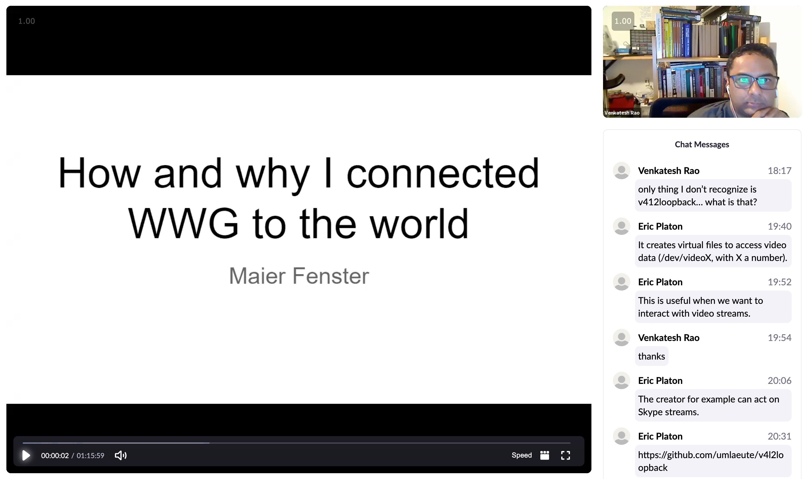
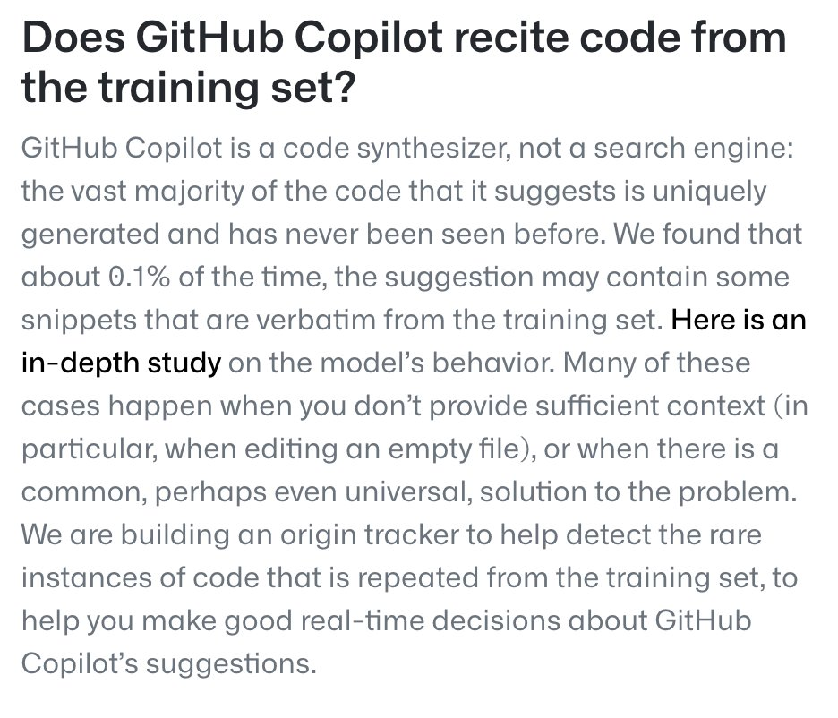
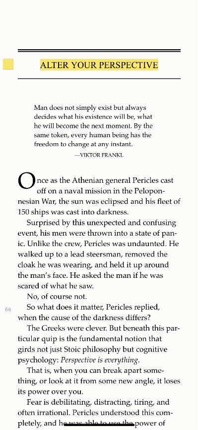

A mostly automated roundup of what the Yak Collective was up to this week. Yaks can [jump on the server](https://discord.com/channels/692111190851059762/725542427229945877) to join in. If you’re not yet a member, [consider joining](../join.md).

## Yak Rover updates
The Yak Rover project — a project to design a real Mars rover prototype that can actually be built and trialed on Earth, and evolved into a production model that could potentially even be launched to Mars. [Roam](https://roamresearch.com/#/app/ArtOfGig/page/QmE-vAzPn).

[This week‘s meeting notes — How and why I connected Wonderful Wandering Growth to the world.](https://ipatent-co-il.zoom.us/rec/play/gcUfRMdk4WyAaknoJPLk-6EPaLe3kmga8X3gw7ONq1VhB-U7e4hz6s5MCiJE0F-5nQpTPKg7ALibXKvc.leCDkfrg2wU5t7zn?continueMode=true&_x_zm_rtaid=rqxYEQxJQhauxFG20XRrsw.1625422801755.8e12920971fdfd876150a91042f89e34&_x_zm_rhtaid=418)

**Nature is Murder.**  Finally booted up the Beaglebone Blue and configured it and got to led blinking. Get to first servo control test on the board. Driver snafus under MacOS Catalina so having to use my wife’s Macbook on High Sierra. Realized that embedded software ecosystems evolve much more slowly than personal computing. Many things are years old. You’re living in slower time.

**Abio Flex Wanderer.**  Fix integration of OAK-1 on the bot. Now available on a /dev/videoX file, for working with Maier’s Twilio tools. BOS software only, focusing on what we now call “situation construction”. OAK-1 works with v4l2 now, but then we cannot leverage its compute and ML capabilities. For that I need to switch it to its specific XLink interface, usable from Python or C++. This may be a permanent limitation, according to the maker (not an issue, because v4l2 is just for video, whereas XLink allows new use (current understanding)). In the BOS software trials — aimed at a toolkit for autonomous rovers — I have plans for several complementary components. I have come to realize recently that “situation construction” can be quite useful to many, aside components for “driving” or ML for example. This could be a good opportunity for contribution. This is also complementary with recent discussions on multi-compute rover software.

**Infinity and Beyond.**  Print the head. Print the final parts. Play with Beyond SDK. Learn more about video editing. check overhangs while printing, otherwise a repeat print is needed. better to print without overhangs

**Stubborn.**  Completed a rewire of the rover. After a lot of precision soldering I have proper connectors and a much more reliable rover. I’m exploring swapping out my ground station Arduino with a raspberry pi. This would provide some interesting potential for connecting the rover up with the world. My latest Adafruit order brought me a little camera I want to play with as well. Seattle heat wave has impacted productivity. After rewiring the rover the motors seem to be operating with a lot less resistance. So much so that it runs faster and it had to be re-tuned. I had no idea how much it had been suffering.

## Channel activity
[Astonishing Stories.](https://discord.com/channels/692111190851059762/709768319108120636/857270681091702804) Fiction study group that occasionally publishes speculative fiction.

> based on the last infra call I’ve come up with an outline for project managing the editing process for stories. I think it would be nice to have a bot that sends notifications on this channel when a story moves from one stage to another, including details of who moved it. Idea would be that once a story is submitted, anyone can pick it up for editing/review/proofreading. And kind of like github it is up to the author to decide whether to accept the changes and move it towards publishing. Can join the infra call this week and explain further. ([⌗](https://discord.com/channels/692111190851059762/709768319108120636/858765400756846642))

[Bot Testbed](https://discord.com/channels/692111190851059762/860920952066277396/860922479588409354). Use this channel for your own bot tests.

> EXPERIMENT Created ⌗bot-testbed so that yaks can play with bot commands without feeling like they are cluttering up a channel. tk: master doc of yak bot tricks. Commands need to be a standalone post to fire.
> 
> @gigayak: `$unfurl` `$agendaadd` `$readingadd` `$links` `$lunks`.
> 
> @Yakyak aka Carl: `!suggestion` `!quickpoll` `!rm`.
> 
> [Carl docs](https://docs.carl.gg/)

[Coffee with a Yak.](https://discord.com/channels/692111190851059762/819285222394036284/848592401639145513) Setting up a mechanism for potential YC customers to have a non-committal talk with a YC member who works on a project. May lead to gigs for YC member or YC in general. [Roam](https://roamresearch.com/#/app/ArtOfGig/page/S-Qwt25Tc).

> Agenda:
> 
> - YakC to drive team formation and team gigs, herds, imagined as opt-in to a small team that wanted to offer similar services together. might be multiple herds on overlapping topics.
> - what’s our stack for the Yak Cafe service? profiles for yaks, for team conversations, for scheduling, for calls, for coordination messaging?
> - what’s the workflow/ux for Yak Cafe lifecycles? for yaks to profile themselves and leave, to define cafe groups for conversation and suspend/end the group, to join a group or leave a group, to initiate a conversation with a cafe group and get trickle notifications before and after.
> - what are blanket ToS for Yak Cafe for the yaks and for guests?

[General Discussion.](https://discord.com/channels/692111190851059762/725542427229945877/858835041747861564) A place to chat about anything and everything you might find interesting or relevant.

> re stretching the airport metaphor that reminds me of several sci fi stories like Station 11 or films where people get stranded in an airport in a post-apocalyptic or other scenario. There’s also the incredibly true story of all the planes on 9/11 that got routed to that obscure Canadian airport that used to get tons of transatlantic traffic in the pre jet era but then was a minor pitstop thereafter until 9/11 happened. There’s a play about the quiet heroism of the town to shelter, feed and take care of everyone during that crazy time. Cool story and well done. Perhaps [worth a gander](https://en.wikipedia.org/wiki/Come_from_Away) if you’re looking for inspiration to flesh out the metaphor a bit more ([⌗](https://discord.com/channels/692111190851059762/725542427229945877/858896504104943647))

> Any yaks involved in regional economic development work like [this link](https://b3kprosperity.org/) for Bakersfield? ([⌗](https://discord.com/channels/692111190851059762/725542427229945877/859170974602362920))

> Is there anything happening beyond white papers and press releases though? The ESG wave is taking a stronger hold over the earth observation / data analytics orgs a lot too. But I haven’t come across much beyond vague gesturing at climate change. ([⌗](https://discord.com/channels/692111190851059762/725542427229945877/860056964892590101))

> It’s real action at one major client company in my case. Sudden shift from talk to action in the last couple of years. ([⌗](https://discord.com/channels/692111190851059762/725542427229945877/860165083711012864))

[Infrastructure.](https://discord.com/channels/692111190851059762/704369362315772044/858029500901097533) Place to talk about the website, twitter, linkedin, facebook, and other bits and pieces of the yak collective shared infrastructure. [Roam](https://roamresearch.com/#/app/ArtOfGig/page/sXVqH6H4T). Standing calls Wednesdays 11am ET

> My top action items for today’s call… Yak trails
> 
> - should Yak trails experiment continue?
> - Want to offer to stand aside for someone else to take the reins for July.
> - It’s still pretty manual for now. In Substack will always be. Buttondown offers the automaticity we are looking for (maybe Mailchimp too).
> - Would be interested to continue if one of our API-understanding yaks wants to team up, now or in August?
> 
> ([⌗](https://discord.com/channels/692111190851059762/704369362315772044/859795428144971796))

> [Jamstack conference](https://docs.google.com/forms/d/e/1FAIpQLSeR5W4m9owqDBJEq2EuRUNXFTOeLCxFPUn0qbuCE15o4SWDFg/viewform?_hsmi=137332582&_hsenc=p2ANqtz--VZBWPx5mn5QZU0ikbZI1uhie4WBOW2o4OgX63OjjyYCZQCeCWLMjE4drN1ztih8tzAYHyNmOsTNOx6z2MIvRDd810zw) and call for short talks in case we’ve done anything innovative here like the knack integration etc ([⌗](https://discord.com/channels/692111190851059762/704369362315772044/859847859566280714))

> I think we’re in a nice position to really shore up backend systems over the rest of systems and do a serious membership drive/new activity kickoff effort in fall. we now have both infrastructure and project capabilities at a maturing level and we know how to do it all right… ([⌗](https://discord.com/channels/692111190851059762/704369362315772044/860218091567710240))

[New Old Home and Country.](https://discord.com/channels/692111190851059762/709753766076874774) Making a call for interesting case studies in the emergent roles & projects spun up or faltered during the course of the pandemic. This would begin as a slide presentation just like last year’s [The New Old Home](../projects/new%20old%20home.md) and could go for there to multimedia formats.

[Online Governance Studies.](https://discord.com/channels/692111190851059762/709454740614021121) A place for discussing ideas about governance of communities, collectives, networks, etc. We take a somewhat scholarly approach to discussions. Friday 9 AM PT governance chats here on the voice channel. [Roam](https://roamresearch.com/#/app/ArtOfGig/page/7dsDXf3u0)

> Today’s agenda: 1. Short reading (5+5min) 2. Review/summarize 2 old readings in spreadsheet (same as last week) (20 min) 3. NEW activity! Insight extraction (20 min) a) a “log line” (tldr) of the year’s readings, b) a “high concept” (the big insight that pulls the themes together. [Here’s the reading](http://www.scriptsecrets.net/tips/tip59.htm), it should only take like a minute or two.
> 
> Agenda:
> 
> - establish content licensing model for website content
> - establish financial governance model id
> - review status of meta-project list
> - discuss cost and benefits of use of email for coordinating YC and whether it is possible to do without email given our constraints, with some suitable reading.
> - discuss a mechanism for publicizing things that require no new infrastructure or project-like work, but just a clear statement of recommended behavior on a key point. Like a “best practice note” or “fatwa” or “supreme court opinion”. This might actually be a way to build up a proper Yak Handbook, as a set of case-law type opinions. We can discuss something like “PM should use emails” at the meeting, vote on it, and then 1 person is charged with writing the “majority opinion” and dissenters can choose to add “minority opinions”. Maybe in the announcements channel or a separate new policies channel.
> - ip policy for hackathon output

[Philosophy.](https://discord.com/channels/692111190851059762/702921068834324710/857969644948946955) we are currently on hiatus; I’ll have a time confirmed this week for the beginning of the next which will be early July

[Quantum Computing](https://discord.com/channels/692111190851059762/855077891347054652/855078058617077780). Would anyone be interested in a project or study group on quantum computing?

[Reimagine Healthcare](https://discord.com/channels/692111190851059762/781218832973824020/861341804158779402). Draft channel for a creative project to change the frame of how people think about healthcare in the US, especially as it pertains to gig workers and the emerging precariat. [Roam](https://roamresearch.com/#/app/ArtOfGig/page/5oz2LDnNd).

> Agenda:
> 
> - Schedule writing session on: understanding how healthcare needs for indie consultants like us and the billion people in free-agent-nation are different from other takes on healthcare
> - Schedule a writing window for: drafting an agenda (a manifesto straw man) that builds on prior art that yaks can use to advocate in other fora for services/products that meet our distinctive healthcare needs.
> - Schedule co-working time for: Fodder for pulling attention to the YakC Cafe in the form of social object creation. to drive consulting conversations and engagement on these subjects (healthcare design sprints, insurance product market research projects, corporate employee/contractor policy rethinks, etc.).

[Welcome Squad.](https://discord.com/channels/692111190851059762/809070388621082635/861348296362688532) Channel for discussing welcoming and onboarding process for new yaks.

> Agenda:
> 
> - complete v1 of new ⌗get-started-here welcome post
> - restart newbie onboarding calls in some form

[Yakfit.](https://discord.com/channels/692111190851059762/809318532990500865/857271503175548970) Exploring wearables and fitness goals for yaks.

> WHOOOOOOOP, I cancelled my Whoop membership today. Been flying blind for over a month and wasn’t missing it. Granted, I’m still tracking my workouts, but I’m not missing Whoop’s recovery features nearly as much as I’d thought. ([⌗](https://discord.com/channels/692111190851059762/809318532990500865/859125210350878721))

> Starting on [Zoe](https://joinzoe.com/) tomorrow. ([⌗](https://discord.com/channels/692111190851059762/809318532990500865/859896859237810237))

[Yak Marketing.](https://discord.com/channels/692111190851059762/756113566452678707/861348849478402058) Marketing for and by YC to create a distributed CMO function shared by several Yaks to elevate YakC marketing capability that fuels its growth [Roam](https://roamresearch.com/#/app/ArtOfGig/page/igJqfjUKe).

> Agenda:
> 
> - review past discussions for action items.
> - discuss how to launch, in view of latest results of launch.
> - where is teh GDPR issue to be discussed?
> - rethink yc-marketing goals in view of input from annual meeting.
> - how to coordinate the various players involved in launch, especially continuous launch.
> - how to build a calendar of expected marketing events, like launches.
> - discuss potentially presenting our capabilities by vertical sector for better marketing (healthcare, robotics) instead of/in addition to offering type (futures, analysis, trends…) or format (pop-up think tank, whitepaper…).
> - interactive serendipity engine for yc. We had a good governance chat today around serendipity in interactive social e-commerce and an idea came up — can we build something like an interactive serendipity engine for yc. Something timeboxed and curated like a periodic hackathon or “festival” or “farmers market” but for production/participation rather than consumption/shopping.
> - discuss whether to have yaks offer packetized work services a la fiverr, operating yak as a platform. So combining vertical, type, and format as a crisply defined, fixed-price, fixed-schedule, specific inputs-outputs product. ＄95 for a 20 minute coffee zoom to talk over a tactical execution problem in your healthcare technology digital transformation project.
> - review proposals for coffee with yak and decide how many yaks.
> - consider: custom URL and email address for shift to Buttondown for Yak trails newsletter.
> - consider: minimal viable testing for pushing eg tweets and links from Discord to Buttondown via API.

[Yak-Tweet.](https://discord.com/channels/692111190851059762/803272779558420551/861354234100711465) Tweets via Yak Collective Discord with `$yaktweet` publish here as well. Keep tweets on the short side, ⌗yakbot will be added. MadeYak Discord role only for now.

### Take-gig-leave-gig
Current gigs. [Details on the server.](https://discord.com/channels/692111190851059762/692816049678057544/856164967811514399)

> Was asked to spread word about this position at the Exeter Ed Incubator — part of the prestigious University of Exeter. It’s a remote job, but you’ll need to based in the UK.

> I am looking for a product engineer to work on a new headphone project I am looking to get off the ground. essentially the idea is modular over ear headphones where if anyone any one part breaks then as part of a subscription you can get a replacement part without having to replace the whole thing.

> looking for a graphic designer who can take technical process and architecture diagrams and make them look attractive.

> Client is looking for a react-native front-end dev for a 2 week UI sprint towards launch.

> cool job alert: Linktree is hiring a Head of Creators and a friend is leading the recruiting for the role. who’s the right person for the job?

> came across this 6 week research project for a food business thought someone here might be interested.

> Urban tech startup is looking for a contract mobile developer, for a small project, to get an app on the app stores (it’s a single-task app for sensor installers, with no commercial activity on the app)

> Justice tech startup is hiring a Product Designer!

> A friend of mine is looking for a web designer to help launch a web page for a start-up he’s working with. Scope of work is to help determine overall design style, illustrations, and UI/UX assets; bonus if it can be done in webflow, or even better — implemented end-to-end. The start-up is a fast growing billing infra B2B.

> Looking for a tech lead/collaborator my new startup! *(I’ve coded a good chunk in MERN + GraphQL, but everything is flexible / fine to throw away / plan to transition to Postgres.)* DM for details. Our vision is a world where citizens are empowered to hold large organizations accountable using class action litigation as the vehicle. We’re starting with ClaimClam, a fun consumer web app that aggregates & automates claim filings for existing class action settlements (think AirHelp/MainStreet/TurboTax for claim filing). There’s about ＄20 billion in ~＄5/10/20 checks that almost no one is filing claims for; ClaimClam redistributes corporate dollars and helps people collect on money owed to them.

> Software engineer contractors / freelancers in Amsterdam ! Backend Developer proficient in Nodejs+AWS, superstar if you have Typescript for the Backend and Serverless/Lambda (fully remote from anywhere in Europe) ! Tech lead — Java/Kotlin, Microservices, with Kubernetes ! Backend Java with Public cloud, Microservices, ! Android Developers, with Java and Kotlin ! iOS Developer with Swift Contact this recruiter — Leroy Watson on LinkedIn Find more freelance contracts in [Telegram](https://t.me/joinchat/UyFHixAf3uc3NGIy)

### Yaks at work
- [Accidental Designs — 1 — by Venkatesh Rao — Ribbonfarm Studio](https://studio.ribbonfarm.com/p/accidental-designs-1)
- [Ask me anything! — Benjamin P. Taylor — Medium](https://antlerboy.medium.com/ask-me-anything-c3f364f4c5d9)
- [The psychology of revenge bedtime procrastination — Ness Labs](https://nesslabs.com/revenge-bedtime-procrastination)
- [The power of names, part 1 — why RedQuadrant? | by Benjamin P. Taylor | Jun, 2021 | Medium](https://antlerboy.medium.com/the-power-of-names-part-1-why-redquadrant-a117158e9cf7)
- [The power of names, part two— @antlerboy | by Benjamin P. Taylor | Jul, 2021 | Medium](https://antlerboy.medium.com/the-power-of-names-part-two-antlerboy-babe5604064c)
- [Not-to-do list: a conscious way to break bad habits — Ness Labs](https://nesslabs.com/not-to-do-list)
- [IDoT Tempos: Cadence, Lifecycles, and the Long Now – Wider.Team](https://wider.team/2021/07/01/time/)
- [The REALIST Stack — by Venkatesh Rao — Ribbonfarm Studio](https://studio.ribbonfarm.com/p/the-realist-stack)

### Links shared
- [Astonishing Stories](../projects/astonishing%20stories/index.md)
- [Yak Collective Calendar](https://calendar.google.com/calendar/u/0/embed?src=o995m43173bpslmhh49nmrp5i4@group.calendar.google.com)
- [He Thought He Could Outfox the Gig Economy. He Was Wrong | WIRED](https://www.wired.com/story/gig-economy-uber-lyft-doordash-jeffrey-fang/)
- [Clutter | Moving & Storage](https://www.clutter.com/)
- [Refactoring](https://martinfowler.com/books/refactoring.html)
- [Ideas That Created the Future | The MIT Press](https://mitpress.mit.edu/books/ideas-created-future)
- [Concepts of Programming Languages — Robert Sebesta](https://www.amazon.co.uk/Concepts-Programming-Languages-Robert-Sebesta/dp/013394302X)
- [fast.ai · Making neural nets uncool again](https://www.fast.ai/)
- [Stephen Wolfram, A New Kind of Science – review by Cosma Shalizi, 2002 | Systems Community of Inquiry](https://www.google.com/amp/s/stream.syscoi.com/2021/05/03/stephen-wolfram-a-new-kind-of-science-review-by-cosma-shalizi-2002/amp/)
- [Come from Away — Wikipedia](https://en.wikipedia.org/wiki/Come_from_Away)
- [A common agenda for enduring regional prosperity — B3K Prosperity](https://b3kprosperity.org/)
- [The sustainability imperative imperative | Greenbiz](https://www.greenbiz.com/article/sustainability-imperative-imperative)
- [How environmental, social, and governance reporting grew up](https://www.strategy-business.com/article/How-environmental-social-and-governance-reporting-grew-up)
- [Difficult Predictions about the Future – The musings of another soul tired of this off-balance world.](https://cattykat4.wordpress.com/2021/07/02/difficult-predictions-about-the-future/)
- [Twitter Rallies Behind HBO Max Intern Blamed for Test Email Accidentally Sent to Subscribers](https://gizmodo.com/twitter-rallies-behind-hbo-max-intern-blamed-for-test-e-1847133274)
- [More New Art Borders Revealed — by Edith Zimmerman — Drawing Links](https://drawinglinks.substack.com/p/more-new-art-borders-revealed)
- [Zero Price, Zero Competition: How Marketization Fixes Anticompetitive Tying in Monetized Markets — Todd Davies, Zlatina Georgieva](https://papers.ssrn.com/sol3/papers.cfm?abstract_id=3868332)
- [Telegram: Join Group Chat](https://t.me/joinchat/UyFHixAf3uc3NGIy)
- [Governance Chat 6-pager — Google](https://docs.google.com/spreadsheets/d/1pfP_39fHiIiv7pSKgYhsJwERyiIYx467_OhoqTd54O4/edit)
- [onboarding\_robot/yak-links-to-markdown.sh at main · The-Yak-Collective/onboarding\_robot · GitHub](https://github.com/The-Yak-Collective/onboarding_robot/blob/main/utilities/yak-links-to-markdown.sh)
- [Screenwriting Tip Of The Day by William C. Martell](http://www.scriptsecrets.net/tips/tip59.htm)
- [Six Characters in Search of an Author — Wikipedia](https://en.wikipedia.org/wiki/Six_Characters_in_Search_of_an_Author)
- [Yak Bot Project · GitHub](https://github.com/The-Yak-Collective/yakcollective/projects/1)
- [Unwirer](https://craphound.com/unwirer/)
- [How Twitter can ruin a life: Isabel Fall’s complicated story — Vox](https://www.vox.com/the-highlight/22543858/isabel-fall-attack-helicopter)
- [Deep sea robots will let us find millions of shipwrecks, says man who discovered Titanic | Exploration | The Guardian](https://www.theguardian.com/science/2021/jul/04/deep-sea-robots-will-let-us-find-millions-of-shipwrecks-says-man-who-discovered-titanic)
- [In a Divided Country, Communal Living Redefines Togetherness | The New Yorker](https://www.newyorker.com/magazine/2021/07/05/in-a-divided-country-communal-living-redefines-togetherness)
- [Analog electronic design without the trial and horror – Bits&Chips](https://bits-chips.nl/artikel/analog-electronic-design-without-the-trial-and-horror/)
- [Search for Life: NASA JPL Explores Martian-Like Caves — YouTube](https://youtu.be/qTW-dbZr4U8)
- [What is the difference between a fast computing system and a real-time computing system? — Quora](https://www.quora.com/What-is-the-difference-between-a-fast-computing-system-and-a-real-time-computing-system)
- [Hyundai x Boston Dynamics | As mobility evolves so does humanity — YouTube](https://youtu.be/O2_NEy0iDck)
- [Modern Microprocessors — A 90-Minute Guide!](http://www.lighterra.com/papers/modernmicroprocessors/)
-  [Unitree — Go1](https://www.unitree.com/products/go1/)
- [This ＄2,700 robot dog will carry a single bottle of water for you — The Verge](https://www.theverge.com/2021/6/10/22527413/tiny-robot-dog-unitree-robotics-go1)
- [Unitree A1 Quadruped Robot](https://www.trossenrobotics.com/a1-quadruped)
- [beagleboard — Questions about the battery management circuit of Beaglebone Blue — Electrical Engineering Stack Exchange](https://electronics.stackexchange.com/questions/376491/questions-about-the-battery-management-circuit-of-beaglebone-blue)
- [Understanding, Using, and Selecting Hot-S — Maxim Integrated](https://www.maximintegrated.com/en/design/technical-documents/app-notes/2/2736.html)
- [Understanding Hot Swap: Example of Hot-Swap Circuit Design Process | Analog Devices](https://www.analog.com/en/analog-dialogue/articles/understanding-hot-swap.html)
- [Quadrupedalism](https://discord.gg/2cCeGtHy)
- [Implementing Robot Waypoint Navigation by David Anderson – DPRG Virtual Monthly Meeting, 6/12/2021 — YouTube](https://youtu.be/nekgAheau9w)
- [WWG and all is well in the world — Google](https://docs.google.com/presentation/d/1boLilPxI1S49fzfxvRyxnPn7x0CIuyk88z9-vLTaszY/edit)
- [Yak Rover Weekly Standup](https://docs.google.com/forms/d/e/1FAIpQLSfl01O61dgzQ6qG0VXbvC9daLhFNnNLaTwezRRUTm-mxh_yLw/viewform)
- [On Rover Languages · Discussion ⌗3 · rhettg/stubborn · GitHub](https://github.com/rhettg/stubborn/discussions/3)
- [Maier Fenster’s Personal Meeting Room — Zoom](https://ipatent-co-il.zoom.us/rec/share/UShq0raqBzucdm20ZWnzZdTG2I5VKeLhKJ-u6WvqHZ3JqC5A0qcJDOf0rAm2icqs.N52s6CzUKe7kMfOx)
- [Starlink review: dreams, not reality — The Verge](https://www.theverge.com/22435030/starlink-satellite-internet-spacex-review?scrolla=5eb6d68b7fedc32c19ef33b4)
- [Revealed: why animals’ pupils come in different shapes and sizes](https://theconversation.com/amp/revealed-why-animals-pupils-come-in-different-shapes-and-sizes-45796)
- [On-Board Decision Making in Space with Deep Neural Networks and RISC-V Vector Processors | Journal of Aerospace Information Systems](https://arc.aiaa.org/doi/full/10.2514/1.I010916?af=R)
- [Canonical Gives RISC-V a HiFive | Tom’s Hardware](https://www.tomshardware.com/news/canonical-ubuntu-risc-v)
- [The Summer of FPGAs — Xilinx | element14 | FPGA Group](https://www.element14.com/community/docs/DOC-96696/l/the-summer-of-fpgas-xilinx)
- [Dropbox — Video 30.6.2021, 13.00.16.mov — Simplify your life](https://www.dropbox.com/s/ozn2oj7ijrlvcja/Video%2030.6.2021%2C%2013.00.16.mov?dl=0)
- [LD-AIR LiDAR | 360° TOF Sensor For All Robotic Applications by LDROBOT — Kickstarter](https://www.kickstarter.com/projects/ldrobot/ld-air-lidar-360-tof-sensor-for-all-robotic-applications)
- [Search for Life: NASA JPL Explores Martian-Like Caves — YouTube](https://m.youtube.com/watch?v=qTW-dbZr4U8)
- [644/1284 Wide | Crowd Supply](https://www.crowdsupply.com/pandauino/wide)
- [ZeroBug Is a 3D-Printed Micro Servo Hexapod Powered by a Raspberry Pi and STM32 — Hackster.io](https://www.hackster.io/news/zerobug-is-a-3d-printed-micro-servo-hexapod-powered-by-a-raspberry-pi-and-stm32-5d9df8a806d1)
- [Buy a Raspberry Pi 400 Personal Computer Kit – Raspberry Pi](https://www.raspberrypi.org/products/raspberry-pi-400/)
- [MicroMod — A modular prototyping platform for interchanging microcontrollers — SparkFun Electronics](https://www.sparkfun.com/micromod)
- [Getting Started with MicroMod — learn.sparkfun.com](https://learn.sparkfun.com/tutorials/getting-started-with-micromod/all)
- [Gitpod — Always ready to code](https://www.gitpod.io/)
- [Scripting News: Monday, June 28, 2021](http://scripting.com/2021/06/28.html)
- [EECS Instructional Support Group Home Page](https://inst.eecs.berkeley.edu/)
- [11 strategies for keeping your coliving community clean — by Phil — Supernuclear](https://supernuclear.substack.com/p/11-strategies-for-keeping-your-coliving)
- [The 9 types of people you find in coliving — by Phil — Supernuclear](https://supernuclear.substack.com/p/the-9-types-of-people-you-find-in)
- [Group decision-making in coliving — by Phil — Supernuclear](https://supernuclear.substack.com/p/group-decision-making-in-coliving)
- [Spotify | An Emergent Organization — by Stowe Boyd — work futures](https://www.workfutures.io/p/spotify-an-emergent-organization)
- [Transcript: Ezra Klein Interviews James Suzman — The New York Times](https://www.nytimes.com/2021/06/29/podcasts/transcript-ezra-klein-interviews-james-suzman.html)
- [Disney Got Itself A ‘If You Own A Themepark…’ Carveout From Florida’s Blatantly Unconstitutional Social Media Moderation Bill | Techdirt](https://www.techdirt.com/articles/20210430/10004546712/disney-got-itself-if-you-own-themepark-carveout-floridas-blatantly-unconstitutional-social-media-moderation-bill.shtml)
- [How Our Team is Building Asynchronous Communication into our Workflows | by Nadia Tatlow | Medium](https://medium.com/@NadiaTatlow/how-our-team-is-building-asynchronous-communication-into-our-workflows-2b06e740be1)
- [Unlocking the Treasury. Over the next 12 months, we will see… | by Larry Sukernik | Medium](https://sukernik.medium.com/unlocking-the-treasury-483aeea01001)
- [Shifting the impossible to the inevitable](https://benjaminreinhardt.com/parpa)
- [A Spark of Hope: The Ongoing Lessons of the Zapatista Revolution 25 Years On | NACLA](https://nacla.org/news/2019/01/18/spark-hope-ongoing-lessons-zapatista-revolution-25-years)
- [Autonomous Administration of North and East Syria — Wikipedia](https://en.wikipedia.org/wiki/Autonomous_Administration_of_North_and_East_Syria)
- [Understanding Urbit — Urbit](https://urbit.org/understanding-urbit/)
- [Permaculture — Wikipedia](https://en.wikipedia.org/wiki/Permaculture)
- [Tech stack for decentralized cities — Mirror](https://creators.mirror.xyz/-lNPJRz2GLWIcsuMTZqklGNEWRrY7Nk0Y33Qn6Lw4q4)
- [Plague and renaissance — by Anand Giridharadas — The.Ink](https://the.ink/p/after-the-plague?token=eyJ1c2VyX2lkIjo4OTg1LCJwb3N0X2lkIjozNjk3MTM4OSwiXyI6IlEzbndiIiwiaWF0IjoxNjIyMzAxMjA1LCJleHAiOjE2MjIzMDQ4MDUsImlzcyI6InB1Yi03MDM3NCIsInN1YiI6InBvc3QtcmVhY3Rpb24ifQ.uBhfjSTVc2DKHYCPeLcTjB5UjdMHqMUFcOAgx8P-z1g)
- [Sociocracy — basic concepts and principles | Sociocracy For All](https://www.sociocracyforall.org/sociocracy/)
- [Our distributed company is a garden — by Tim Casasola — computers suck](https://sanctucompu.substack.com/p/distributed)
- [How To Be An Educated Layman | Sarah Constantin](https://srconstantin.github.io/2021/06/09/Educated-Layman.html)
- [The Wetware Crisis: the Thermocline of Truth : Bruce F. Webster](https://brucefwebster.com/2008/04/15/the-wetware-crisis-the-themocline-of-truth)
- [Partial Common Ownership — RadicalxChange](https://www.radicalxchange.org/concepts/partial-common-ownership/)
- [Stewardship of global collective behavior | PNAS](https://www.pnas.org/content/118/27/e2025764118)
- [Motionographer Hold me, I’m scared: Your guide to navigating the hold system](https://motionographer.com/2019/03/11/hold-me-im-scared-your-guide-to-navigating-the-hold-system/)
- [Ise Jingu and the Pyramid of Enabling Technologies — The Prepared](https://theprepared.org/features-feed/ise-jingu-and-the-pyramid-of-enabling-technologies)
- [III. CBDCs: an opportunity for the monetary system](https://www.bis.org/publ/arpdf/ar2021e3.htm)
- [How Haier Works — Video Animation — YouTube](https://www.youtube.com/watch?v=AhdjLXdxnFc)
- [‘At first I thought, this is crazy’: the real-life plan to use novels to predict the next war | Books | The Guardian](https://www.theguardian.com/lifeandstyle/2021/jun/26/project-cassandra-plan-to-use-novels-to-predict-next-war)
- [How organisations are changing.. The next “next” generation | by swardley | May, 2021 | Medium](https://swardley.medium.com/how-organisations-are-changing-cf80f3e2300)
- [Amazon.jobs](https://www.amazon.jobs/en-gb/principles)
- [GitHub Copilot · Your AI pair programmer](https://copilot.github.com/)
- [Can I Wear My Oura Ring at the Gym? – Oura Help](https://support.ouraring.com/hc/en-us/articles/360051199614-Can-I-Wear-My-Oura-Ring-at-the-Gym-)
- [All The Gear — Ridgeline issue 119](https://craigmod.com/ridgeline/119/)
- [Use Automatic Activity Detection – Oura Help](https://support.ouraring.com/hc/en-us/articles/360063022993-Use-Automatic-Activity-Detection)
- [ZOE — Understand how your body responds to food](https://joinzoe.com/)
- [The MASALA Study](https://www.masalastudy.org/)
- [Improve health, fitness, wellness through blood tests, doctors, nutrition — WellnessFX](https://wwws.wellnessfx.com/packages)
- [NutriSense: Unlock Your Body’s Data](https://www.nutrisense.io/)
- [Opinion | Exercise, and Accept Your ‘Inevitable Demise’ — The New York Times](https://www.nytimes.com/2021/06/24/opinion/sway-kara-swisher-alison-bechdel.html)
- [The Secret to Superhuman Strength — Alison Bechdel](https://bookshop.org/books/the-secret-to-superhuman-strength/9780544387652)
- [Carl-bot Documentation](https://docs.carl.gg/)
- [Winning the Internet | 2021-06-27](https://mailchi.mp/7edfc79cb263/winning-the-internet-2021-06-27)
- [EasyPoll | Discord Bots | Top.gg](https://top.gg/bot/437618149505105920)
- [Infomation/Polls — Carl-bot Documentation](https://docs.carl.gg/utilities/info-polls/)
- [Suggestions — Carl-bot Documentation](https://docs.carl.gg/utilities/suggestions/)
- [Logging — Carl-bot Documentation](https://docs.carl.gg/logging/logging/)
- [Jamstack Conf 2021: Call for Papers](https://docs.google.com/forms/d/e/1FAIpQLSeR5W4m9owqDBJEq2EuRUNXFTOeLCxFPUn0qbuCE15o4SWDFg/viewform?_hsmi=137332582&_hsenc=p2ANqtz--VZBWPx5mn5QZU0ikbZI1uhie4WBOW2o4OgX63OjjyYCZQCeCWLMjE4drN1ztih8tzAYHyNmOsTNOx6z2MIvRDd810zw)
- [Scripting News: Wednesday, June 30, 2021](http://scripting.com/2021/06/30.html)
- [I suck at regular expressions · Issue ⌗215 · scripting/Scripting-News · GitHub](https://github.com/scripting/Scripting-News/issues/215)
- [Knack](https://yak.knack.com/yaks)
- [Luma — Activate Your Community](https://lu.ma/)
- [Is there a way to have new users be automatically logged-in after they register? — Knack Knowledge Base](https://learn.knack.com/article/azyebz627h-is-there-a-way-to-have-new-users-be-automatically-logged-in-after-they-register)
- [Join the Yak Collective](https://optimistic-jennings-266cab.netlify.app/join/)
- [Imgur: The magic of the Internet](http://m.imgur.com/przSo7I)
- [What I’ve learned about data recently | Seldo.com](https://seldo.com/posts/what-i-ve-learned-about-data-recently)
- [Help a computer win the New Yorker Cartoon Caption Contest](https://mailchi.mp/pudding/caption-cartoons-1279998)
- [The standard for data onboarding | Flatfile](https://flatfile.com/)
- [The Technium: The Essential Workshop Tool Kit](https://kk.org/thetechnium/the-essential-workshop-tool-kit/)
- [Learning to Work with Fewer Pixels](http://www.macdrifter.com/2021/06/learning-to-work-with-fewer-pixels.html)
- [Yak trails 2021-06-27 — Yak Talk](https://yakcollective.substack.com/p/yak-trails-2021-06-27)
- [Yak trails 2021-06-27](https://buttondown.email/yakcollective/archive/yak-trails-2021-06-27/)
- [GitHub — The-Yak-Collective/menus: Bot to manage ](https://github.com/The-Yak-Collective/menus)

> I feel attacked.
> 
> <https://www.vice.com/en/article/bullshitting-sign-intelligence-psychology-lying/>
> 
> — [Scott Hanselman • @shanselman • 3:27 AM • Jun 29, 2021](https://x.com/shanselman/status/1409715241261277184)

> wonder if there are no new genres of fiction because there is no longer a need for sublimation of beliefs through fiction. Whatever crazy/taboo thing you believe you would have better luck finding other people by starting a subreddit or a conspiracy theory
> 
> — [Sachin • @SachinB91 • 7:11 PM • Jun 24, 2021](https://x.com/SachinB91/status/1408140834659352577)

> A few Wednesday morning thoughts on creative methodologies — in particular the use of fiction — in national security policy analysis.
> 
> — [Kathleen J. McInnis • @kjmcinnis1 • 11:14 AM • Jun 30, 2021](https://x.com/kjmcinnis1/status/1410195127948218368)

> @meekaale @visakanv @michaelcurzi Alexander has a number of pieces in APL which allude to intergenerationality like Teenager’s Cottage. There is an emergent typology of dualfrontdoor homes serving the grannyflat + boomerangkids + airbnbsublet. I’d like to see this APL’d.
> 
> — [Phil Pawlett Jackson • @ppawlettjackson • 11:17 AM • Jun 25, 2021](https://x.com/ppawlettjackson/status/1408383958983794694)

> The Modular Robotic Vehicle developed by NASA is well-suited for busy urban environments. The driver relies on control inputs being converted to electrical signals and transmitted by wire to the motors within the vehicle <https://technology.nasa.gov/patent/MSC-TOPS-74>
> 
> video: <https://www.youtube.com/watch?v=eE0KwnDYYh8>
> 
> — [Massimo • @Rainmaker1973 • 6:00 AM • Jun 25, 2021](https://x.com/rainmaker1973/status/1408303945089495042)

> @vgr @inaturalist Long story! Short story is knockoffs flooded the market: <https://amazon.com/s?k=underwater+drones>
> 
> They got better very fast, and much cheaper. But underwater drones are now more accessible than ever, which was the goal!
> 
> — [David Lang • @davidtlang • 4:18 AM • Jun 26, 2021](https://x.com/davidtlang/status/1408640829690765317)

> Off to an inauspicious start with the Beaglebone Blue. The network drivers won’t install on MacOS Catalina. Apparently the packages, HoRNDIS and EnergiaFTDIDrivers (no idea what they do… ELI5?) do shady shit at system level so Catalina sez no.
> 
> — [Venkatesh Rao • @vgr • 5:05 PM • Jun 28, 2021](https://x.com/vgr/status/1409558475999350786)

> github copilot has, by their own admission, been trained on mountains of gpl code, so i’m unclear on how it’s not a form of laundering open source code into commercial works. the handwave of “it usually doesn’t reproduce exact chunks” is not very satisfying
> 
> — [eevee • @eevee • 12:47 AM • Jun 30, 2021](https://x.com/eevee/status/1410037309848752128)

> Some thoughts about Github Copilot and copyright (I am not a lawyer). Copilot uses a version of GPT3 trained on GPL licensed code. GPL give everyone the right to copy and make derivatives. Derivatives inherit GPL. Copilot can sometimes memorize and repeat snippets of code.
> 
> 
> 
> — [Mark O. Riedl • @mark\_riedl • 2:13 PM • Jun 30, 2021](https://x.com/mark_riedl/status/1410240122776440836)

> I know this might sound controversial, but maybe extracting fossil fuels from the seafloor (or anywhere really) is a bad idea
> 
> — [Brian Kahn • @blkahn • 9:43 PM • Jul 2, 2021](https://x.com/blkahn/status/1411078040654860289)

> ⌗roamans, what’s the currently preferred way of reading .epub ebooks, making notes and getting things into Roam on iOS (yes, very specific question 😁)? I’ve been using Marvin but the last update was three years ago and I’m looking for something better.
> 
> 
> 
> <https://apps.apple.com/us/app/marvin-3/id1086482858>
> 
> — [C𐃏rtex Futura 🚢 9/30 Atomic Essays • @cortexfutura • 8:03 AM • Jun 25, 2021](https://x.com/cortexfutura/status/1408335044381392900)

> @cortexfutura Few years ago I used MarginNote for ePub with great success. I also know some ⌗roamans using it today. I haven’t used it for a while, but it advertises multiple format outputs.
> 
> 
> 
> <https://apps.apple.com/us/app/marginnote-3/id1348317163>
> 
> — [RoamHacker — exploring PKM and its future • @roamhacker • 8:09 AM • Jun 25, 2021](https://x.com/roamhacker/status/1408336566267924480)

> @cortexfutura Currently using Apple’s Books and @readwiseio to transfer highlights and notes into Roam
> 
> 
> 
> <https://help.readwise.io/article/35-how-do-i-import-apple-books-highlights-from-my-iphoneipad>
> 
> — [Federico Gaggio @federicogg 8:31 AM • Jun 25, 2021](https://x.com/federicogg/status/1408341972235046913)
