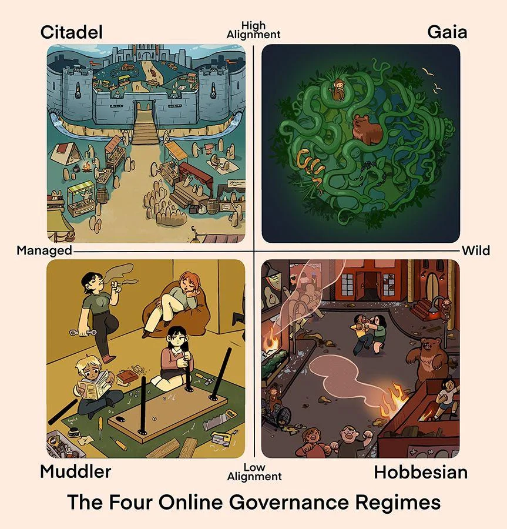

A couple of weeks ago, the Yak Collective published the **[Yak Online Governance Primer](../projects/online%20governance%20primer.md). It is one of our most ambitious collaborative projects to date.

The primer is based on about a year of weekly governance study group meetings on the Yak Collective Discord. It explores and synthesizes a curated set of 49 readings, and is intended as a resource for individuals, groups and organizations trying to develop a solid foundation of governance tools and practices in a virtual-first world.

**You can read the primer, and collect it[^1] as an NFT, [here](https://yakcollective.mirror.xyz/aJdO_SO3gw34cLtwBwNC2OD3s0YT3us9C-C2NNPQ_us).**

[^1]: While most NFTs are published as “1/1” single items via auctions, we used the [Mirror Editions](https://dev.mirror.xyz/AOoIsKPfZvf8LACKWp7gj_mg1ICCDOfPnVBOsDQoXo8) model to publish this. Instead of auctioning off a single copy of an item, it allows up to 555 individuals to collect the item at 3 levels: Legendary (5), Rare (50), and Common (500), depending on the amount. If you collect the NFT, you’ll be able to display it in various blockchain apps, and your wallet address will also show up on the Mirror page for the primer.

**Please share widely, tweet, post the images to social media, and so on.**  **We appreciate any and all signal boosting!**

If you need a PDF to forward or print for offline reading, you can find one [here](../assets/180d8e4e90c3ac50b69eda1b2ca24694.pdf).

The primer was authored by **Sachin Benny, Venkatesh Rao, Grigori Milov, and Bryan King**, with **Jenna Dixon** and **Nathan Acks** providing editing and production support. **Grace Witherell** supplied some beautiful illustrations. Other regular members of the the governance chat contributed feedback and comments throughout. NFT proceeds will be shared among the contributors, with a portion going to the Yak Collective for future projects.[^2]

[^2]: The primer is published using what is known as a split contract on the Ethereum blockchain, which allows funds to be automatically distributed to multiple accounts. We’ve set things up so about 75% goes to contributors, and 25% to the Yak Collective. We’ve taken our cue from the indirect-cost support model used in government-funded university research.

If you are interested in having one of us drop by one of your organization’s meetings to talk about the primer and discuss the ideas, feel free to reach out to any of us. You can tweet at [@yak\_collective](https://x.com/yak_collective) to get in touch, or just [join us](../join.md) in the **\#online-goverance** channel of our Discord.

Some further background, for those of you who are interested.

## Web3 and the Yak Collective
This NFT project is the first of what we suspect might be many blockchainy activities and projects for the Yak Collective.

Since January 2022, we’ve had a blockchain roadmap working group that meets every Monday at 8 AM Pacific (open to all members, [join us](../join.md) if interested). We mix readings and discussions with hands-on exploration and evaluation of blockchain tools for potential adoption. Members take turns leading discussions and deep dives on topics of interest, and we also frequently have guests joining us to share their expertise on bleeding-edge Web3 topics.

While our main goal with this initiative is to evaluate whether it makes sense to adopt the DAO (Decentralized Autonomous Organization) model for ourselves, we’re casting a wide net, and learning all we can. Whether or not we end up adopting the DAO model, chances are, there’s blockchainy things in the future of the Yak Collective.

Managing our internal finances with a [Gnosis multisig safe](https://gnosis.io/), releasing our work as NFTs on Mirror and elsewhere, adopting Web3-native workflow tools like [Clarity.so](https://www.clarity.so/) and [0xSplits](https://www.0xsplits.xyz/), rebuilding our website in a Web3 way (with wallet-based authentication and a distributed backend like IPFS), putting the rovers from the [Yak Rover](../study%20groups/yak%20robotics%20garage.md) project on the blockchain — there are many exciting ideas on the table.

Through the course of our explorations, we’ve also been developing productive working relationships with many other groups exploring or developing Web3 technologies. **If you think there is interesting collaboration potential between your group and the Yak Collective, please reach out**. We enjoy meeting other groups and doing crossover things with them.

Web3 has been an interesting topic to explore and experiment with, since views of it are so intense and polarized, even within the Yak Collective. And we don’t shy away from the tough conversations in our discussions. Long-time member [Nathan Acks](https://x.com/necopinus) posted this take on our Discord:

> At this point, I’m fairly convinced that most critiques boil down to the question: Do blockchains have a “natural” value \> 0? At this point, I’m pretty convinced that they *do* because they enable useful things to be done on top of them, though I’m not sure what that is (and I don’t think it’s based upon cryptocurrency as a hedge against DoOoM). So my point of view is that “what is the value of a blockchain” is similar to the question “what is the value of a road”? The contingent out there who maintains that the natural value of a blockchain is 0 (or often, \< 0 because of externalities) tends, I think, to either assume that our current context is static (same energy mix) or assign a negative moral valence to tech/finance/VC/etc. (rather than having a specific argument about blockchains *per se*). I’m actually sympathetic, but I tend to think the energy directed against blockchains is misplaced (the problem isn’t blockchain energy consumption, it’s the way we generate power; the problem isn’t cryptocurrency speculation, it’s a dearth of good productive investment opportunities; etc.). I don’t really buy that blockchains make things significantly “worse”, rather than just making existing problems more obvious.

Many of us involved in the exploration resonate with this take, but as with any topic we end up exploring, there’s a broad spectrum of opinions in the mix. There are some who are more skeptical than Nathan, and others who are more enthusiastic. We think extended, serious attention from a broad array of perspectives will end up pointing us in interesting and generative directions.

One way or another, we’re going to have fun with this.

Once again, please do share the **[Yak Online Governance Primer](../projects/online%20governance%20primer.md)**, tweet, reach out, [join us](../join.md) (blockchain roadmap meetings on Monday mornings 8 AM Pacific, governance studies meetings on Friday mornings 9 AM Pacific), and of course, [collect our first NFT](https://yakcollective.mirror.xyz/aJdO_SO3gw34cLtwBwNC2OD3s0YT3us9C-C2NNPQ_us) if you’d like to support our shenanigans.

If this email is your first glimpse of the Yak Collective, check out **[our main website](../index.md)** for more on who we are and what we’re about. We are **[@yak\_collective](https://x.com/yak_collective)** on Twitter.
