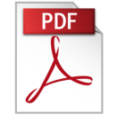
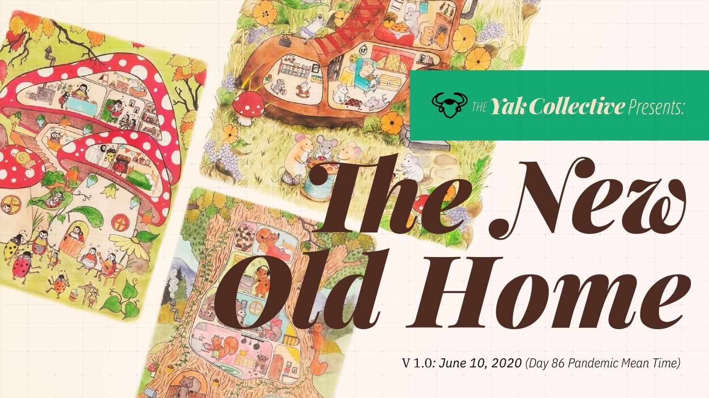



	

		<figure class="ma0">
			

				<iframe src="the-new-old-home/the-new-old-home-2020-10-28.pdf#view=fitH" class="w-100 h-100 absolute top-0 left-0 bn"></iframe>
			

		</figure>
		<figcaption class="yak-content">
			
<a href="the-new-old-home/the-new-old-home-2020-10-28.pdf"> Download PDF</a>

		</figcaption>
	

	

		<figure class="ma0">
			

				
			

		</figure>
		<figcaption class="yak-content">
			
<a href="the-new-old-home/the-new-old-home-2020-10-28.pdf"> Download PDF</a>

		</figcaption>
	

## The Yak Wisdom Project

This deck is the **second** in a series of studies the Yak Collective is undertaking over the coming months. If you find this report interesting, be sure to check out our first, [_Don't Waste the Reboot_](/projects/dont-waste-the-reboot.html). We aim to generate a body of Covid-19 reboot intelligence that is fundamentally different from anything you might see anywhere else, not just in terms of content, but in terms of the process of getting to it.

## Let the Yak Collective Guide Your Reboot

**Want to keep up with our efforts?** Follow us on [Twitter](https://twitter.com/yak_collective), [LinkedIn](https://www.linkedin.com/company/yak-collective/), or [Facebook](https://www.facebook.com/The-Yak-Collective-115005446854705).

**Like bits and pieces of what you saw in this deck?** Feel free to contact one or more individual contributors directly! The Yak Collective is not an agency or intermediary. Our members collaborate because they want to, and each of us maintains their own independent consulting practice. We offer you a catalog of ideas and people to choose from, not a bundle.

**Like a lot of what you see?** Contact [Pamela Hobart](/members/100068.html) to loop The Yak Collective into your reboot efforts. We will assemble the right small team and set of ideas to work with you, in whatever way is most effective. It might be a study or report. It might be facilitating a workshop or series of conversations for your executive team. Or it might just be an ongoing conversation with one or more of us.

**Want to hang out with us _live_ as we work on these problems?** [Join our Discord server.](/join.html) Our working process is literally open. Any independent consultant from anywhere in the world who has ideas is welcome to join our efforts, contribute to and lead collaborative projects. Any prospective client is welcome to hang out as well.

## Additional Credits

Project illustrations courtesy [Jodi Lynn Burton](http://jodilynndoodles.com/).

