*Robotics tinkering for everyone*

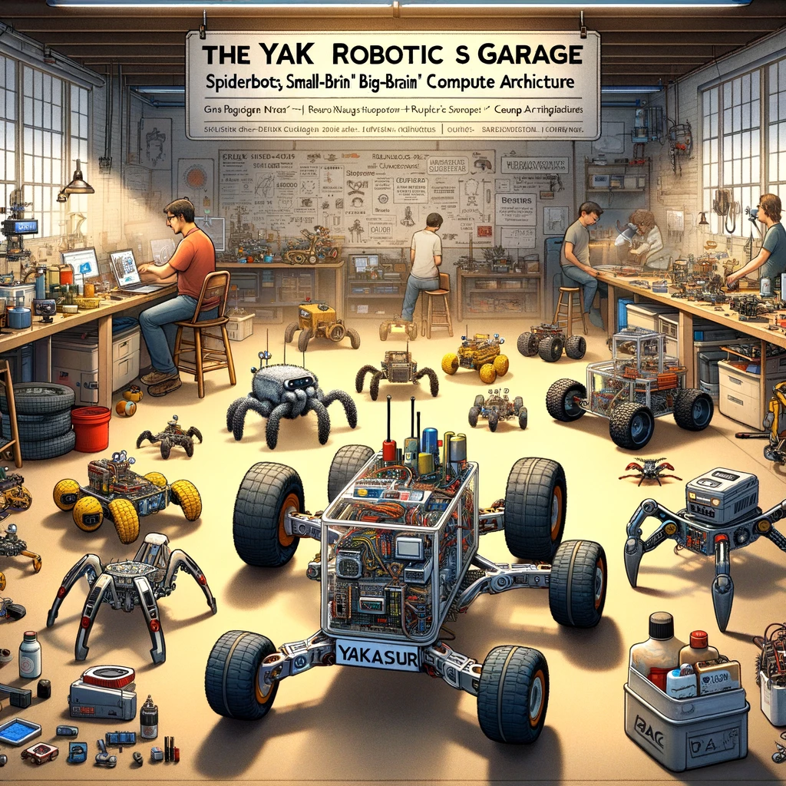

The Yak Robotics Garage (YaRG) is an informal robotics research group with a relatively mature focus on rovers, with an aspirational goal of deploying open-source rovers on Mars, starting with rovers in living rooms on Earth. In 2024, we are starting to explore other verticals besides rovers.

Since 2021, we have been tinkering with a variety of both from-scratch and kit-based rovers and robots, and simultaneously exploring current cutting-edge technological trends such as machine-learning and RISC-V based robotics. Rovers we have built or tinkered with include spiderbots, rocker-bogie rovers based on NASA and ESA missions,car-like 4-wheelers, and various simple 2-wheel rovers, such as the Elegoo Tumbller (recommended if you want an easy starting point for joining us as a builder).

Currently, our main collaborative activity is designing and deploying a rover called [the Yakasaur](https://github.com/The-Yak-Collective/yakasaur), a 2-wheel rover for desert environments built around a “small-brain/big-brain” compute architecture, possibly with some onboard machine-learning elements. Our goal is to build and deploy this in the Mojave desert by 2025.

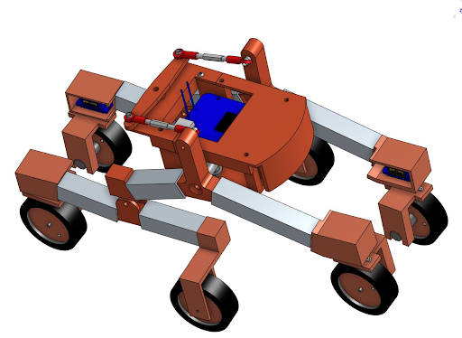
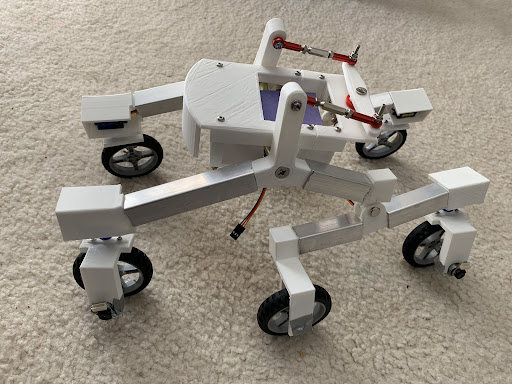

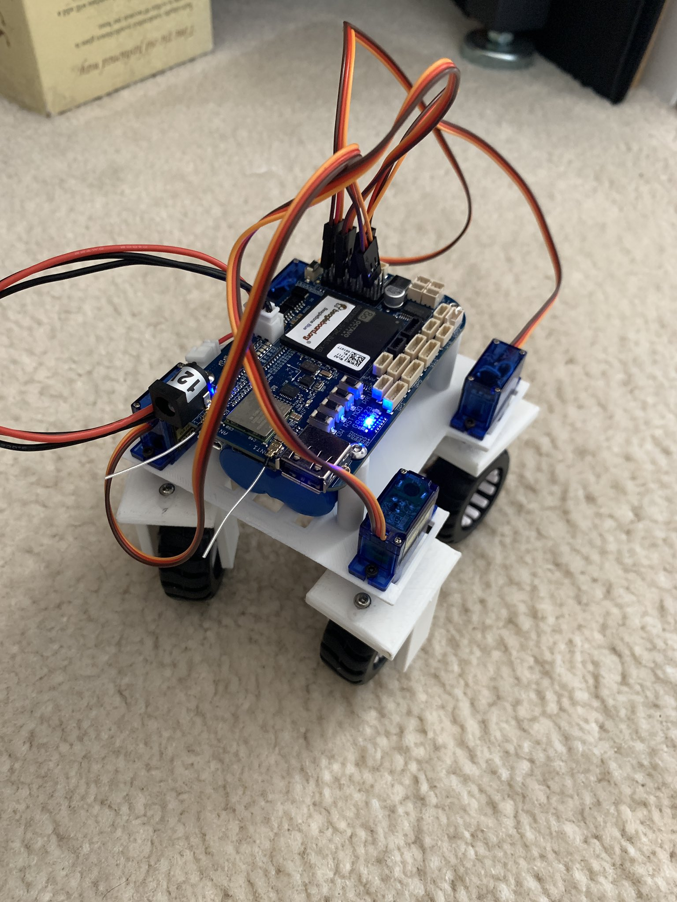
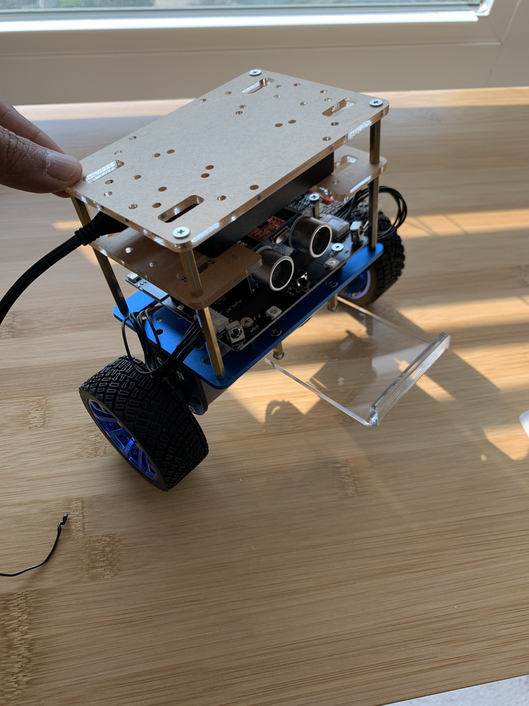

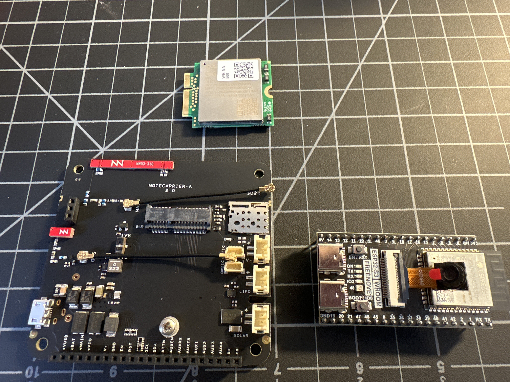
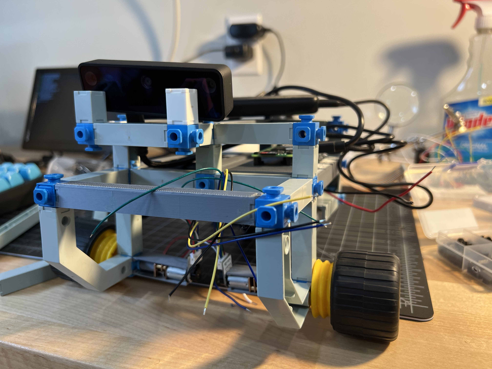
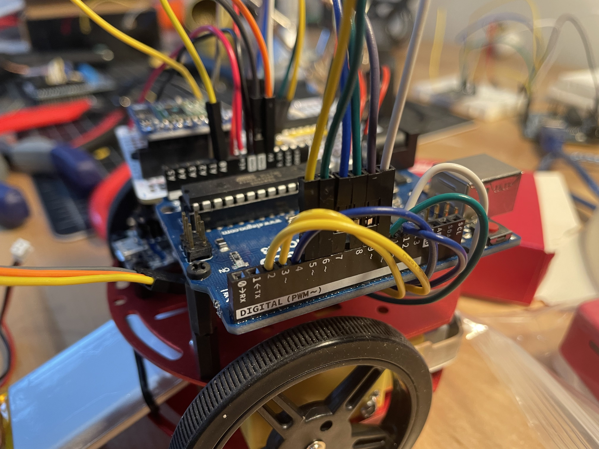

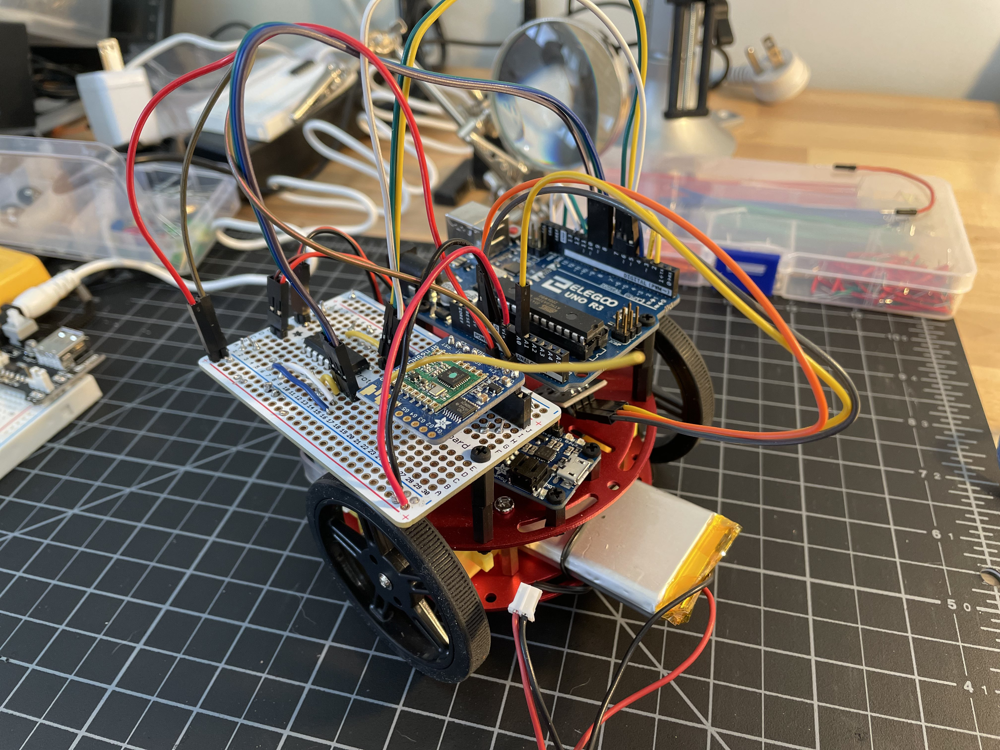
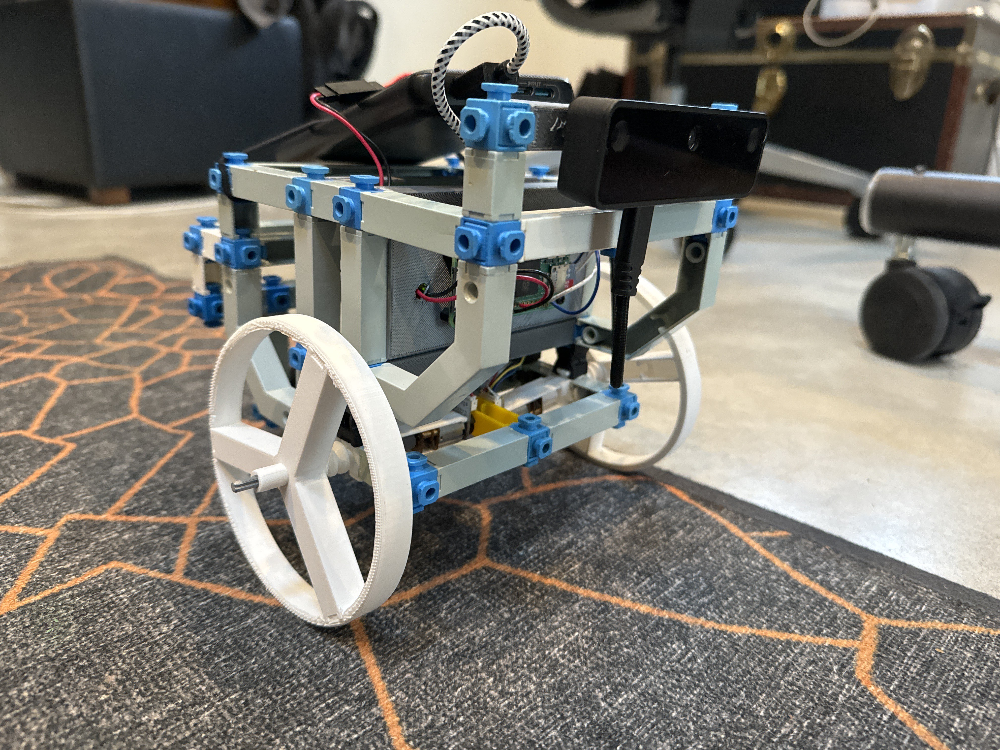
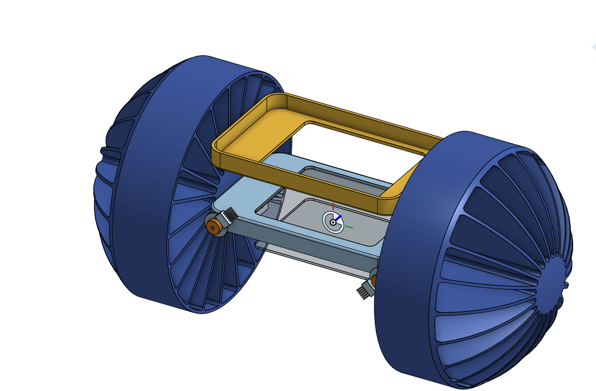

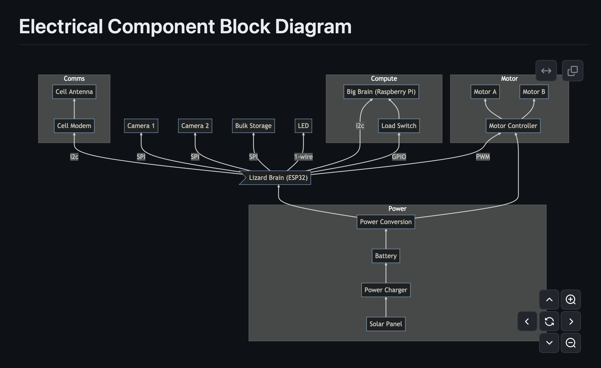

Our group meets weekly online. Meetings alternate between strategizing or coworking around specific builds we are developing (individually or collectively) and exploring frontier tools and topics via peer learning sessions. Periodically, we also do special events such as [the spider-bot teleoperated rover race we did in Tokyo in 2021](https://www.youtube.com/watch?v=Wro96wL-HMQ), and the rover-themed hackathon we did in 2022. You can join our activities via the [⌗yak-rover](https://discord.com/channels/692111190851059762/779070653122084864) channel on our Discord ([join here](../join.md)). All are welcome regardless of level and nature of skills/interests. Roverics requires many skills and each YaRGer approaches the subject in their own way. You can check out recordings of our past meetings on our YouTube channel.

## Current Research Threads (2024)
- Machine-vision based robotics navigation (using an LMM in a loop to guide behaviors)
- Blockchains on rovers (Ethereum light node on a low-compute rover)
- Social roverics: community of rovers in a domain
- Hobbyist-friendly rover design
- RISC-V based robotics
- Power electronics and solar power
- Languages for rover operations

## Past Research Threads (2021 – 2023)
- Mechanical modeling of rover designs and morphologies
- New kinds of wheels
- Speculative design of weird rover designs
- Machine learning based proprioception
- Simulation technologies for rovers (Gazebo etc.)
- Robot communications (VPNs, remote access, and tele-operation)
- Rover operating systems and software architectures

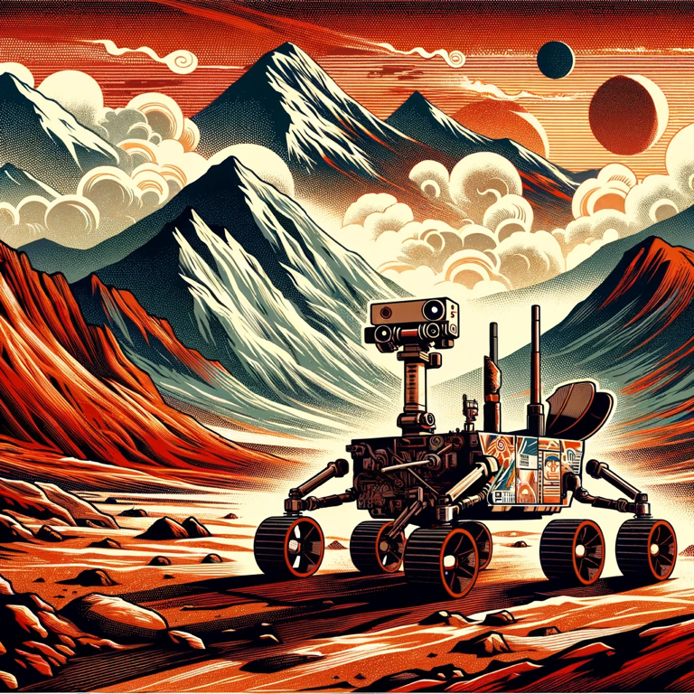

## Contributors
### Current Roboticists
- [Maier Fenster](https://x.com/maierfenster)
- [Venkatesh Rao](https://venkateshrao.com/)
- [Rhett Garber](https://x.com/rhettford)
- [Eric Platon](https://warpcast.com/ic)
- [Jascha Wilcox](https://x.com/jaschawilcox)
- [Anuraj R](https://anurajrp.io/)

### Alumni
- Victor Hill
- Brian Smith
- [Ananth](https://x.com/arjunsridhar)
